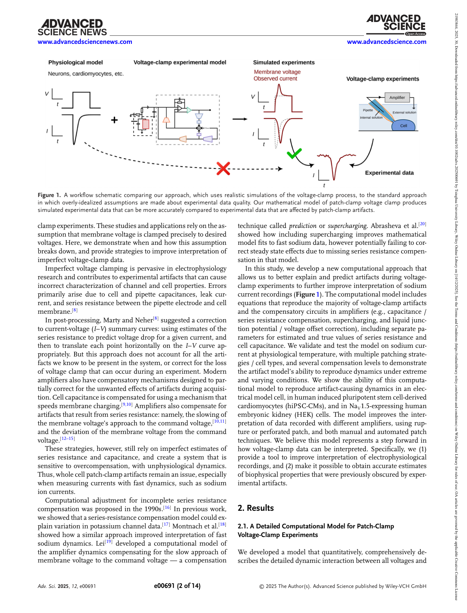
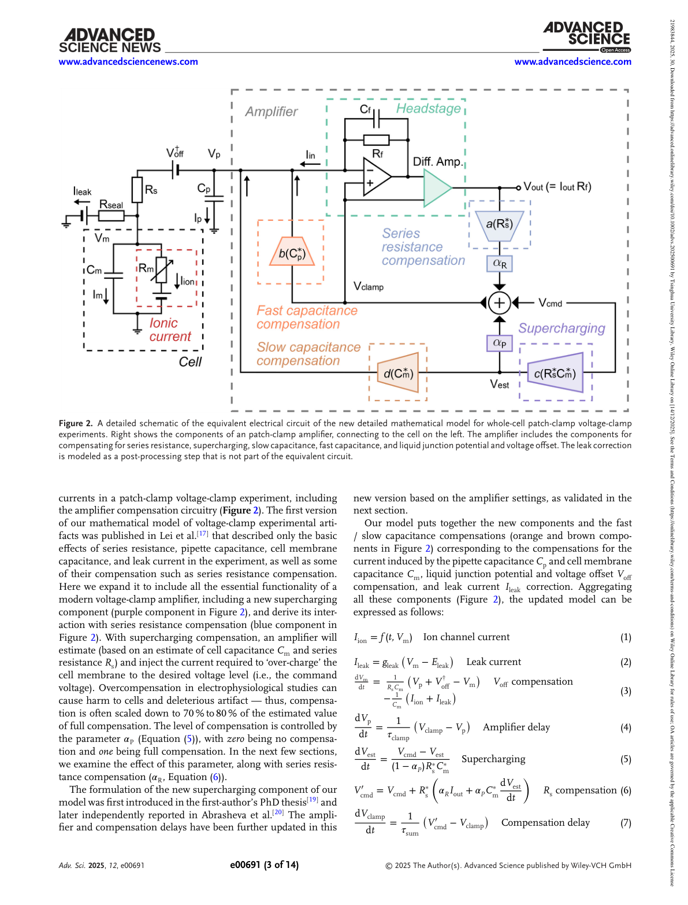
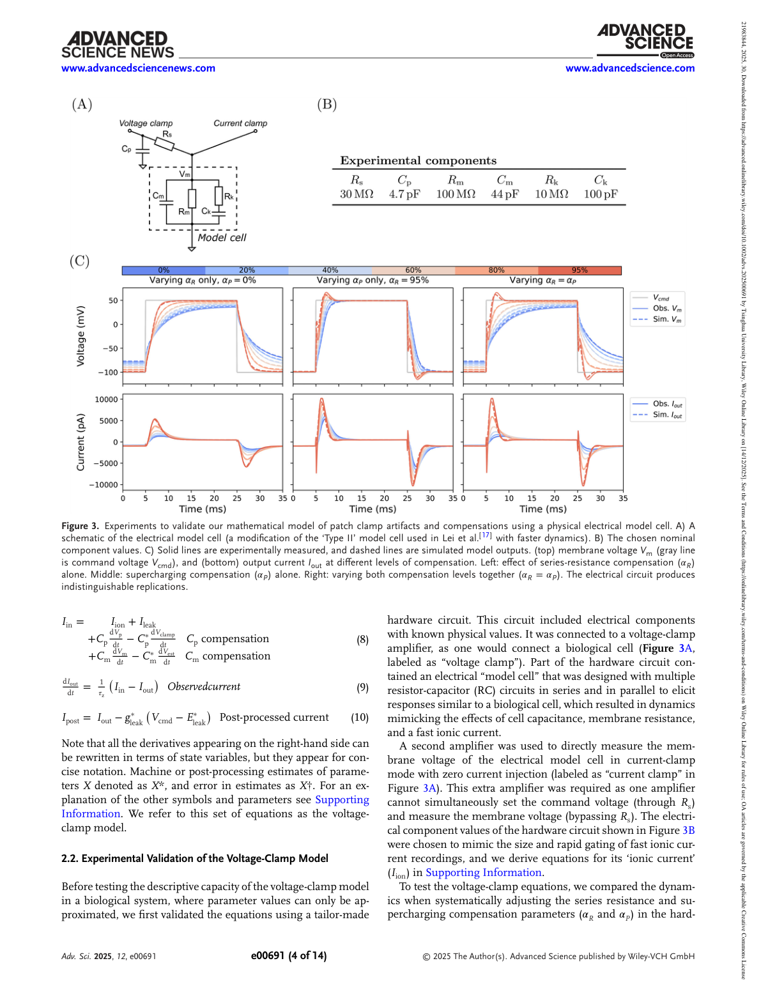
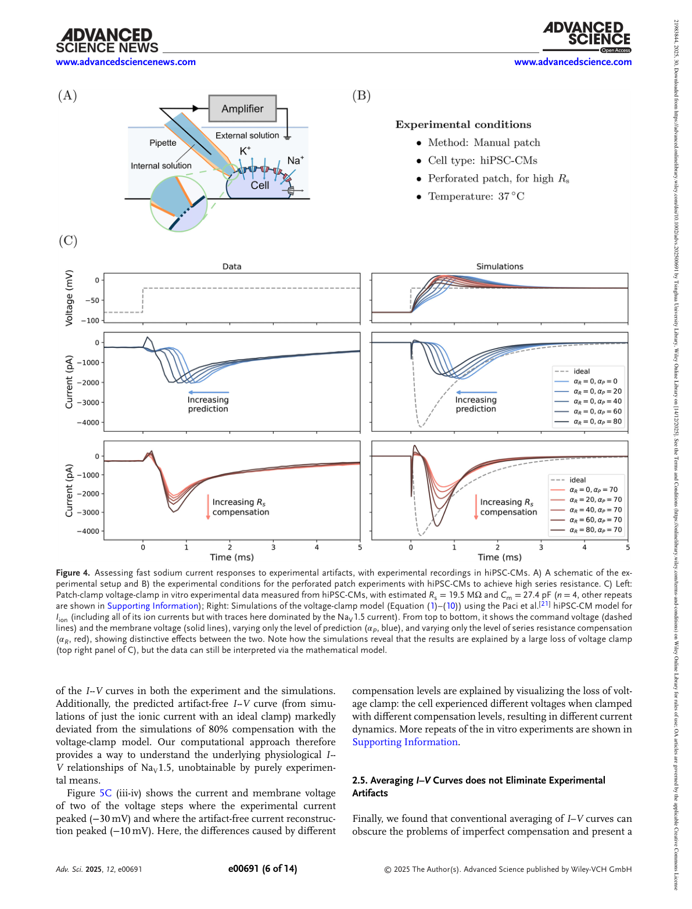
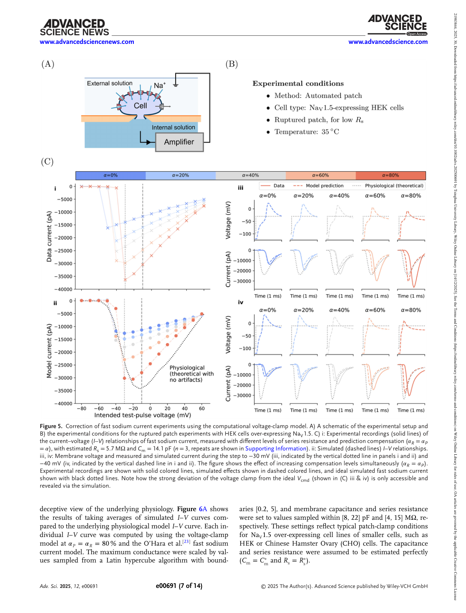
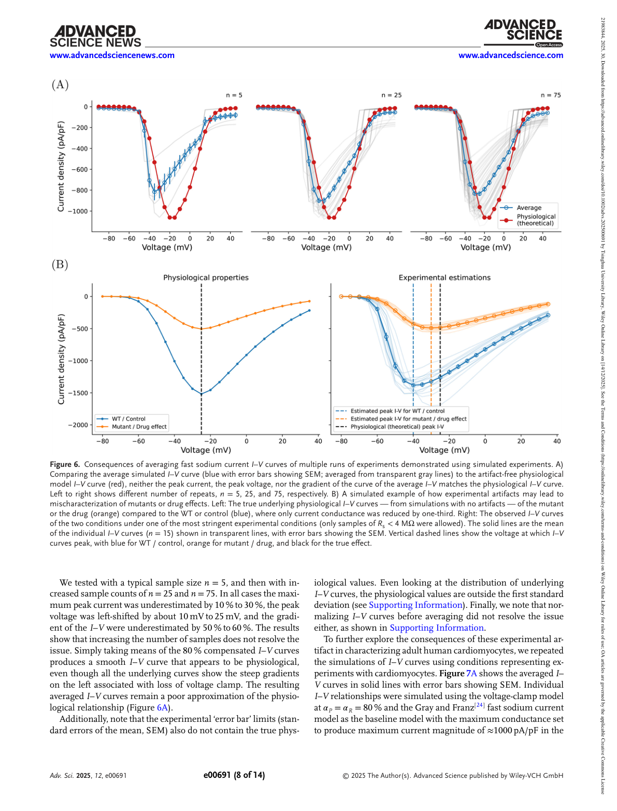
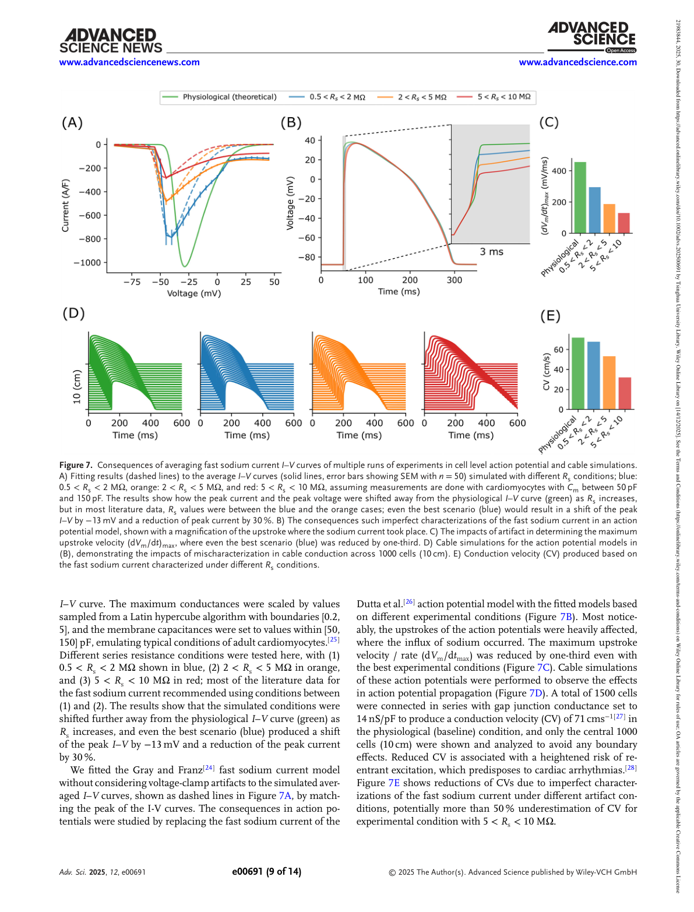
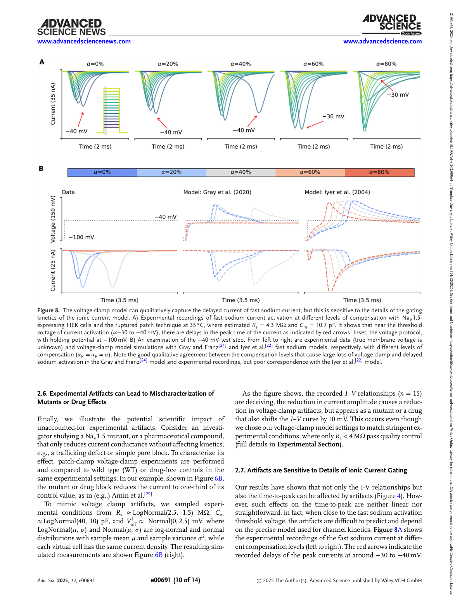

# 论文精读笔记

## 论文信息

- **标题**：Resolving Artifacts in Voltage-Clamp Experiments with Computational Modeling: An Application to Fast Sodium Current Recordings
- **作者**：Chon Lok Lei*, Alexander P. Clark, Michael Clerx, Siyu Wei, Meye Bloothooft, Teun P. De Boer, David J. Christini, Trine Krogh-Madsen, Gary R. Mirams
- **单位**：University of Macau (Lei); University of Nottingham (Clark, Clerx, Mirams); Utrecht University (Wei, Bloothooft, De Boer); Weill Cornell Medical College (Christini, Krogh-Madsen)
- **通讯作者**：Chon Lok Lei (chonloklei@um.edu.mo)
- **期刊**：Advanced Science, Vol. 12, Issue 30, 2025, e00691
- **DOI**：[10.1002/advs.202500691](https://doi.org/10.1002/advs.202500691)
- **预印本**：[bioRxiv 10.1101/2024.07.23.604780](https://doi.org/10.1101/2024.07.23.604780)
- **代码仓库**：[GitHub - CardiacModelling/nav-artefact-model](https://github.com/CardiacModelling/nav-artefact-model)
- **许可**：CC BY

### 来源链接

- [Advanced Science (Wiley)](https://advanced.onlinelibrary.wiley.com/doi/10.1002/advs.202500691)
- [PMC Full Text](https://pmc.ncbi.nlm.nih.gov/articles/PMC12376535/)
- [bioRxiv Preprint](https://www.biorxiv.org/content/10.1101/2024.07.23.604780v1)

### 本地文件

- `Advanced Science - 2025 - Lei - Resolving artifacts in voltage-clamp experiments with computational modeling.pdf`：原文 PDF

---

## 一、这篇文章在问什么问题

**核心问题**：Voltage clamp 是测量离子通道电流动力学的 gold standard，但记录到的电流会被测量系统本身引入的伪迹（artifacts）所扭曲——这些伪迹到底有多大？能不能用计算模型来预测、解释甚至修正它们？

**为什么值得问**：
- Patch clamp voltage clamp 支撑了从基础神经科学到心脏病学、肿瘤学、再到药物安全性检测（如 CiPA）的广泛应用
- 但 voltage clamp 的一个根本矛盾是：**要钳住电压就必须通过 pipette 注入电流，而电流流过 pipette 的串联电阻（Rs）就会产生压降，导致膜上的实际电压并不等于命令电压**
- 对于慢电流（如延迟整流钾电流），Rs 造成的电压误差可以忽略或通过硬件补偿基本消除
- 但对于**快速门控电流**（如心脏快钠电流 INa，激活/失活时间常数 ~0.1-1 ms），Rs 伪迹变得不可忽略——即使补偿了 80-90%，残余伪迹仍然会显著扭曲 I-V 曲线
- **更关键的是**：以往的做法是对多个细胞的 I-V 数据取平均，隐含地假设伪迹会"平均掉"。但作者证明：**平均化不仅不能消除伪迹，反而引入了系统性偏差**，其量级和致病突变的效应大小相当
- 这意味着：基于 voltage clamp 数据的离子通道参数估计、药物效应评估、甚至突变致病性判断，可能都受到了伪迹的系统性污染

**一句话概括**：这篇论文建立了一个包含 Rs、Cm、Cp、补偿电路在内的完整 voltage clamp 等效电路计算模型，用电学模型细胞实验验证了模型的准确性，然后应用于心脏快钠电流数据，证明了 voltage clamp 伪迹在常规实验条件下会系统性地偏移和压低 I-V 曲线，并且**无法通过增加样本量来消除**。

---

## 二、这篇论文和你的研究直接相关

### 2.1 你应该注意到的第一件事

**这篇论文处理的问题和你的 IEEE TIM 论文处理的问题，是同一个测量系统（patch clamp）在不同工作模式下的不同伪迹来源。**

| | 你的 TIM 论文 | Lei 2025 (本文) |
|---|---|---|
| **工作模式** | Current clamp（也涉及 voltage clamp） | Voltage clamp |
| **伪迹来源** | 胞外电位 $V_e \neq 0$ 叠加在记录信号上 | 串联电阻 $R_s$ 导致膜电位 ≠ 命令电压 |
| **核心问题** | $V_m = V_i - V_e$，不做差分就测不到真正的 $V_m$ | $V_m \neq V_{cmd}$，Rs 补偿不完美时 $V_m$ 偏离 $V_{cmd}$ |
| **解决方案** | 差分测量 + 电极电容补偿 | 计算模型后处理修正 |
| **等效电路** | Rs/Cp/Cn/Rm/Cm + 3D 点电流源 | Rs/Cm/Cp + 放大器补偿电路 |

两者的共同点在于：**都是从等效电路出发，建立数学模型来理解和修正 patch clamp 的测量伪迹**。你用的是 $V_e$ 的 3D 点电流源模型 + 差分去除；他们用的是 Rs 压降的 ODE 模型 + 计算后处理修正。思路完全类似。

### 2.2 用你最熟悉的等效电路语言来理解这篇论文

这篇论文的 Figure 2 是全文的钥匙——voltage clamp 等效电路。让我用你熟悉的符号系统来翻译：

**他们的等效电路**（Figure 2）：

```
V_cmd → [放大器补偿电路] → V_p → Rs → V_m → [Cm || (Rm + 离子通道)]
                                              ↓
                                        I_out = (V_p - V_m) / Rs
```

**完整 ODE 系统（Equations 1-10）**：

$$I_{ion} = f(t, V_m) \quad \text{(Eq.1, 离子通道电流，可插入任意 HH 型模型)}$$

$$I_{leak} = g_{leak}(V_m - E_{leak}) \quad \text{(Eq.2, 漏电流)}$$

$$\frac{dV_m}{dt} = \frac{1}{R_s C_m}\underbrace{(V_p + V_{off}^\dagger - V_m)}_{V_{off}\text{ compensation}} - \frac{1}{C_m}(I_{ion} + I_{leak}) \quad \text{(Eq.3)}$$

$$\frac{dV_p}{dt} = \frac{1}{\tau_{clamp}}(V_{clamp} - V_p) \quad \text{(Eq.4, 放大器钳制动态)}$$

$$V_{clamp} = V_{cmd} + \underbrace{R_s^* \cdot \alpha_P \cdot C_m^*}_{\text{supercharging}} \cdot \frac{dV_{est}}{dt} \quad \text{(Eq.5)}$$

$$V_{cmd}' = V_{cmd} + \underbrace{R_s^* \cdot \alpha_R \cdot I_{out}}_{\text{Rs compensation}} + R_s^* \cdot \alpha_P \cdot C_m^* \cdot \frac{dV_{est}}{dt} \quad \text{(Eq.6)}$$

$$\frac{dV_{est}}{dt} = \frac{1}{\tau_{sum}}(V_{cmd}' - V_{est}) \quad \text{(Eq.7, 估计膜电位动态)}$$

$$I_{in} = I_{ion} + I_{leak} + C_p \frac{dV_p}{dt} - C_p^* \frac{dV_{clamp}}{dt} + C_m \frac{dV_m}{dt} - C_m^* \frac{dV_{est}}{dt} \quad \text{(Eq.8, Cp/Cm 补偿)}$$

$$\frac{dI_{out}}{dt} = \frac{1}{\tau_z}(I_{in} - I_{out}) \quad \text{(Eq.9, 观测电流低通滤波)}$$

$$I_{post} = I_{out} - g_{leak}^*(V_{cmd} - E_{leak}^*) \quad \text{(Eq.10, 后处理漏减)}$$

其中：
- $\alpha_R$ = Rs 补偿比例（0 到 ~95%），$\alpha_P$ = supercharging/prediction 补偿比例
- $X^*$ 表示放大器/后处理估计的参数值，$X^\dagger$ 表示估计误差
- $\tau_{clamp}$ = 放大器钳制时间常数，$\tau_z$ = 输出低通滤波时间常数
- **关键洞察**：当 $\alpha_R < 1$ 且 $I_{out}$ 很大时，Eq.3 中的 $V_m$ 显著偏离 $V_{cmd}$ → "loss of voltage clamp"

**和你的等效电路对比**：

你的 TIM 论文中的 whole-cell 等效电路：$V_i = V_{cmd} - I \cdot R_s$，而 $V_m = V_i - V_e$。

- **你额外考虑的**：$V_e$ 项（他们没有，因为他们不施加胞外电刺激）
- **他们额外考虑的**：放大器的 Rs 补偿和 supercharging 算法的详细建模，以及 Rs 补偿不完美时的系统误差

实际上，这两个问题是**可加的**：如果你在施加胞外电刺激的同时做 voltage clamp 记录，那 $V_m$ 既偏离 $V_{cmd}$（因为 Rs），又和 $V_e$ 叠加（因为参考电极在 bath 里）。**两者的伪迹会叠加**。

### 2.3 为什么这篇论文对你非常重要——Rs 补偿与你的 $V_e$ 修正的交互

你在 TIM 论文中讨论了胞外电刺激下的 voltage clamp 伪迹：$V_e$ 叠加导致放大器"看到"的电流包含伪迹成分。但你可能还需要考虑一个更深层的问题：

当你施加胞外电刺激时：
1. $V_e$ 改变了 bath 中 pipette 尖端的电位 → 放大器看到的 $V_p$ 波动
2. 放大器的 Rs 补偿电路试图"补偿"这个波动 → 改变了注入的电流
3. 这个额外的电流通过 Rs 产生了额外的压降 → $V_m$ 进一步偏离

Lei 的模型给了你一个工具来定量分析这个交互效应。你的差分方法解决了 $V_e$ 的加性叠加问题，但 Rs 补偿电路对 $V_e$ 波动的响应是一个**二阶效应**，可能在你的高时间分辨率实验中可见。

---

## 三、实验设计与结果逐层拆解

### 第一层：计算模型的构建——从等效电路到 ODE（Figure 1-2）

**做了什么**：
- 建立了包含以下元件的完整 voltage clamp 等效电路（Fig. 2）：
  - Rs（串联电阻，pipette + access resistance）
  - Cm（膜电容）
  - Cp（pipette 电容）
  - Rm/Rseal（膜电阻/封接电阻）
  - 离子通道电导（可插入任意 Hodgkin-Huxley 型模型）
  - 放大器补偿电路：Cp 快补偿、Cm 慢补偿、Rs 补偿（$\alpha_R$）、Supercharging/Prediction（$\alpha_P$）
  - 液接电位偏移（$V_{off}$）
- 将整个系统写成耦合 ODE 组（Equations 1-10）
- 用 Figure 1 的 workflow 图对比了传统方法（假设 $V_m = V_{cmd}$）和他们的方法（用模型模拟真实的 $V_m$ 轨迹）

**Figure 1 的核心对比——标准流程 vs 本文方法**：

标准流程假设：
- Rs 补偿 80% → "基本够好" → $V_m \approx V_{cmd}$
- 对多个细胞取平均 → "消除了细胞间变异"
- 直接用 $V_{cmd}$ 作为 I-V 曲线的 x 轴

本文方法：
- 承认 Rs 补偿不完美 → 用 ODE 模型模拟真实的 $V_m(t)$ 轨迹
- 把 $I_{out}(t)$ 和模拟的 $V_m(t)$ 耦合起来分析 → 得到修正后的 I-V 关系
- 可以从有伪迹的数据中"反推"无伪迹的离子通道参数


> **Fig. 1 — A workflow schematic comparing our approach to the standard approach.**
> 左侧（标准方法）：假设 Rs 补偿足够好 → $V_m \approx V_{cmd}$ → 直接用 $V_{cmd}$ 作为 I-V 的 x 轴。右侧（本文方法）：用数学模型模拟包含 Rs、Cm、补偿电路在内的完整 voltage clamp 过程 → 生成"模拟实验数据"和真实的 $V_m(t)$ 轨迹 → 与实验数据更准确地对比和修正。


> **Fig. 2 — A detailed schematic of the equivalent electrical circuit of the new mathematical model.** ⭐ **理解全文的钥匙**
> 右侧为 patch-clamp 放大器的各补偿模块：Rs 补偿（蓝色）、Supercharging（紫色）、慢电容 Cm 补偿（棕色）、快电容 Cp 补偿（橙色）、液接电位/电压偏移补偿。左侧为细胞等效电路：Rs → Cm || (Rm + 离子通道)。整个系统由 Equations 1-10 描述。

**怎么理解——和你的方法论完全对标**：
你在 TIM 论文中也做了类似的事情：不是假设 $V_e = 0$，而是实际测量 $V_e(t)$，然后用差分得到真正的 $V_m(t)$。**两篇论文的方法论哲学完全一致：不要假设伪迹不存在，而是建模并修正它。**

### 第二层：电学模型细胞验证——物理实验确认模型准确性（Figure 3）

**这是全文最关键的验证实验。**

**做了什么**：
- 构建了一个物理 RC 电路（"Type II" model cell 的改进版），其中包含一个非线性电阻网络来模拟 INa 的快速开关行为
- 将这个模型细胞连接到 patch clamp 放大器（MultiClamp 700B），用标准 voltage clamp 方案记录
- 系统性地扫描 Rs 补偿（$\alpha_R$）和 supercharging（$\alpha_P$）参数：0%, 50%, 80%, 90%, 95%
- 将实验记录的 $I_{out}(t)$ 与计算模型的预测进行比较

**结果**：
- **0-80% 补偿**：模型预测和实验记录几乎完美吻合——无论是电流波形的形态、幅度、还是时间进程
- **90% 补偿**：出现复杂的振荡和过冲（overshoots），模型仍然能捕捉到
- **95% 补偿**：振荡更剧烈，接近补偿电路的不稳定边界，模型仍然定性一致
- 补偿从 0% 增加到 80%：记录到的峰值电流从 ~5 nA 增大到 ~8 nA → 说明即使在模型细胞上，不补偿 Rs 就会严重低估电流幅度


> **Fig. 3 — Experiments to validate our mathematical model using a physical electrical model cell.**
> **(A)** 电学模型细胞（改进版 "Type II" model cell）的示意图。一个放大器做 voltage clamp，另一个放大器用 current clamp 模式直接测量 $V_m$（绕过 Rs）。
> **(B)** 电路元件的标称值。
> **(C)** 实线 = 实验测量，虚线 = 模型预测。上排：$V_m$（灰线为 $V_{cmd}$）；下排：$I_{out}$。左列：仅变化 $\alpha_R$（0-95%）；中列：仅变化 $\alpha_P$；右列：$\alpha_R = \alpha_P$ 同步变化。0-80% 补偿下模型预测和实验几乎完美吻合；95% 出现振荡但仍定性一致。

**怎么理解——这就是他们的 "bare electrode" 实验**：
你在 TIM 论文中用 bare electrode 来标定电极电容补偿参数——因为 bare electrode 的电学特性是已知的，可以作为"参考标准"。Lei 这里做了完全类似的事情：用一个电学参数完全已知的物理模型细胞来验证计算模型。两者的实验设计哲学完全一致：**在已知系统上标定，然后在未知系统上应用。**

### 第三层：hiPSC 心肌细胞的穿孔膜片钳——大 Rs 条件下的伪迹（Figure 4）

**做了什么**：
- 人诱导多能干细胞来源的心肌细胞（hiPSC-CMs），穿孔膜片钳（perforated patch）
- Rs ≈ 19.5 MΩ（**非常大**——这在心脏电生理中是典型的，因为穿孔膜片钳的 access resistance 远高于破膜膜片钳）
- 标准 INa voltage clamp 方案：holding -120 mV → step to -80 ~ +40 mV → record INa

**结果**：
- **无补偿**：I-V 曲线严重左移（peak voltage ~-50 mV vs 预期 ~-30 mV），峰值电流被低估
- **加 Prediction（supercharging）**：I-V 曲线整体左移并变形——因为 supercharging 加速了膜电位向命令电压的趋近，但大 Rs 下仍然无法完全消除伪迹
- **加 Rs 补偿**：I-V 曲线右移、峰值增大，更接近真实值

**计算模型的关键揭示——"voltage clamp 丢失"**：
- 模型可以计算出实验过程中**真实的膜电位轨迹 $V_m(t)$**
- 在命令电压 step 到 -40 mV 时，真实的 $V_m$ 可能只到达了 -60 mV → **放大器以为钳住了 -40 mV，实际上膜电位差了 20 mV**
- 这就是所谓的 "loss of voltage clamp"——对快电流，Rs 造成的电压误差和电流瞬态同步发生，来不及被补偿


> **Fig. 4 — Assessing fast sodium current responses to experimental artifacts, with experimental recordings in hiPSC-CMs.**
> **(A)** 实验设置示意图；**(B)** 穿孔膜片钳实验条件。
> **(C)** 左：hiPSC-CM 实验数据（Rs = 19.5 MΩ, Cm = 27.4 pF）。右：voltage-clamp 模型模拟。从上到下：$V_{cmd}$（虚线）与 $V_m$（实线），分别变化 $\alpha_P$（蓝色）和 $\alpha_R$（红色）。右上角面板展示了 $V_m$ 对 $V_{cmd}$ 的严重偏离——"loss of voltage clamp"——仅通过模拟才能揭示。

**用你的语言翻译**：
这和你发现的问题有一个有趣的对称性。你的问题是 $V_e \neq 0$ 导致测量的 $V_m$ 不等于真实的 $V_m$（信号污染）。Lei 的问题是 $V_m \neq V_{cmd}$ 导致你以为施加了某个电压但实际上膜上的电压不对（控制丢失）。两者都是"名义值 ≠ 实际值"，只是一个发生在测量端，一个发生在控制端。

### 第四层：HEK 细胞 NaV1.5——较低 Rs 下的修正演示（Figure 5）

**做了什么**：
- HEK 细胞过表达 NaV1.5 钠通道，破膜膜片钳（ruptured patch）
- Rs ≈ 5.7 MΩ（比 hiPSC-CM 好得多，但仍然不为零）
- 扫描 Rs 补偿水平：0%, 50%, 80%
- 用计算模型拟合实验数据，同时估计 Rs、Cm、和最大电导率

**结果**：
- 即使 Rs 只有 5.7 MΩ，在 80% 补偿下仍然可见显著伪迹：
  - 峰值电流幅度被低估 ~20%
  - I-V 曲线 peak voltage 左移 ~5-10 mV
- 模型拟合后估计的"真实"（artifact-free）I-V 曲线和记录到的数据有明显差异
- 特别是在**激活电压附近**（-50 到 -30 mV），伪迹最严重——因为这里 INa 变化最快


> **Fig. 5 — Correction of fast sodium current experiments using the computational voltage-clamp model.**
> **(A)** 实验设置示意图；**(B)** HEK-NaV1.5 破膜膜片钳实验条件。
> **(C)** i: 实验 I-V 曲线（实线），Rs = 5.7 MΩ, Cm = 14.1 pF，$\alpha_R = \alpha_P = \alpha$ 分别为 0%, 50%, 80%。ii: 模型模拟（虚线）。iii-iv: 在 -30 mV 和 -40 mV 步阶下的电流和 $V_m$ 波形。黑色虚线 = 理想无伪迹电流。**关键：即使 80% 补偿，$V_m$ 仍然严重偏离 $V_{cmd}$。**

**为什么这对你重要**：
你在 TIM 论文中做 voltage clamp 实验来表征细胞参数（Rs、Cm 等）。即使你没有施加胞外电刺激，你用 voltage clamp 测到的 Rs 和 Cm 值本身也可能受到 Rs 补偿不完美的影响。Lei 的模型提供了一种方法来**从有伪迹的 voltage clamp 数据中更准确地估计这些参数**。

### 第五层：I-V 曲线平均化的系统性偏差——全文最 provocative 的结果（Figure 6）

**这是全文影响最深远的结果。**

**做了什么**：
- 模拟了大量"虚拟实验"：固定 INa 模型参数，但 Rs 和 Cm 在实验变异范围内随机取值（Rs: 3-20 MΩ, Cm: 20-100 pF）
- 假设所有细胞做了 80% Rs 补偿（当前领域标准）
- 对 n = 5, 25, 75 个"虚拟细胞"的 I-V 数据取平均
- 与"无伪迹"的真实 I-V 曲线比较

**结果——三个关键偏差**：
1. **峰值电流被低估 10-30%**：因为每个细胞的 Rs 不同，peak 出现在不同的命令电压处 → 平均化"抹平"了峰值
2. **Peak voltage 左移 10-25 mV**：Rs 压降使真实的 $V_m$ 小于 $V_{cmd}$ → 电流峰值出现在比预期更负的命令电压处
3. **I-V 曲线斜率（gradient）被低估 50-60%**：激活曲线变得更"平缓"

**最致命的发现——增加样本量不能解决问题**：
- n = 5 → n = 75：偏差基本不变，只是 SEM 变小
- 但**真实值落在 SEM 区间之外** → 统计显著性提高了对错误结论的"信心"
- 这是一个**系统性偏差（bias）而非随机误差（variance）**，平均化只能减小 variance 但不能消除 bias

**Figure 6B——"突变"的误解**：
- 模拟了一个"致病突变"场景：真实效应仅仅是 gmax 降低到 2/3（电导减小）
- 但在有伪迹的 voltage clamp 数据中，这个突变表现为：不仅电流减小，**还出现了 ~10 mV 的 I-V 曲线偏移**
- 如果研究者按表面值解读，会错误地结论这个突变同时影响了通道的门控（gating shift）——但实际上那只是伪迹
- **这个偏移量级（~10 mV）和很多文献中报道的致病突变的门控偏移量级相当**

**怎么理解——这是对整个领域的警示**：
想象一下：你发现某个基因突变使 INa 的 I-V 曲线左移了 10 mV，据此推断该突变改变了通道的激活门控。但 Lei 的工作告诉你：如果突变只是改变了电流密度（改变了 Rs 补偿的有效性），你可能看到同样大小的 I-V 偏移，完全是伪迹。


> **Fig. 6 — Consequences of averaging fast sodium current I-V curves of multiple runs of experiments.** ⭐ **全文最 provocative 的结果**
> **(A)** 蓝色 = 模拟的平均 I-V 曲线（透明灰线为单个细胞，误差棒为 SEM），红色 = 无伪迹的生理 I-V 曲线。从左到右 n = 5, 25, 75。**无论样本量多大，峰值电流低估 10-30%，peak voltage 左移 10-25 mV，斜率低估 50-60%。SEM 甚至不包含真实值。**
> **(B)** 突变/药物误解的模拟：真实效应仅为 gmax 降至 2/3（左图，橙色 vs 蓝色）。但在有伪迹的记录中（右图），出现了 ~10 mV 的 I-V 偏移——完全是伪迹，会被误判为门控改变。

### 第六层：心肌细胞水平的模拟——伪迹对动作电位和传导速度的影响（Figure 7）

**做了什么**：
- 把从有伪迹/无伪迹的 I-V 数据估计的 INa 参数分别代入心肌细胞动作电位模型
- 比较 AP upstroke velocity (dVm/dt)max 和 cable 传导速度

**结果**：
- 有伪迹的参数 → (dVm/dt)max 被低估 ~1/3
- Cable 传导速度被低估 >50%
- 这意味着：从有伪迹的 voltage clamp 数据构建的心脏计算模型，会系统性地低估传导速度 → 低估心律失常风险

**和你的工作的联系**：
你的差分测量方法最终也是服务于更准确地理解电刺激下神经元的行为。如果基础数据（离子通道参数）本身就有系统性偏差，那建立在这些数据上的一切建模和预测都会继承这个偏差。Lei 的工作提醒：**测量伪迹的影响不仅限于测量本身，它会传播到所有下游分析。**


> **Fig. 7 — Consequences of averaging fast sodium current I-V curves in cell level action potential and cable simulations.**
> **(A)** 不同 Rs 条件下模拟的平均 I-V 曲线（实线 + SEM 误差棒，n=50）和拟合结果（虚线）。蓝色：0.5-2 MΩ，橙色：2-5 MΩ，红色：5-10 MΩ，绿色：无伪迹生理曲线。即使最佳条件（蓝色），peak 也左移 13 mV，幅度降低 30%。
> **(B)** 不同 INa 参数化下的动作电位波形放大图（upstroke 阶段）。
> **(C)** (dVm/dt)max 对比：最佳条件下也降低约 1/3。
> **(D)** 1000 细胞 cable 模拟的传导图。
> **(E)** 不同 Rs 条件对传导速度的影响——即使最佳条件，CV 也显著降低。

### 第七层：模型局限性——对 INa 门控动力学模型的敏感性（Figure 8）

**做了什么**：
- 比较了不同的 INa 门控动力学模型（Gray & Franz vs Iyer et al.）
- 检查模型预测的"延迟电流"（delayed current near activation threshold）是否和实验一致

**结果**：
- 在激活阈值附近（约 -30 到 -40 mV），实验记录到 INa 出现明显的时间延迟（time-to-peak delay）
- 机制：Rs 导致的正反馈——小的钠电流 → Rs 压降使 $V_m$ 更正 → 更大的钠电流 → 最终突破激活阈值
- Gray & Franz 模型能定性复现这个延迟，但 Iyer et al. 模型不能
- 差异来自两个模型在 -30 到 -40 mV 附近的 I-V 斜率不同


> **Fig. 8 — The voltage-clamp model can qualitatively capture the delayed current, but this is sensitive to the gating kinetics model.**
> **(A)** HEK-NaV1.5 在 35°C 下不同补偿水平的快钠电流记录。红色箭头标出激活阈值附近的 time-to-peak 延迟。Rs = 4.3 MΩ, Cm = 10.7 pF。
> **(B)** -40 mV 步阶的详细对比。左：实验数据（真实 $V_m$ 未知）。中：Gray & Franz 模型 + voltage-clamp 模型——能定性复现延迟。右：Iyer et al. 模型——**不能复现延迟**，说明修正结果对通道模型敏感。

**为什么这重要**：
这提醒你：计算修正方法的有效性依赖于你对离子通道动力学的先验知识。如果通道模型本身不准确，计算修正可能引入新的误差。这和你在 TIM 论文中对 3D 电场模型的精度依赖是类似的——模型越准确，修正越可靠。

论文中对此给出了一个精妙的物理解释：在 $V_{cmd}$ 恰好低于激活阈值时，小的 INa → Rs 压降使 $V_m$ 比 $V_{cmd}$ 更正 → 更多 INa 被激活 → 更大的 Rs 压降 → **正反馈**直到 $V_m$ 突破阈值。这个正反馈的速度取决于 I-V 曲线在阈值附近的斜率——不同模型给出不同斜率，因此延迟时间不同。

---

## 四、证据链评估

### 强在哪里

1. **完整的验证链**：物理模型细胞（已知参数）→ 真实细胞（两种制备）→ 群体统计 → 功能后果。从"模型对不对"到"偏差有多大"到"这个偏差有什么后果"，逻辑闭环
2. **定量严谨**：不是定性地说"Rs 有影响"，而是精确计算了偏差的量级（10-30% 电流，10-25 mV 偏移），并与生物学效应（致病突变）的量级进行了直接对比
3. **实用性强**：提供了开源的代码和 workflow，研究者可以直接用自己的数据跑模型修正
4. **挑战了领域惯例**：不是改进了一个技术细节，而是质疑了"平均 I-V 曲线"这个几十年来被认为理所当然的标准做法
5. **方法论可迁移**：虽然论文聚焦于心脏 INa，但等效电路模型适用于任何 voltage clamp 实验——包括你的神经电生理场景

### 不够硬的地方

1. **只验证了一种放大器**：电学模型细胞实验用的是 MultiClamp 700B。不同放大器的补偿算法实现细节可能不同（如 Axopatch 200B 的 supercharging 实现和 MultiClamp 700B 不完全相同）。虽然基本物理是一样的，但量化精度可能因放大器而异
2. **INa 门控模型的不确定性**（作者自己也承认，Fig. 8）：在激活阈值附近，模型对通道动力学的敏感性很高。如果通道模型不准确，计算修正可能引入新误差
3. **没有考虑 space clamp 问题**：论文隐含假设了 perfect space clamp（膜电位空间均匀）。但真实细胞（尤其是神经元）有突起（树突、轴突），膜电位在空间上不均匀 → 即使 $V_m$ at soma = $V_{cmd}$，远端膜上的电压可能完全不同。Space clamp 误差和 Rs 伪迹会叠加
4. **高频放大器动力学未完全建模**：Bessel 滤波器、采样率限制等在微秒时间尺度上可能有影响，但论文的模型没有包含
5. **没有讨论胞外电刺激条件**：如果在 voltage clamp 记录同时施加胞外电刺激（像你的实验），$V_e$ 和 Rs 伪迹的交互效应会更复杂——这篇论文没有涉及

---

## 五、对你的研究的直接影响

### 5.1 你的 TIM 论文应该引用这篇文章

理由：
- 你的论文讨论了 $V_e$ 对 patch clamp 测量的影响，包括 voltage clamp 模式
- Lei 这篇是目前最系统的 voltage clamp 伪迹建模工作
- 引用它可以增强你的 motivation：不仅 $V_e$ 是伪迹来源，Rs 也是——两者在胞外电刺激条件下会叠加
- 也可以在 Discussion 中指出你的差分方法和 Lei 的计算修正是**互补的解决方案**

### 5.2 你的差分方法和 Rs 补偿修正的关系

**Voltage clamp 模式下的两层伪迹**：

| 层次 | 伪迹来源 | 机制 | 你的方法能解决？ | Lei 的方法能解决？ |
|---|---|---|---|---|
| 第一层 | Rs ≠ 0 | $V_m \neq V_{cmd}$，命令电压的控制误差 | 不能（这不是 $V_e$ 的问题） | **能**（ODE 模型重建 $V_m(t)$） |
| 第二层 | $V_e \neq 0$ | $V_e$ 叠加在放大器看到的信号上 | **能**（差分去除 $V_e$） | 不能（模型中没有 $V_e$ 项） |
| 交互效应 | Rs × $V_e$ | $V_e$ 通过 Rs 补偿电路被放大或畸变 | 部分能 | 需要扩展模型 |

**最佳方案**：将你的差分方法和 Lei 的计算模型结合——先用差分去除 $V_e$ 的加性叠加，然后用计算模型修正 Rs 残余伪迹。

### 5.3 Lei 的模型可以直接用于你的数据分析

你在 TIM 论文中需要从 voltage clamp seal test 数据估计 Rs、Cm 等参数。Lei 的 ODE 模型提供了一种比传统指数拟合更精确的方法来估计这些参数——特别是当 Rs 补偿开启时，传统拟合方法的假设不再成立。

他们的代码是开源的（[GitHub](https://github.com/CardiacModelling/nav-artefact-model)），可以直接适配到你的实验条件。

### 5.4 对你的 Discussion 的叙述建议

一种可能的框架（可以放在 TIM 论文的 Discussion 中）：

> Voltage clamp 记录中的伪迹有两个独立来源。第一，串联电阻 Rs 导致膜电位偏离命令电压，尤其影响快速门控电流的 I-V 曲线特征化（Lei et al., Advanced Science, 2025）。第二，胞外电刺激下 $V_e \neq 0$ 导致放大器参考电位偏移，直接污染记录信号——这是本文差分测量方法所解决的问题。在胞外电刺激条件下同时做 voltage clamp 记录时，这两种伪迹会叠加，因此最准确的分析流程应同时考虑 Rs 补偿修正和 $V_e$ 差分去除。

### 5.5 和 Lesperance 2018 的三角关系

现在你手里有了三篇方法学论文，它们构成了一个完整的 patch clamp 伪迹地图：

| 论文 | 工作模式 | 伪迹类型 | 伪迹后果 | 解决方案 |
|---|---|---|---|---|
| **Lesperance 2018** (Brain Stim) | Current clamp (PCA) + EFS | PCA 反馈环路注入伪迹电流 | 人为改变了真实的 $V_m$（measurement back-action） | 换用 VFA |
| **你的 TIM 论文** | Current/Voltage clamp + EFS | $V_e$ 叠加在记录信号上 | 测量的 $V_m$ 包含 $V_e$ 成分（observer effect） | 差分测量 $V_m = V_i - V_e$ |
| **Lei 2025** (Adv Sci) | Voltage clamp（无 EFS） | Rs 导致 $V_m \neq V_{cmd}$ | I-V 曲线系统性偏移和低估（control error） | 计算模型后处理修正 |

三篇论文合在一起，覆盖了 patch clamp 在不同工作条件下的主要伪迹来源。你的 TIM 论文在这个"伪迹地图"中占据了一个独特且重要的位置——它是唯一处理 $V_e$ 叠加问题的。

---

## 六、待讨论的问题

1. **你的 voltage clamp 数据是否需要 Lei 的修正？** 你在 TIM 论文中用 voltage clamp 来做 seal test 和参数提取（Rs, Cm 估计）。这些测量是在无 EFS 条件下做的，应该不受 $V_e$ 影响。但 Rs 补偿伪迹仍然存在——你目前用什么方法估计 Rs 和 Cm？是传统的指数拟合还是其他方法？Lei 的 ODE 模型是否值得尝试？

2. **两种伪迹的量级对比**：在你的实验条件下（1 mA 刺激，200 μm 电极距离），$V_e$ ≈ 几 mV。而 Rs 伪迹（假设 Rs = 10 MΩ，INa peak ≈ 1 nA）= 10 mV。两者量级相当。但时间尺度不同：$V_e$ 跟随刺激脉冲（μs 级 onset），Rs 伪迹跟随离子通道电流（ms 级）。你能在你的数据中区分这两种伪迹吗？

3. **Rs 补偿和差分测量的顺序问题**：如果你在 EFS 条件下做 voltage clamp，应该先做 $V_e$ 差分去除还是先做 Rs 补偿修正？这两个操作是否可交换？直觉上，应该先去除 $V_e$（因为它是加性的，去除后信号更干净），然后对干净的信号做 Rs 修正。但如果 Rs 补偿电路已经对 $V_e$ 波动做出了反应（注入了额外电流），那这个顺序可能需要调整。

4. **你是否见过 Lei 描述的 I-V 偏移？** 在你的 voltage clamp 数据中（如果有 I-V 曲线的话），是否观察到过 peak voltage 的偏移？如果有，那可能不全是 $V_e$ 的贡献，Rs 也有份。

5. **Lei 的模型能否扩展来包含 $V_e$？** 他们的 ODE 模型（Eqs. 1-10）中没有 $V_e$ 项。但在原则上，只需要在 $V_p$ 项中加入 $V_e(t)$ 就可以扩展模型：$V_p = V_{cmd}' - V_e$。这样就可以同时处理 Rs 和 $V_e$ 两种伪迹。你是否有兴趣做这个扩展？

6. **这篇论文对你论文 framing 的影响**：Lei 的故事是 "voltage clamp 的 Rs 伪迹被低估了"。你的故事是 "voltage clamp / current clamp 在 EFS 条件下需要差分修正"。两者可以被 frame 成同一个更大叙事的不同章节：**patch clamp 不是一个完美的测量工具，在任何非理想条件下（Rs ≠ 0, $V_e$ ≠ 0），都需要定量的伪迹修正。** 你的 TIM 论文为 EFS 条件下的修正提供了方案，Lei 为 Rs 条件下的修正提供了方案。

7. **你最想搞清楚的一件事是什么？**
