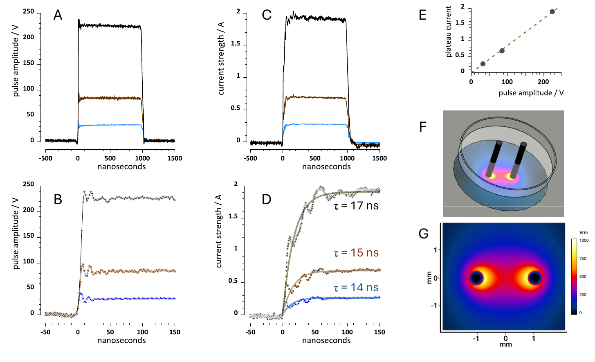
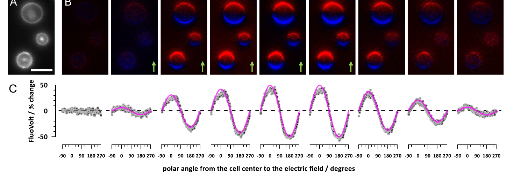
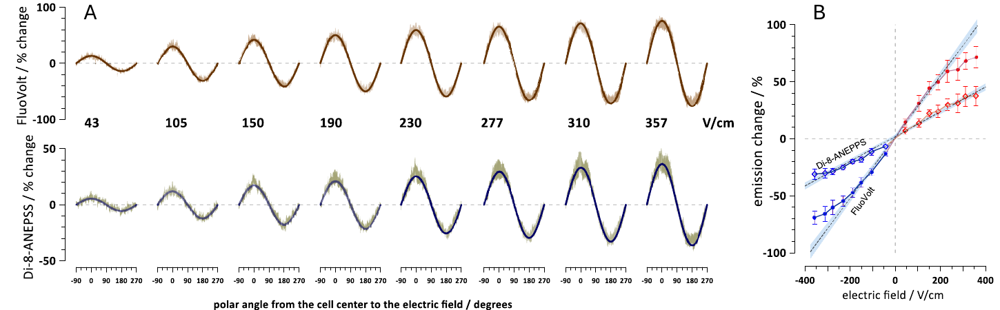
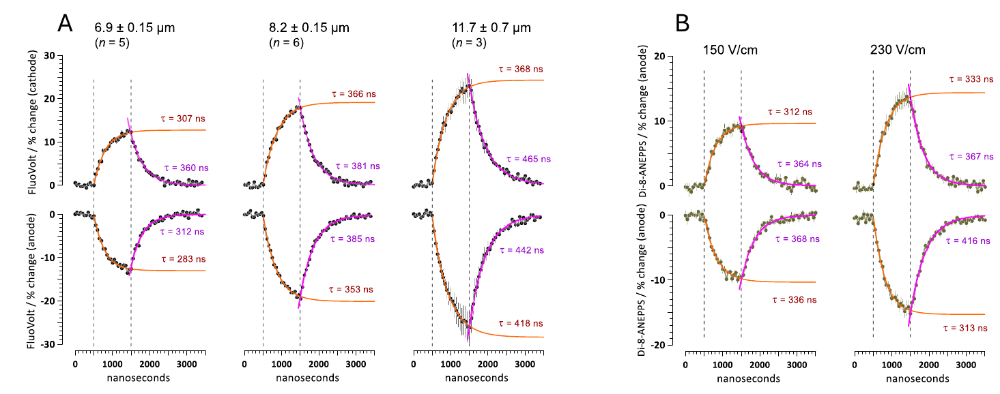
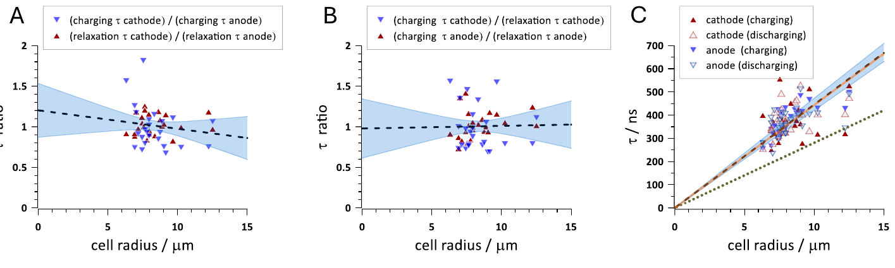

# 论文精读笔记

## 论文信息

- **标题**：Resolving nanosecond kinetics of the optical membrane potential in pulsed electric fields
- **作者**：Iurii Semenov, Giedre Silkuniene, Mantas Silkunas, Olga N. Pakhomova, Joel N. Bixler, Bennett L. Ibey, Mark A. Keppler, Andrei G. Pakhomov*
- **单位**：Frank Reidy Research Center for Bioelectrics, Old Dominion University; Air Force Office of Scientific Research; Department of Biomedical Engineering, Texas A&M University
- **通讯作者**：Andrei G. Pakhomov (2andrei@pakhomov.net, apakhomo@odu.edu)
- **期刊**：Bioelectrochemistry 168 (2026) 109143
- **DOI**：[10.1016/j.bioelechem.2025.109143](https://doi.org/10.1016/j.bioelechem.2025.109143)
- **收稿/修回/接收**：2025-08-05 / 2025-10-13 / 2025-10-16
- **在线发表**：2025-10-17

### 来源链接

- [DOI](https://doi.org/10.1016/j.bioelechem.2025.109143)

### 本地文件

- `Bioelectrochemistry - 2026 - Semenov - Resolving nanosecond kinetics of the optical membrane potential in pulsed electric fields.pdf`：原文 PDF
- `figures/Fig1.png` - `figures/Fig5.png`：从 PDF 裁出的主图

---

## 0、先把术语和试剂型号说清楚

这篇文章英文术语很多，先把最容易卡住的词解释一下，后面读起来会顺很多。

- **PEF / pulsed electric field / 脉冲电场**：不是一直开的恒定电场，而是很短的电脉冲。这篇主要用 **1 μs** 的单个电脉冲刺激细胞，场强单位是 **V/cm**。
- **CHO-K1 细胞**：Chinese hamster ovary cell，中国仓鼠卵巢细胞系。它不是神经元，作者选它是因为它比较圆、内源性电压门控通道少，适合当“近似球形电容模型”来验证膜充电理论。
- **Optical membrane potential / optical MP / 光学膜电位**：不是电极直接测的膜电位，而是用电位敏感染料的荧光变化间接反映局部膜电位变化。
- **IMP / induced membrane potential / 诱导膜电位**：外加电场在细胞膜两侧“诱导出来”的膜电位变化。它不是细胞自发产生的动作电位，而是外电场把细胞膜两侧电荷重新分布后产生的电压差。
- **VSD / voltage-sensitive dye / 电位敏感染料**：膜电位变了，染料荧光也会变，用相机拍荧光就能推断膜电位变化。
- **FluoVolt**：Thermo Fisher 的一种电位敏感染料商品名。优点是灵敏度高，小电压变化也容易看出来；缺点是动态范围较窄，较强电场下可能接近饱和。
- **Di-8-ANEPPS**：另一种经典电位敏感染料，属于 ANEPPS 系列。它灵敏度比 FluoVolt 低，但线性范围更宽，适合看更大的膜电位变化。
- **Annine-6**：前人研究用过的另一种电位敏感染料。它在一些文献里报告过阳极/阴极不对称充电，但这篇文章认为那些异常可能和染料标定或电穿孔有关。
- **Strobe imaging / 脉冲激光频闪成像**：类似频闪照相。不是靠相机连续高速拍，而是在电脉冲后的某个精确时间点打一个 6 ns 激光闪光，拍一张；多次重复不同延迟，就拼出纳秒级时间过程。
- **Cathode-facing / anode-facing**：指细胞膜朝向阴极/阳极的一侧。朝阴极的一侧在这篇里表现为去极化，朝阳极的一侧表现为超极化。
- **Charging / relaxation**：这里的 charging 是膜像电容一样“充电”；relaxation 不是心理放松，而是电脉冲结束后膜电位“放电恢复”。
- **Electroporation / electropermeabilization / 电穿孔**：电场太强时，细胞膜出现纳米级孔洞，膜漏电、通透性增加。本文主要刻意避开强电穿孔条件，验证低场强下的正常膜充电。
- **Bleaching / 光漂白**：荧光染料被反复激光照射后变暗。作者用正反延迟顺序平均，尽量抵消这个影响。
- **Sim4Life**：电磁/生物物理仿真软件。这里用来估算两根刺激电极之间的电场分布。
- **EPULSUS-FPM4-7**：脉冲电场发生器型号，用来输出 1 μs 电脉冲。
- **Tungsten rod electrodes**：钨棒电极。钨是金属材料，做成两根细棒，在培养皿里给细胞施加电场。
- **$\tau$ / tau / 时间常数**：电容充电快慢的参数。过了 1 个 $\tau$，大约达到最终值的 63%；过了 3 个 $\tau$，大约达到 95%。
- **RC 模型**：电阻 R 加电容 C 的等效电路模型。细胞膜在外电场下可以先粗略看成一个电容，膜内外液体提供电阻通路。

## 一、这篇文章在问什么问题

**核心问题**：在 1 μs 脉冲电场（PEF）下，CHO 细胞膜的光学膜电位充电/放电动力学是否真的符合经典电容充电理论？之前报道的阳极/阴极不对称、充电与放电时间常数不同、染料响应异常，是真实生物物理现象，还是测量方法带来的假象？

**为什么值得问**：

- PEF 的首要生物效应是膜充电；后续的电刺激效应（electrostimulation）、电穿孔（electroporation）、钙离子进入或释放（Ca2+ mobilization）都取决于这个初始跨膜电位。
- 理论上，球形细胞在均匀电场中的 induced membrane potential (MP) 应该符合 Schwan 方程：

$$
MP(t)=1.5Er\cos\theta(1-e^{-t/\tau})
$$

- 其中时间常数近似为：

$$
\tau=rC_m\left(\frac{1}{\sigma_i}+\frac{1}{2\sigma_e}\right)
$$

- 但以往用 Annine-6、FluoVolt 这些电位敏感染料，以及脉冲激光频闪成像（strobe imaging）的研究出现过互相矛盾的结果：有的报道阳极极化比阴极大 3-5 倍，有的报道实测 MP 比理论小 2-3 倍，有的报道膜放电恢复（relaxation）比膜充电（charging）慢 2.5 倍。
- 如果这些异常是真的，说明经典等效电路/Schwan 方程漏掉了关键机制；如果是假的，则需要把问题定位到染料、标定、电穿孔或成像流程。

**一句话概括**：这篇文章用 6 ns 脉冲激光频闪成像，在 CHO 球形细胞上比较 FluoVolt 和 Di-8-ANEPPS 两种电位敏感染料，证明 1 μs、0-350 V/cm 脉冲电场下的光学膜电位充电是阳极/阴极对称的，膜充电和放电恢复的时间常数一致，并且 $\tau$ 随细胞半径的关系可由 $C_m\approx1.6\,\mu F/cm^2$、$\sigma_i\approx0.4\,S/m$ 的经典电容模型解释。

---

## 二、这篇论文和你的研究的关联

### 2.1 它在替你的差分测量论文补一个“光学参照系”

你的 IEEE TIM 差分测量工作关注的是：

$$
V_m(t)=V_i(t)-V_e(t)
$$

也就是在胞外刺激存在时，如何把真实膜电位和胞外伪迹（extracellular artifact）分开。

Semenov 这篇的测量对象不一样：它不试图从 patch clamp 里扣除 $V_e$，而是直接用电位敏感染料读取细胞膜局部的 optical MP。两者共同点是：**当外加电场存在时，传统单点电生理读数不再天然等于真实局部膜电位**。你的方法是在电生理框架内补偿 $V_e$；他们的方法是换成空间分辨的光学读数。

这篇文章对你有用的地方不是实验场强本身，而是它给出了一个很干净的对照：在球形 CHO 细胞、已知电场、已知半径的条件下，膜电位响应确实可以回到等效电路预测。也就是说，外电场下的膜充电不是“玄学”，关键是测量方法要把空间位置、染料线性范围和时间常数说清楚。

### 2.2 它解释了为什么 whole-cell patch clamp 不适合回答这个问题

论文里强调：外电场会让**朝阴极的一侧细胞膜去极化**（cathode-facing pole depolarize），让**朝阳极的一侧细胞膜超极化**（anode-facing pole hyperpolarize）。对于一个球形细胞，这两个半球的局部 MP 符号相反、空间上近似余弦分布。

如果用普通 whole-cell patch clamp，它更像给细胞做一个整体电学读数，很难分辨“同一细胞两侧同时一个正、一个负”的局部极化结构。因此 patch clamp 不适合验证 Fig. 2/3 这种周向分布；这恰好说明你的差分 patch clamp 和光学 VSD 的边界：

| 问题 | 更适合的方法 |
|---|---|
| 刺激伪迹中提取 soma 附近的真实 $V_m$ | 差分 patch clamp |
| 验证外电场在细胞膜周向诱导的空间极化分布 | 光学电位敏感染料（VSD）/ 脉冲激光频闪成像 |
| 测 50-500 ns 级膜充电时间常数 | 脉冲激光频闪成像 |
| 测动作电位、突触输入、慢电生理响应 | patch clamp |

### 2.3 它和已有同组 Semenov 2026 高场强文章是互补关系

你库里已有一篇：

`Bioelectrochemistry - 2026 - Semenov - Sub-microsecond optical measurements of cell membrane charging and lesioning by pulsed electric fields`

那篇更偏“高场强下电穿孔/lesioning 后膜极化能力怎么丢失”。本篇更偏“在低场强、非电穿孔窗口里，光学膜电位动力学是否可信”。两篇合起来的逻辑是：

- 本篇：先证明“脉冲激光频闪成像 + FluoVolt/Di-8-ANEPPS 电位敏感染料”在非损伤条件下能给出符合理论的 $\tau$。
- 已有那篇：再把方法推到更高场强，用 Di-8-ANEPPS 的宽线性范围去看电穿孔/膜损伤（electroporation/lesioning）。

对你的工作来说，本篇更像方法学地基：如果将来用电位敏感染料（VSD）验证差分测量，首先要确认刺激强度、染料选择、线性范围和时间常数都在可靠区间内。

---

## 三、实验设计与结果逐层拆解

### 第一层：刺激系统本身足够快，电路不是主要限速环节 (Fig. 1)

**做了什么**：

- 用 EPULSUS-FPM4-7 脉冲发生器产生 1 μs、近似矩形、单极性的脉冲电场。
- 两根 500 μm 钨棒电极（tungsten rod electrodes），相距 1.6 mm，离玻璃底 50 μm。
- 用示波器记录电压和电流波形，并用 Sim4Life 仿真软件建模电极附近电场分布。

**结果**：

- 电压脉冲 rise time < 10 ns。
- 电流上升可用单指数拟合，时间常数约 14-17 ns，约 50 ns 达到 95% plateau。
- 平台电流随电压线性增加，对应系统电阻约 120 Ω。
- 仿真用于把电极电压换算为细胞所在平面附近的电场强度。

**怎么理解**：

这个 Fig. 1 的意义是排除仪器本身的慢响应。如果系统电流需要几百纳秒才稳定，那后面看到的膜充电时间常数就可能只是刺激电路伪影。这里电路时间常数约 15 ns，而细胞膜 $\tau$ 是 300-500 ns 量级，两者差了一个数量级。因此后面测到的慢过程主要来自细胞膜 RC 电容充电，而不是电极/线缆的寄生阻抗（parasitic impedance）。

### 第二层：光学膜电位呈现经典偶极子式空间分布 (Fig. 2)

**做了什么**：

- CHO-K1 细胞装载 FluoVolt 电位敏感染料。
- 在 1 μs、150 V/cm PEF 前后，用 6 ns、440 nm 激光闪光在不同时间点拍照。
- 对同一细胞周长做 line scan，把 $\Delta F/F_0$ 按 polar angle 展开。

**结果**：

- 朝阴极的半个细胞膜荧光增强，对应去极化（depolarization）。
- 朝阳极的半个细胞膜荧光降低，对应超极化（hyperpolarization）。
- 周向分布可以很好地用 cosine function 拟合。
- 在 100 ns 刚开始时信号较弱但已经符合方向性；700-900 ns 时极化接近峰值；PEF 结束后约 700 ns 大幅恢复。

**怎么理解**：

这张图是全文的直观核心：它把 Schwan 方程里的 $\cos\theta$ 直接拍出来了。对你来说，可以把它想成“外场在细胞膜上诱导了一个空间分布的 $V_e$ 差异”，但这里不是用电极测 $V_i$ 和 $V_e$，而是用染料看局部膜两侧电场导致的荧光变化。

论文也承认个别细胞看起来会有一点阳极/阴极不对称，但后面 Fig. 5 说明这不是群体层面的系统性差异。

### 第三层：场强依赖和染料差异，FluoVolt 灵敏但动态范围更窄 (Fig. 3)

**做了什么**：

- 在电脉冲开始后 900 ns 这个固定时间点，比较 43-357 V/cm 不同场强下的膜极化。
- 同时测试 FluoVolt 和 Di-8-ANEPPS。
- 沿细胞周长分析 optical MP，并分别取阳极/阴极极区信号做场强拟合。

**结果**：

- 两种染料的周向分布都高度符合 cosine function。
- Di-8-ANEPPS 至少到 350 V/cm 仍保持线性。
- FluoVolt 在约 200 V/cm 以上开始偏离线性。
- 在线性范围内，FluoVolt 灵敏度更高：每增加 100 V/cm，荧光强度变化约 27%；Di-8-ANEPPS 每 100 V/cm 约变化 10.8%。

**怎么理解**：

这和已有那篇高场强 Semenov 2026 文章的结论一致：FluoVolt 更适合低噪声、低场强测量，但高 MP 时容易接近饱和；Di-8-ANEPPS 灵敏度低一些，但动态范围更大。

这对你的实际启发是：如果只是验证较弱电刺激下是否存在胞外伪迹/膜电位变化，FluoVolt 的高灵敏度有优势；如果刺激强度可能让局部 IMP 超过几百 mV，就应该优先考虑 Di-8-ANEPPS 或至少做线性范围验证。

### 第四层：膜充电时间常数随细胞半径增加，和 RC 模型一致 (Fig. 4)

**做了什么**：

- 以 50 ns 间隔采集 PEF 前、PEF 中和 PEF 后的光学膜电位。
- 用指数函数拟合膜充电过程（charging）：

$$
MP(t)=1.5Er(1-e^{-t/\tau})
$$

- 用指数函数拟合电脉冲结束后的放电恢复过程（relaxation）：

$$
MP(t)=MP_{max}e^{-t_d/\tau}
$$

**结果**：

- FluoVolt 90 V/cm 条件下，细胞越大，极化幅度越大，充电越慢。
- 半径 $6.9\pm0.15\,\mu m$ 细胞：阳极侧膜充电时间常数 $\tau\approx283$ ns，最终光学膜电位幅度约为 13% 荧光变化。
- 半径 $8.2\pm0.15\,\mu m$ 细胞：对应 $\tau\approx353$ ns，limit MP 约 20%。
- 半径 $11.7\pm0.7\,\mu m$ 细胞：对应 $\tau\approx418$ ns，limit MP 约 28%。
- Di-8-ANEPPS 在类似半径细胞中，150 和 230 V/cm 的 $\tau$ 相近，说明在染料线性范围内，场强主要影响幅值，不应系统性改变 $\tau$。

**怎么理解**：

这个结果非常符合等效电路直觉：细胞越大，膜面积和等效电容越大，充电时间常数越长；同时 $MP_{max}\propto Er$，所以细胞越大、场强越高，最终极化幅度越大。

对你的研究语境来说，这一点很重要：外电场下的膜响应不能只看刺激电压或电流，还要看细胞几何尺度。脑片神经元的 soma、axon、dendrite 在同一外电场下的局部 IMP 时间常数和幅值都可能不同；但你的 patch clamp soma 记录通常只给出一个局部/整体混合读数。

### 第五层：没有系统性“阳极/阴极异常”，实测 $\tau$ 对应 $C_m\approx1.6\,\mu F/cm^2$ (Fig. 5)

**做了什么**：

- 对 24 个细胞分别拟合阴极侧/阳极侧膜区域的充电和放电恢复时间常数。
- 比较：
  - 阴极侧充电 $\tau$ / 阳极侧充电 $\tau$
  - 阴极侧放电恢复 $\tau$ / 阳极侧放电恢复 $\tau$
  - 充电 $\tau$ / 放电恢复 $\tau$
- 把所有 96 个 $\tau$ 值对细胞半径做 through-origin linear regression。

**结果**：

- 阴极侧/阳极侧 $\tau$ 比值：充电为 $0.99\pm0.06$，放电恢复为 $1.03\pm0.03$，基本等于 1。
- 充电/放电恢复 $\tau$ 比值：阴极侧为 $0.985\pm0.06$，阳极侧为 $1.025\pm0.04$，也基本等于 1。
- 所有 $\tau$ vs radius 的拟合斜率为 44.5 ns/μm。
- 若取 $\sigma_e=1.64\,S/m$、$\sigma_i\approx0.4\,S/m$、$C_m=1\,\mu F/cm^2$，理论斜率约 28 ns/μm，偏小。
- 若取 $C_m=1.6\,\mu F/cm^2$，理论线与实验拟合线几乎重合。

**怎么理解**：

这是全文最有力的结论：前人报道的“阳极/阴极充电异常”并不是这套实验条件下的稳定现象。至少在 CHO 球形细胞、1 μs PEF、非强电穿孔窗口内，膜行为仍然可以被一个普通 RC 电容模型解释。

这对你写差分测量论文时有参考价值：当你的数据和理论不一致时，首先要怀疑测量链路里的 calibration、artifact、动态范围和补偿流程，而不是立刻引入新的生物物理机制。Semenov 这篇相当于把这个判断在 optical MP 领域完整演示了一遍。

---

## 四、证据链评估

### 强在哪里

1. **实验问题定义很清楚**：不是泛泛测电位敏感染料信号，而是专门验证几个历史异常：阳极/阴极不对称、充电/放电恢复不一致、理论时间常数不匹配。
2. **两种机制不同的染料交叉验证**：FluoVolt 是光诱导电子转移机制（photoinduced electron transfer），Di-8-ANEPPS 是电致变色机制（electrochromism）；两者都给出相同 $\tau$，说明结论不太可能只是单一染料特性造成。
3. **时间分辨率足够高**：6 ns 激光闪光加 50 ns 时间步进，能看到 300-500 ns 的充电过程；刺激电路自身约 15 ns，比膜时间常数快得多。
4. **结果能回到可解释的物理参数**：不是只说“符合理论”，而是把 $\tau$-radius slope 映射到 $C_m\approx1.6\,\mu F/cm^2$，且这个量级能被其他细胞类型的电旋转/阻抗谱结果支持。
5. **主动避免危险的电压标定**：作者没有把荧光强行换算成超出生理范围的膜电位，减少了 Annine-6 染料文献里可能存在的标定外推问题。

### 不够硬的地方

1. **只在近似球形 CHO 细胞上验证**：球形、无兴奋性、无复杂突起是优点，也是限制。它证明的是“理想化细胞模型”下无异常，不等于真实神经元树突/轴突形态下也完全无异常。
2. **1 μs 脉冲电场外推到 50-600 ns 脉冲电场仍是推论**：作者认为 50 ns 之后就没有看到极性差异，所以结论可扩展到更短电脉冲，但这不是逐一重复 60 ns、300 ns、600 ns 条件后的直接证据。
3. **没有做绝对电压标定**：这是降低错误的优点，但也意味着本篇更强的是动力学和对称性判断，而不是精确报告每个点的绝对 mV 值。
4. **FluoVolt >200 V/cm 非线性的来源仍不能完全排除**：作者倾向认为是染料饱和（saturation），也承认不能排除 FluoVolt 让细胞膜更容易被电穿孔。
5. **重复脉冲电场采样依赖光漂白补偿**：作者用“延迟时间递增”和“延迟时间递减”两套采样顺序做平均，尽量抵消光漂白和激光强度波动，但这仍然是一个后处理假设；若某些细胞损伤或染料内化随重复脉冲非线性变化，可能残留偏差。

---

## 五、对你的研究的直接影响

### 5.1 电位敏感染料可以作为差分 patch clamp 的独立验证，但要先定义“验证什么”

如果你想用光学电位敏感染料支持 TIM 差分测量，不能简单说“用 VSD 看膜电位”。你需要区分两类问题：

- 验证胞体（soma）附近刺激伪迹是否被差分扣除：需要和 patch clamp 同步、关注时间波形。
- 验证外电场在细胞膜上的空间极化模式：需要周向/区域成像，patch clamp 本身不能替代。

Semenov 这篇提供的是第二类验证范式，但它的技术控制项也可迁移到第一类：染料线性范围、激光/相机触发时序、光漂白补偿、电场标定。

### 5.2 你的“补偿/差分”思路和这篇的“避免错误标定”是一类方法学精神

这篇文章并没有急着把所有荧光信号换算成 mV，而是先问：

- 信号是否随 $\cos\theta$ 变化？
- 是否随场强线性变化？
- 阳极和阴极是否对称？
- 膜充电和放电恢复的 $\tau$ 是否一致？
- $\tau$ 是否随细胞半径按理论变化？

这和你处理刺激伪迹时的逻辑很像：先确认裸电极/胞外响应、补偿是否稳定，再谈真实膜响应。对于你的论文 discussion，可以引用这种思想：**在外电场实验里，测量链路的物理一致性比单个漂亮波形更重要。**

### 5.3 对你判断“低场强刺激是否会造成膜损伤”有定量帮助

这篇低场强窗口最高到 350 V/cm，已经远高于你脑片常规刺激的有效场强，但仍主要讨论非电穿孔膜充电。按照 Schwan 方程，半径 10 μm 细胞在 0.1 kV/cm 下稳态极区 MP 约 150 mV；文章中 FluoVolt 约 200 V/cm 以上出现非线性，Di-8-ANEPPS 到 350 V/cm 仍线性。

这说明你常规 mA 级脑片刺激里的主要问题大概率不是电穿孔，而是：

- 电极极化/电容耦合造成的记录伪迹；
- 局部 $V_e$ 梯度对 patch 参考点的影响；
- 神经元形态导致的空间非均匀极化；
- 刺激同步造成的放大器饱和（amplifier saturation）或补偿残差。

### 5.4 可以作为你论文里“电位敏感染料（VSD）文献线”的方法学参考

如果你的 TIM 论文需要讨论光学验证（optical validation），可以把文献分成三层：

| 层级 | 代表含义 |
|---|---|
| Lesperance 2018 | 电位敏感染料证明：胞外刺激下，patch clamp 可能记录到假的超极化伪迹 |
| Semenov 2026 本篇 | 电位敏感染料 + 脉冲激光频闪成像：在低场强下可测出符合 Schwan 方程的纳秒级膜充电动力学 |
| Semenov 2026 lesioning 篇 | 高场强下，电位敏感染料可追踪电穿孔、膜电导率上升和极化能力丧失 |

这样你的论文不只是说“有人用过 VSD”，而是能说明 VSD 在不同场强和问题层级下分别能解决什么、不能解决什么。

---

## 六、待讨论的问题

1. 你是否需要在 TIM 论文 discussion 里引入这篇作为“optical MP gold-standard/control”的文献，而不是只引用 Lesperance 2018？
2. 如果你要设计一个 VSD 验证实验，目标应该是验证差分后的 soma $V_m(t)$，还是验证刺激电场在细胞周围的空间分布？
3. 你目前刺激条件下，是否能估算一个粗略的局部 $E$ 值，并用 $MP_{max}=1.5Er$ 判断它离 FluoVolt 线性上限有多远？
4. 这篇文章把 $C_m$ 从常用的 $1\,\mu F/cm^2$ 调到 $1.6\,\mu F/cm^2$ 才匹配 CHO 数据。你的脑片神经元模型里是否需要对膜电容取值做更谨慎的说明？
5. 对复杂神经元形态，是否有必要把“球形细胞 Schwan 方程”作为上限估算，而不是直接作为真实预测？
6. **你最想深入讨论的方向是什么？**
