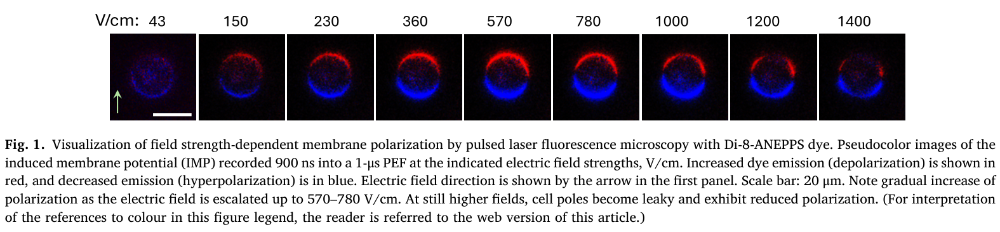
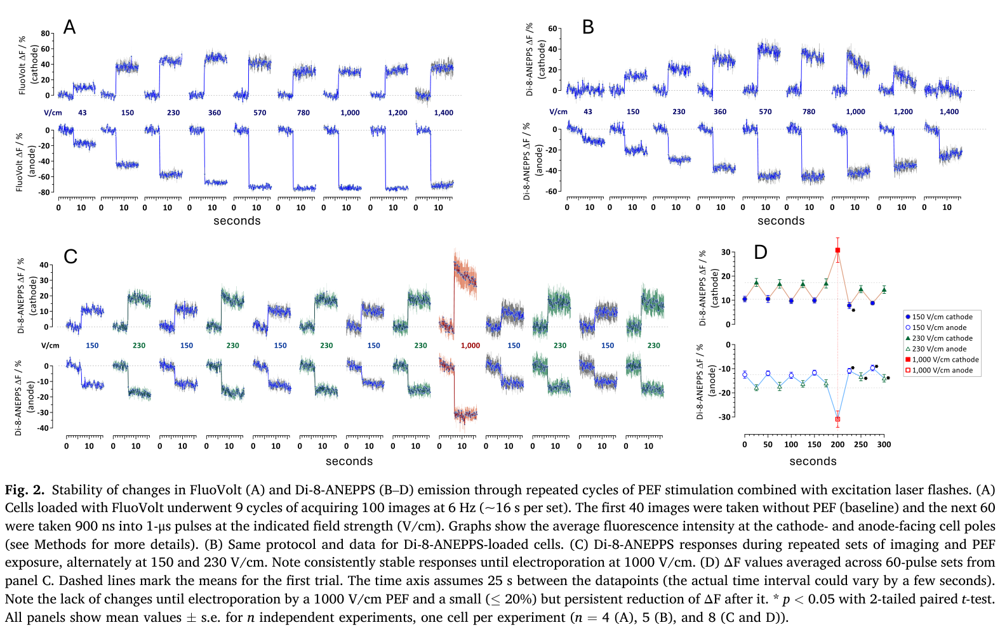
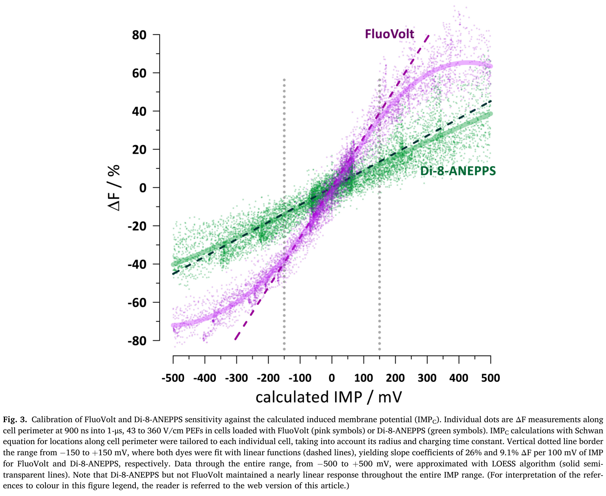
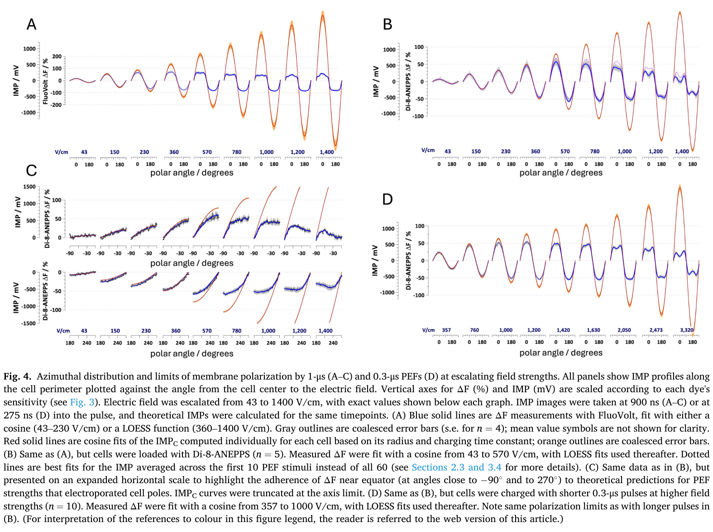
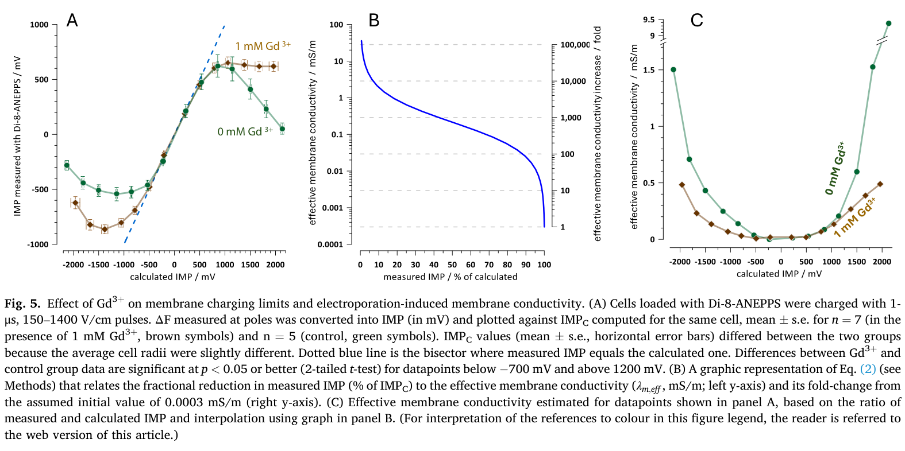
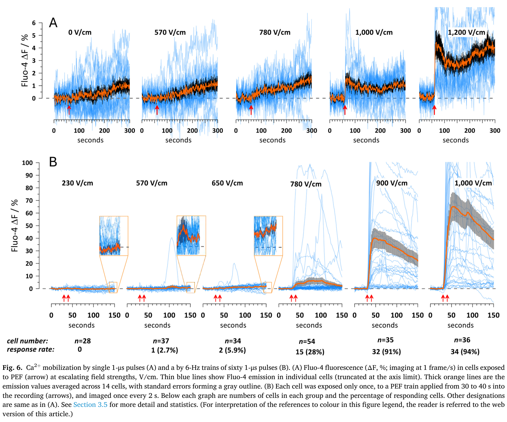
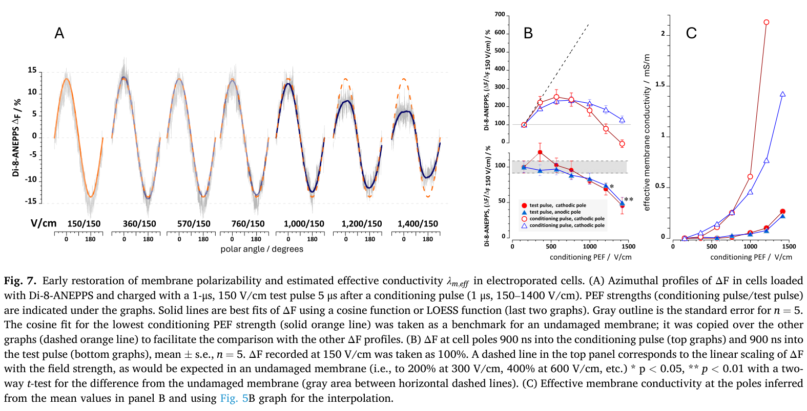

# 论文精读笔记

## 论文信息

- **标题**：Sub-microsecond optical measurements of cell membrane charging and lesioning by pulsed electric fields
- **作者**：Iurii Semenov, Giedre Silkuniene, Mantas Silkunas, Olga N. Pakhomova, Joel N. Bixler, Bennett L. Ibey, Peter Kochunov, Andrei G. Pakhomov*
- **单位**：Frank Reidy Research Center for Bioelectrics, Old Dominion University; Air Force Office of Scientific Research; University of Texas Health Science Center
- **通讯作者**：Andrei G. Pakhomov (2andrei@pakhomov.net, apakhomo@odu.edu)
- **期刊**：Bioelectrochemistry 171 (2026) 109283
- **DOI**：[10.1016/j.bioelechem.2026.109283](https://doi.org/10.1016/j.bioelechem.2026.109283)
- **收稿/接收**：2025-12-09 / 2026-03-14
- **在线发表**：2026-03-15

### 本地文件

- `Bioelectrochemistry - 2026 - Semenov - Sub-microsecond optical measurements of cell membrane charging and lesioning by pulsed electric fields.pdf`：原文 PDF

---

## 一、这篇文章在问什么问题

**核心问题**：当我们用脉冲电场（PEF）刺激细胞时，细胞膜到底充电到了多少伏？充电到什么程度会发生电穿孔（electroporation）？电穿孔之后膜电导率怎么变化、恢复有多快？

**为什么值得问**：
- 外加电场在细胞膜上诱导的跨膜电位（induced membrane potential, IMP）是所有生物电效应的起点——无论是神经激活、基因转染、还是电化疗
- 理论上，Schwann 方程可以预测球形细胞上的 IMP 分布：$IMP_C(t) = 1.5 E R \cos\theta (1 - e^{-t/\tau})$
- 但理论预测在高场强下失效，因为电穿孔改变了膜电导率，反过来影响了充电过程
- 以往用 patch clamp 标定荧光染料的方法在高 IMP（>200 mV）下不可行——膜会被击穿
- 因此，**在电穿孔阈值附近及以上**的 IMP 实测数据一直存在很大的不确定性

**一句话概括**：这篇论文用脉冲激光频闪荧光成像，以亚微秒的时间分辨率实测了 CHO 细胞在脉冲电场下的膜充电全过程，标定了两种电位敏感染料（FluoVolt 和 Di-8-ANEPPS）的响应范围和线性极限，确定了电穿孔的 IMP 阈值（~500 mV），并追踪了电穿孔后膜电导率的微秒级恢复动力学。

---

## 二、这篇论文和你的研究的关联

### 2.1 共同的核心问题：外加电场下如何准确测量跨膜电位

你的 IEEE TIM 论文解决的是：在胞外电刺激下，patch clamp 记录的 $V_m$ 被 $V_e$ 污染，需要差分测量 $V_m(t) = V_i(t) - V_e(t)$。

Semenov 这篇论文面对的是同一族问题的另一个切面：当外加电场非常强（几百 V/cm）、脉冲非常短（μs 级）时，patch clamp 根本不可用（会击穿封接、无法跟上），因此他们完全绕开了电生理方法，用**光学成像**直接读取 IMP。

两个工作的共同认识是：**胞外电场 ≠ 0 时，传统的电生理测量面临原理性的困难**。你的方案是"修正电生理"（差分），他们的方案是"换一种物理量来测"（荧光）。

### 2.2 光学方法 vs 电生理方法——互补而非替代

| 维度 | 你的差分 patch clamp | Semenov 的脉冲激光频闪成像 |
|---|---|---|
| 时间分辨率 | ~4 μs（250 kHz 采样） | ~亚微秒（激光闪光时刻可精确控制） |
| 空间分辨率 | 单细胞 | 单细胞亚细胞（沿细胞周长分辨方位角） |
| IMP 范围 | 不受限（但 PCA 伪迹问题） | 受染料动态范围限制（FluoVolt ±200 mV，Di-8-ANEPPS ±500 mV） |
| 适用制备 | 脑片中的神经元 | 培养的球形细胞（CHO） |
| 电场强度 | μA-mA（~几 V/cm） | 几十到上千 V/cm |
| 能否追踪动作电位 | 能 | 这篇文章的条件不行（CHO 无兴奋性） |
| 核心优势 | 绝对电压值、高信噪比 | 无接触、无 back-action、空间分布信息 |

**关键洞察**：这篇论文和 Lesperance 2018 形成了一个有趣的对照。Lesperance 用 VSD（FluoVolt）作为**验证手段**来证明 patch clamp 有伪迹；Semenov 把 VSD 作为**主要测量手段**，然后花了大量篇幅去标定 VSD 本身的可靠性和局限性。对你来说，这两篇论文合在一起，提供了一幅完整的图景：如果你将来需要**独立验证**你的差分 patch clamp 结果，VSD 是最佳候选手段，但你需要知道它的线性范围在哪里。

### 2.3 Schwann 方程——你应该知道的基本理论框架

这篇论文反复使用的 Schwann 方程：

$$IMP_C(t) = 1.5 \cdot E \cdot R \cdot \cos\theta \cdot (1 - e^{-t/\tau})$$

其中 $E$ 是外加电场强度，$R$ 是细胞半径，$\theta$ 是相对于电场方向的方位角，$\tau$ 是膜充电时间常数。

这个方程假设：
- 细胞是球形的
- 膜未被电穿孔（电导率不变）
- 胞外和胞内电导率均匀

在你的实验中，虽然脑片中的神经元远非球形，但这个方程仍然提供了一个有用的估算框架。对于一个典型的皮层神经元（soma 直径 ~20 μm），在 1 mA 刺激、电极距离 ~200 μm 的条件下，$V_e$ 大约在几百 μV 到几 mV 量级——远低于电穿孔阈值。但这个方程帮你理解了一个关键点：**IMP 和细胞尺寸成正比**。轴突（直径 ~1 μm）感受到的 IMP 远小于胞体（直径 ~20 μm），这也是为什么你的脑片实验中很少需要担心电穿孔。

---

## 三、实验设计与结果逐层拆解

### 第一层：方法学基础——脉冲激光频闪荧光成像（Methods + Fig. 1）

**做了什么**：
- 球形 CHO-K1 细胞（无电压门控离子通道），装载 FluoVolt 或 Di-8-ANEPPS
- 0.3 μs 或 1 μs 矩形单极 PEF，场强 43-1400 V/cm
- 脉冲激光闪光在 PEF onset 后特定延迟时刻（如 275 ns 或 900 ns）触发，单次曝光捕获一幅 IMP 图像
- 重复 100 次取平均以压低噪声

**为什么用 CHO 细胞**：
球形 + 无离子通道 = 纯电容性充电，IMP 可以用 Schwann 方程精确预测。这使得他们可以把理论预测作为"参考标准"来标定染料响应。这和你用 bare electrode 响应作为参考标准来标定电极电容的思路是**完全类似的**。

**Figure 1 关键观察**：
- 低场强（43-570 V/cm）：膜极化随场强线性增大，阳极面去极化（红），阴极面超极化（蓝），完美的偶极子分布
- 高场强（780 V/cm）：阴极极的极化开始饱和，出现"暗化"
- 更高场强（1000-1400 V/cm）：两极都变暗，但极区附近的赤道区域反而开始极化 → 电穿孔后膜漏了，电荷从极点跑掉

> **Fig. 1 — Visualization of field strength-dependent membrane polarization by pulsed laser fluorescence microscopy with Di-8-ANEPPS**
> 1 μs PEF onset 后 900 ns 拍摄的 IMP 伪彩色图像。红色 = 去极化（阴极面），蓝色 = 超极化（阳极面）。随场强从 43 V/cm 升至 570-780 V/cm，极化线性增大；780 V/cm 以上，极区变暗（膜漏电），赤道区域反而出现极化。比例尺 20 μm。

### 第二层：染料稳定性与重复测量的可靠性（Fig. 2）

**核心问题**：反复的 PEF + 激光闪光会不会改变染料响应？

**结果**：
- 非电穿孔强度（≤570 V/cm）：FluoVolt 和 Di-8-ANEPPS 在 800+ 次脉冲和 480 次激光闪光后，响应保持稳定
- 电穿孔强度（1000 V/cm）：Di-8-ANEPPS 的 ΔF 在重复刺激后逐渐下降 ~20%，提示膜损伤有累积效应
- FluoVolt 在电穿孔强度下没有明显衰减——但这可能是因为 FluoVolt 已经饱和了，而不是因为它更稳定

**对你的启示**：如果你将来考虑用 VSD 验证差分 patch clamp，这个稳定性数据告诉你：在你的刺激条件下（远低于电穿孔阈值），VSD 的重复测量是可靠的。

> **Fig. 2 — Stability of FluoVolt and Di-8-ANEPPS emission through repeated PEF + laser flash cycles**
> **(A)** FluoVolt 在 9 轮 PEF 刺激（43-1400 V/cm）中的荧光变化，阴极面和阳极面分别追踪。在非电穿孔场强下信号稳定。
> **(B)** Di-8-ANEPPS 同样协议的数据，信号随场强升高而增加直到 570 V/cm；780 V/cm 以上出现衰减。
> **(C)** Di-8-ANEPPS 在 150 和 230 V/cm 交替重复刺激下响应完全稳定，但 1000 V/cm 时信号逐渐下降。
> **(D)** 60-pulse set 平均后的 ΔF 变化：电穿孔后 ΔF 下降约 20%，提示膜损伤有累积效应。

### 第三层：两种染料的标定——核心定量结果（Fig. 3）

**这是全文方法学贡献的核心。**

**做了什么**：
- 沿细胞周长测量每个位置的 ΔF，对应的 IMP 用 Schwann 方程计算（考虑了每个细胞的半径和充电时间常数）
- ΔF vs IMP 绘制标定曲线

**结果**：
- **FluoVolt**：灵敏度高（26% ΔF/100 mV IMP），但在 ±200 mV 处已经偏离线性，±255 mV / -320 mV 处饱和
- **Di-8-ANEPPS**：灵敏度低（9.1% ΔF/100 mV IMP），但线性范围宽得多，从 -500 mV 到 +550 mV 仍基本线性

**关键认识**：
FluoVolt 的"早期饱和"不是因为膜坏了——用 Gd³⁺ 稳定膜后（Fig. 5A），IMP 可以充到 -850 mV 而 Di-8-ANEPPS 仍然线性，但 FluoVolt 在 ±200 mV 就已经到顶了。所以 FluoVolt 的饱和是**染料本身的动态范围限制**，不是电穿孔造成的假象。

回忆 Lesperance 2018：他们用的正好是 FluoVolt。在那篇论文的实验条件下（mA 级刺激、几 mV 的 IMP），FluoVolt 工作在其线性范围的中心，完全没问题。但如果有人想用 FluoVolt 来测更强刺激下的 IMP，就需要 Semenov 这篇论文的标定数据来判断是否已经饱和。

> **Fig. 3 — Calibration of FluoVolt and Di-8-ANEPPS sensitivity vs. calculated IMP**
> 沿细胞周长每个位置的 ΔF 对理论 IMP（Schwann 方程）的标定曲线。粉色点 = FluoVolt，绿色点 = Di-8-ANEPPS。虚线 = 线性拟合（-150 到 +150 mV），实线 = LOESS 平滑。FluoVolt 灵敏度 26% ΔF/100 mV 但在 ±200 mV 饱和；Di-8-ANEPPS 灵敏度 9.1% ΔF/100 mV 但线性范围宽至 ±500 mV。

### 第四层：方位角分布与电穿孔的空间特征（Fig. 4）

**做了什么**：
- 沿细胞周长 360° 分辨 IMP 分布
- 对比 1 μs 和 0.3 μs PEF
- 用理论 Schwann 方程的余弦分布作为参考

**结果**：
- 低场强（43-360 V/cm）：实测 IMP 完美符合余弦分布（= Schwann 方程预测）
- 570 V/cm（1 μs PEF）：阴极极开始偏离余弦 → 电穿孔开始
- 780 V/cm 以上：两极都偏离，但阴极极偏离更严重
- 赤道区域始终符合余弦 → 电穿孔主要发生在极点

**电穿孔的不对称性**——阴极极更容易穿孔：
- 阴极面：膜去极化 → IMP 为正 → 膜外正、膜内负被反转
- 阳极面：膜超极化 → IMP 为负 → 增强了膜的正常极性
- 实验观察到阴极面的 IMP 饱和更早、衰减更快 → 阴极面电穿孔更严重

这个不对称性和你在 TIM 论文中讨论的极性效应有概念上的联系。你的实验中，刺激电极的极性会影响靠近的细胞是被去极化还是超极化。虽然你的刺激强度远不到电穿孔，但极性依赖的响应差异是同一物理机制（Schwann 方程的 cosθ 项）在不同量级下的体现。

> **Fig. 4 — Azimuthal distribution and limits of membrane polarization at escalating field strengths**
> **(A)** FluoVolt 测量的 IMP 方位角分布（1 μs PEF, 900 ns 时刻）。蓝线 = ΔF 数据，红线 = 余弦拟合/LOESS。低场强完美余弦；高场强极区偏离。
> **(B)** Di-8-ANEPPS 同样数据（n=5），在 570 V/cm 阴极极开始偏离理论值。虚线 = 前 10 个 PEF 平均。
> **(C)** 面板 B 数据的赤道区域放大。赤道始终符合余弦 → 电穿孔局限于极点。
> **(D)** 0.3 μs PEF（275 ns 时刻）结果：极化极限与 1 μs PEF 相似。

### 第五层：电穿孔阈值的多角度确认

论文用了三种独立手段来确定电穿孔阈值：

| 方法 | 电穿孔起始的场强（1 μs PEF） | 对应的 IMP |
|---|---|---|
| FluoVolt ΔF 饱和 | ~360 V/cm | ~±200 mV（但这是染料极限，非真正阈值） |
| Di-8-ANEPPS ΔF 偏离余弦 | ~570 V/cm | ~500 mV |
| Ca²⁺ 进入 | 780 V/cm（28% 响应率） | ~600 mV |
| Gd³⁺ 条件下 IMP 偏离理论值 | ~700 V/cm | ~500-600 mV |

**综合判断**：电穿孔阈值大约在 500-600 mV IMP，对应 1 μs PEF 的 570-780 V/cm。

> **Fig. 5 — Effect of Gd3+ on membrane charging limits and electroporation-induced membrane conductivity**
> **(A)** 1 mM Gd3+（棕色）vs 对照（绿色）条件下，Di-8-ANEPPS 测量的 IMP 对理论 IMP_C 的关系。Gd3+ 将膜极化极限从 ~-542 mV 扩展到 ~-864 mV，证明 Di-8-ANEPPS 的线性范围未饱和。
> **(B)** 测量 IMP（占理论值百分比）与有效膜电导率 λ_m,eff 及其倍数变化的对应关系。
> **(C)** 对照和 Gd3+ 组的有效膜电导率估计：Gd3+ 将电穿孔引起的电导率增加降低了 2-3 倍。

> **Fig. 6 — Ca2+ mobilization by single and repeated 1 us PEFs**
> **(A)** 单个 1 μs PEF（箭头处施加）在不同场强下的 Fluo-4 荧光变化。蓝线 = 单细胞，橙线 = 均值。1000 V/cm 以上出现明显 Ca2+ 信号。
> **(B)** 60 个 1 μs PEF（6 Hz）脉冲串在不同场强下的 Ca2+ 响应。每个细胞仅测一次。响应率从 230 V/cm 的 0% 逐步上升到 1000 V/cm 的 94%，780 V/cm 时为 28%。Ca2+ 内流确认电穿孔阈值在 650-780 V/cm（~500-600 mV IMP）。

### 第六层：电穿孔后膜电导率的微秒级恢复（Fig. 7）

**这是时间分辨率方面最 impressive 的结果。**

**做了什么**：
- 双脉冲方案：先一个 conditioning pulse（1 μs，150-1400 V/cm），间隔 5 μs 后，再一个弱 test pulse（150 V/cm）
- 用 test pulse 时的 Di-8-ANEPPS ΔF 来探测膜此刻的极化能力

**结果**：
- 570-760 V/cm conditioning：test pulse 时的极化完全恢复（6 μs 内）→ 轻度电穿孔是**完全可逆的**
- 1000 V/cm conditioning：test pulse 极化降至 ~80% → 部分恢复
- 1200-1400 V/cm conditioning：test pulse 极化降至 ~50% 以下 → 严重、持续的膜损伤

**膜电导率变化的时间尺度**：
- 电穿孔发生：~纳秒级（一旦 IMP 达到阈值，孔隙几乎瞬间形成）
- 轻度电穿孔恢复：~6 μs（within the accuracy of measurement）
- 严重电穿孔：有效电导率上升 10 倍，恢复不完全

> **Fig. 7 — Early restoration of membrane polarizability and estimated effective conductivity after electroporation**
> **(A)** 双脉冲方案的方位角 ΔF 分布：conditioning pulse（1 μs, 150-1400 V/cm）后 5 μs 施加 test pulse（150 V/cm）。灰色轮廓 = 标准误差。实线 = 余弦/LOESS 拟合。最低场强（150 V/cm）的余弦曲线复制到其他面板作为未损伤基准。
> **(B)** 极区（±5°）ΔF 对比：conditioning pulse 期间（顶图）vs test pulse 期间（底图）。虚线 = 线性预测。570-760 V/cm 后 test pulse 极化完全恢复；1000 V/cm 后降至 ~80%；1200-1400 V/cm 后降至 ~50%。
> **(C)** 由面板 B 推断的极区有效膜电导率：轻度电穿孔 6 μs 内完全恢复，强电穿孔残余电导率持续升高。

---

## 四、证据链评估

### 强在哪里

1. **方法学的系统性**：不是简单地测一个 IMP 数值，而是先标定染料、验证稳定性、确认理论符合度，然后才用来做生物学测量。这个"先校准再测量"的思路和你在 TIM 论文中用 bare electrode 标定电容补偿的思路完全一致
2. **两种染料交叉验证**：FluoVolt 灵敏但饱和早，Di-8-ANEPPS 不灵敏但线性范围宽。如果只用一种染料，会得出完全不同（且可能错误）的结论
3. **Gd³⁺ 作为关键控制实验**：用 Gd³⁺ 稳定膜来区分"染料饱和"和"膜电穿孔"——这个设计非常巧妙
4. **微秒级时间分辨率**：脉冲激光方法可以在脉冲期间的任意时刻拍照，这是任何电生理方法都无法达到的

### 不够硬的地方

1. **CHO 细胞的局限性**：球形、无离子通道、培养条件——和你的急性脑片中形态复杂、有丰富离子通道的神经元相差甚远。Schwann 方程对球形细胞是精确的，但对真实神经元只能做非常粗略的估计
2. **没有电生理验证**：全文没有 patch clamp 数据作为独立验证。虽然作者引用了之前的 patch clamp 标定工作，但在当前的高场强条件下，patch clamp 确实不可用——这是方法本身的限制，不是实验设计的缺陷
3. **单脉冲或低频重复**：他们的实验主要是单脉冲或 6 Hz 的慢重复。没有探讨 kHz 级重复 PEF 下膜充电/恢复的累积效应（虽然 Fig. 2 涉及了一些重复效应）
4. **温度**：实验在室温（21-23°C）。生理温度下膜流动性更高，电穿孔阈值可能不同

---

## 五、对你的研究的直接影响

### 5.1 IMP 估算——你的实验条件下是否需要担心电穿孔

用 Schwann 方程做一个快速估算。你的典型条件：
- 刺激电流 $I$ = 1 mA
- 电极到细胞距离 $r$ ≈ 200 μm
- bath 电导率 $\sigma$ ≈ 1.6 S/m
- 点电流源模型：$E \approx I / (4\pi\sigma r^2) \approx 1\times10^{-3} / (4\pi \times 1.6 \times (200\times10^{-6})^2) \approx 1240$ V/m = **12.4 V/cm**

对一个 soma 半径 $R$ = 10 μm 的神经元：

$$IMP_{max} = 1.5 \times 12.4 \times 10 \times 10^{-4} = 0.019 \text{ V} = 19 \text{ mV}$$

这远低于电穿孔阈值（500 mV）。即使把电极靠到 50 μm：$E$ ≈ 200 V/cm，$IMP_{max}$ ≈ 0.3 V = 300 mV——仍然在安全范围内，但已经接近 FluoVolt 的饱和区。

**结论**：在你当前的实验条件下，电穿孔不是问题。但如果将来需要加大刺激强度或缩短电极距离，这篇论文的 IMP 阈值数据提供了一个定量的安全边界。

### 5.2 如果你将来需要光学验证差分测量

这篇论文给了你一份详细的染料选型指南：

- **你的 IMP 范围**（几 mV 到几十 mV）→ **选 FluoVolt**。灵敏度高（26% ΔF/100 mV），在你的 IMP 范围内完全线性
- 不要选 Di-8-ANEPPS 做低 IMP 测量：灵敏度只有 9.1%/100 mV，在 ±20 mV 范围内信噪比太差
- Lesperance 2018 用 FluoVolt 验证 patch clamp 伪迹，效果很好——这和你的 IMP 量级匹配

### 5.3 两篇论文 + 你的工作 = 一个完整的方法学图景

把 Semenov、Lesperance 和你的 TIM 论文放在一起，覆盖了胞外电场下膜电位测量的三个关键场景：

| 场景 | 核心挑战 | 解决方案 | 参考 |
|---|---|---|---|
| 弱 EFS + patch clamp (PCA) | PCA 反馈环路注入伪迹电流 | 换用 VFA | Lesperance 2018 |
| 弱 EFS + patch clamp (VFA) | $V_e$ 叠加在记录信号上 | 差分测量 $V_m = V_i - V_e$ | **你的 TIM 论文** |
| 强 PEF（>100 V/cm） | patch clamp 不可用 | 光学成像（VSD） | Semenov 2026 |

这三个方案不是互相竞争的，而是覆盖不同参数空间的互补方案。

### 5.4 膜充电时间常数——和你的脉宽设计相关

Semenov 测量的 CHO 细胞膜充电 $\tau$ ~纳秒到亚微秒级（精确值取决于细胞大小，对 $R$ = 8 μm 的 CHO 细胞约 0.5-1 μs）。

对于你实验中的神经元（soma $R$ ≈ 10 μm），$\tau$ 量级类似但会受树突和轴突的影响。这意味着：
- 你常用的 **100 μs 脉宽** >> $\tau$ → 膜充电早已达到稳态，IMP 由稳态 Schwann 方程决定
- 如果你用 **<1 μs 的超短脉冲** → 膜来不及充满，IMP 低于稳态预测值

这和你在 TIM 论文中做脉宽扫描实验时看到的短脉冲响应减小的趋势是一致的。

---

## 六、待讨论的问题

1. **你的实验中 IMP 到底有多大？** 上面用点电流源模型做了粗估（~19 mV at 200 μm, 1 mA）。你的 3D 模型可以给出更精确的值。如果 IMP 和动作电位阈值（~20-30 mV above rest）在同一量级，那 IMP 本身就足以触发 spiking——这正是你的差分测量想要精确量化的。

2. **光学方法在脑片上的可行性**：Semenov 用的是单层培养的球形细胞，光路清晰。你的急性脑片是 300 μm 厚的散射组织，VSD 成像的信噪比会差很多。如果你考虑做光学验证，可能需要用共聚焦或双光子而非宽场荧光。Lesperance 在脑片上用 FluoVolt 做到了，但他们的信噪比也不高。

3. **电穿孔作为安全边界**：你的刺激电极有时会出现电解和产气现象（尤其是大电流刺激时）。Semenov 的数据提醒你：在电极尖端附近（距离 <50 μm），场强可以达到几百 V/cm，靠近电极的细胞有可能被电穿孔。这可能是你观察到的一些"强刺激下细胞失活"现象的原因之一。

4. **Schwann 方程的极性依赖 vs 你的极性实验**：Schwann 方程的 cosθ 项决定了阳极面去极化、阴极面超极化。在你的实验中，当你翻转刺激极性时看到的不同响应，本质上就是被记录细胞在电场中的方位角发生了 180° 翻转。这篇论文的 Fig. 4 提供了最直观的视觉化。

5. **和 Lesperance 论文的联动思考**：Lesperance 用 VSD 证明 patch clamp 有伪迹；Semenov 用类似的 VSD 做独立的 IMP 测量但发现了染料本身的局限。这两篇论文合在一起，给出了一个重要的方法学教训：**没有完美的测量工具，每种方法都有其线性范围和伪迹来源。关键是理解每种工具的适用边界，并用多种独立方法交叉验证。** 这也是你在 TIM 论文中反复强调的——差分测量不是因为 patch clamp "不好"，而是因为在 EFS 条件下需要额外的步骤才能得到正确的 $V_m$。

6. **你最想深入讨论的方向是什么？** 比如：(a) 这篇论文的 Schwann 方程估算方法能否直接应用于你的 3D 点电流源模型来预测脑片中特定位置的 IMP？(b) 你是否有兴趣在实验中引入 VSD 作为差分测量的独立验证手段？(c) 电穿孔的安全边界对你的最大刺激强度选择有没有实际意义？
