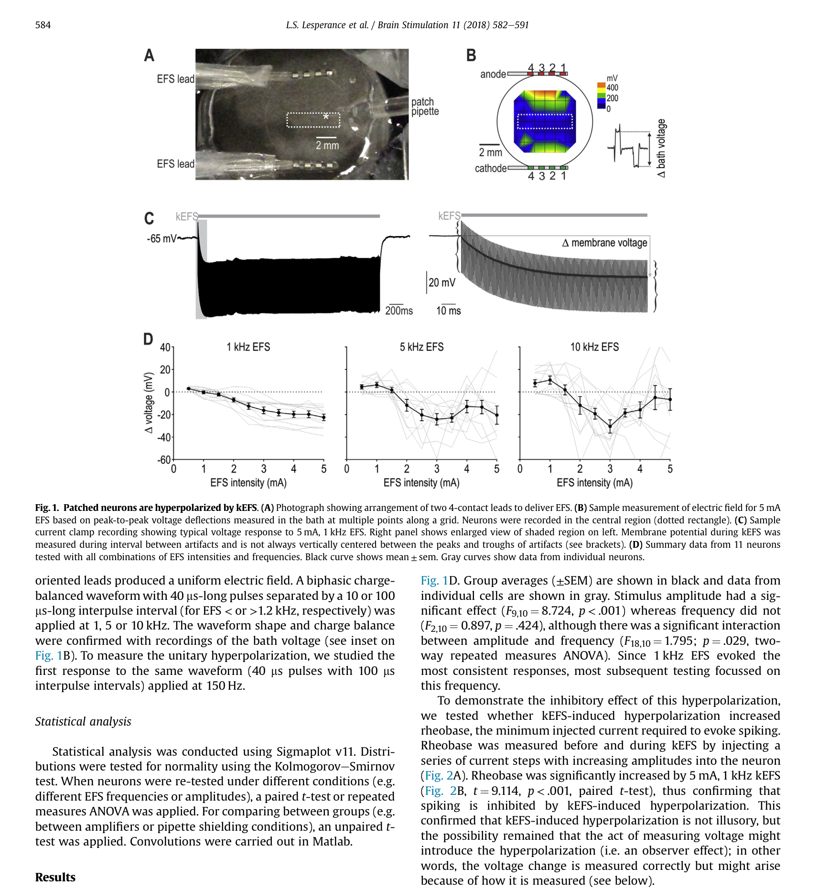
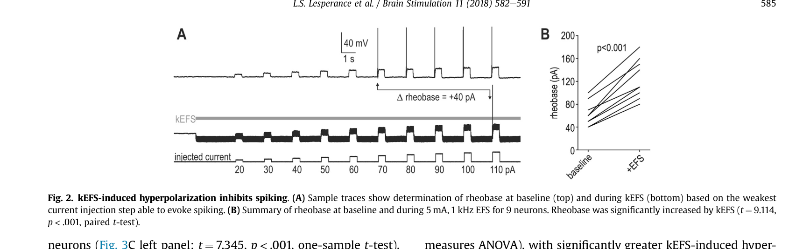
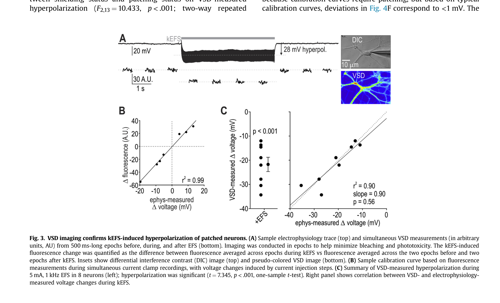
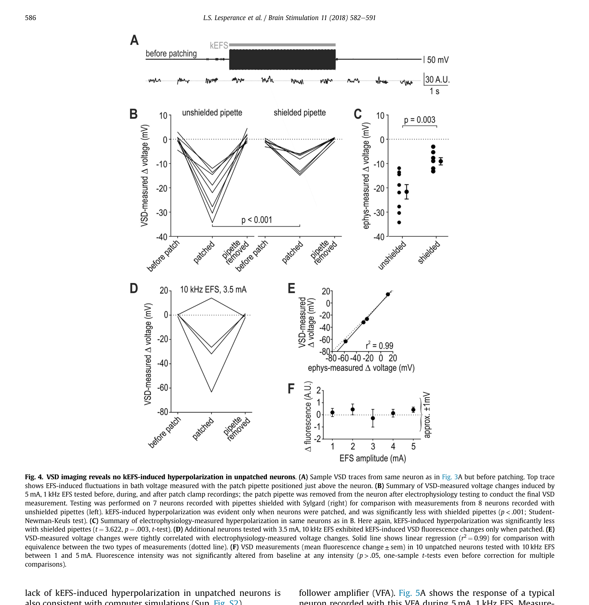
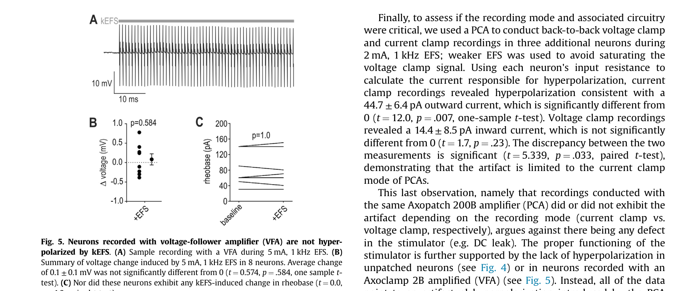
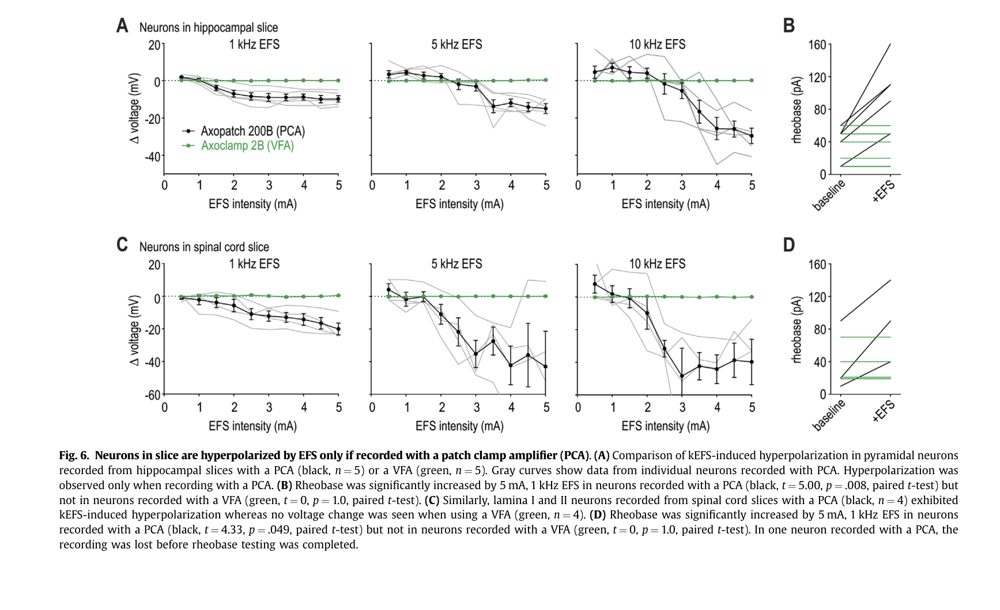
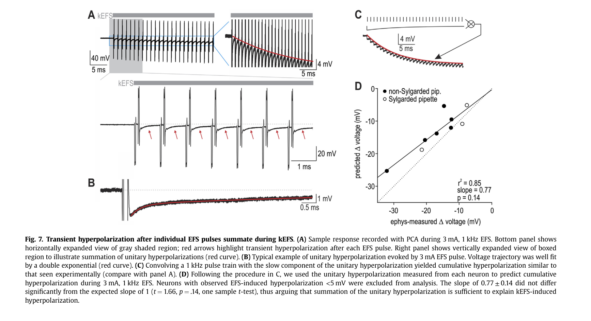
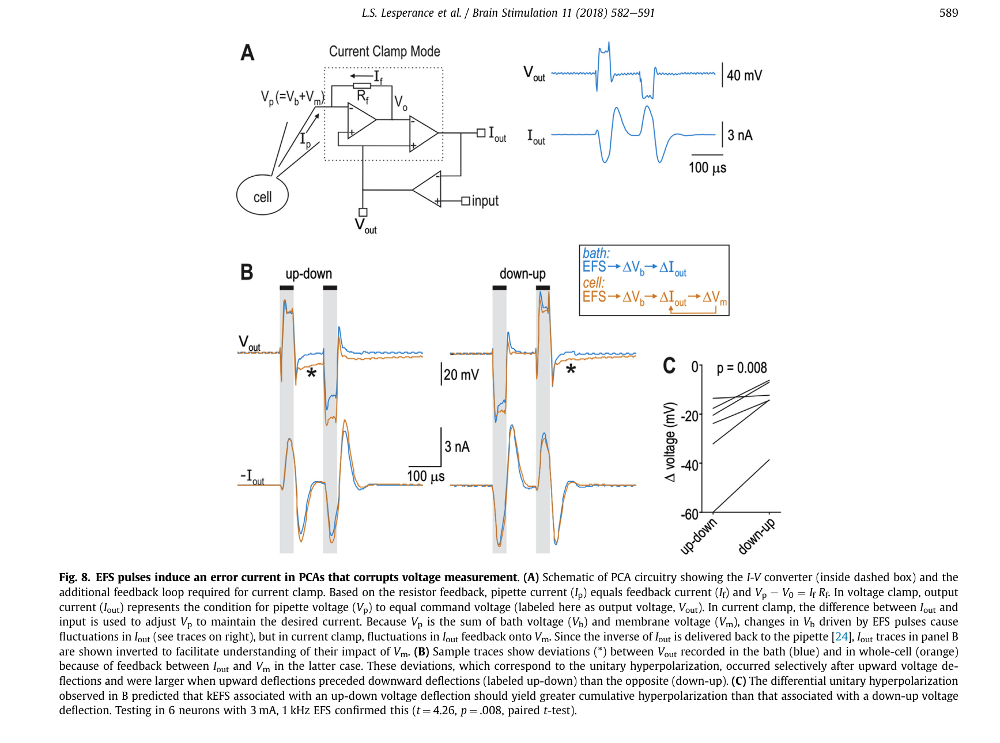

# 论文精读笔记

## 论文信息

- **标题**：Artifactual hyperpolarization during extracellular electrical stimulation: Proposed mechanism of high-rate neuromodulation disproved
- **作者**：L. Stephen Lesperance, Milad Lankarany, Tianhe C. Zhang, Rosana Esteller, Stephanie Ratte, Steven A. Prescott*
- **单位**：The Hospital for Sick Children, Toronto; University of Toronto (Physiology & BME); Boston Scientific Neuromodulation, Valencia, CA
- **通讯作者**：Steven A. Prescott (steve.prescott@sickkids.ca)
- **期刊**：Brain Stimulation 11 (2018) 582-591
- **DOI**：[10.1016/j.brs.2017.12.004](https://doi.org/10.1016/j.brs.2017.12.004)
- **收稿/接收**：2017-09-22 / 2017-12-11
- **许可**：CC BY-NC-ND 4.0

### 来源链接

- [ScienceDirect](https://www.sciencedirect.com/science/article/pii/S1935861X17310203)
- [DOI](https://doi.org/10.1016/j.brs.2017.12.004)

### 本地文件

- `Brain Stimulation - 2018 - Lesperance - Artifactual hyperpolarization during extracellular electrical stimulation.pdf`：原文 PDF

---

## 一、这篇文章在问什么问题

**核心问题**：之前有人报道千赫兹频率胞外电刺激（kEFS）能使脊髓神经元超极化，从而提出了一种高频脊髓电刺激（SCS）镇痛的新机制——这个超极化到底是真实的生理效应，还是 patch clamp 记录的伪迹？

**为什么值得问**：
- 高频 SCS（1-10 kHz）已经在临床上用于治疗慢性疼痛，但机制不清楚
- Lee et al. [21] 用 patch clamp 发现 kEFS 使神经元超极化，提出这是一种全新的"直接抑制"机制
- 如果这是真的，那将是电刺激领域的 paradigm shift——胞外电场直接引起超极化，绕过了传统的突触机制
- 但这个发现和理论预测（胞外刺激应该引起去极化）以及神经阻滞实验的结果相矛盾
- **Patch clamp amplifier 在胞外电刺激条件下的伪迹问题，早有报道但从未在 EFS 条件下被系统检验过**

**一句话概括**：这篇论文证明了 kEFS 引起的"超极化"是 patch clamp amplifier (PCA) 在 current clamp 模式下的伪迹，从根本上否定了基于此观察提出的高频 SCS 镇痛机制。

---

## 二、这篇论文和你的研究直接相关

### 2.1 你应该注意到的第一件事

**这篇论文处理的核心问题，和你的 IEEE TIM 论文处理的是同一族问题的不同切面。**

你的工作：$V_m = V_i - V_e$，在胞外电刺激下 $V_e \neq 0$，所以必须做差分测量才能得到真正的 $V_m$。

这篇论文的发现：PCA 在 current clamp 模式下，pipette voltage $V_p = V_b + V_m$，其中 $V_b$ 是 bath voltage。EFS 改变了 $V_b$，PCA 的反馈环路把 $V_b$ 的变化错误地转换成了注入细胞的电流，从而 **人为改变了真实的 $V_m$**。

两者的共同根源是：**胞外电场不为零时，测量系统无法正确分离胞内和胞外信号。**

但关键区别在于：
- 你处理的是 **observer effect**（测量不准，但不改变被测量）的一部分——虽然你的框架也涉及到差分后才能得到真正的 Vm
- 这篇论文揭示的是更严重的 **measurement-induced perturbation**——PCA 不仅测不准，还会主动注入伪迹电流，**真的改变了细胞的膜电位**

### 2.2 等效电路视角——用你最熟悉的语言理解这篇论文

这篇论文的 Figure 8A 是理解全文的钥匙。让我用你熟悉的等效电路语言来翻译：

**PCA Current Clamp 模式的工作原理**：
- PCA 的核心是一个 I-V 转换器（voltage clamp 的基础）
- Current clamp 是在 voltage clamp 基础上加一个正反馈环路实现的
- 在 current clamp 下，PCA 输出 $V_{out}$，而 $I_{out}$（反馈电流）被送回 pipette

**正常情况（无 EFS）**：
- $V_p = V_m$（因为 $V_b \approx 0$）
- PCA 正确追踪 $V_m$

**EFS 条件下**：
- $V_p = V_b + V_m$
- EFS 改变 $V_b$ → $V_p$ 波动 → PCA 的 $I_{out}$ 波动
- **关键**：$V_b$ 的变化对 bath 来说是 mA 级电流中的微小扰动，但 $I_{out}$ 的波动直接注入细胞（pA 级即可显著改变 $V_m$）
- 结果：PCA 把 bath voltage 的波动"放大"并注入细胞，人为改变了 $V_m$

这和你在 TIM 论文中讨论的 $V_e$ 污染问题，在物理本质上是耦合的：
- 你的问题：$V_e$ 叠加在记录信号上，需要差分去除
- 这篇论文的问题：$V_e$（= $V_b$）不仅叠加在信号上，还通过 PCA 反馈环路被转换成了伪迹电流

### 2.3 为什么 VFA（voltage-follower amplifier）没有这个问题

Axoclamp 2B 作为 VFA 工作时：
- 它是真正的 voltage follower，$V_{out} = V_p = V_b + V_m$
- 虽然输出也包含 $V_b$ 的成分（和你的 TIM 问题一样），但它**不会把 $V_b$ 的变化转换成注入细胞的电流**
- 所以 VFA 记录到的 $V_m$ 虽然包含 $V_b$ 的叠加（observer effect），但不会 **改变** 真实的 $V_m$（no perturbation）

这个区别在你的框架下可以这样理解：

| | PCA (current clamp) | VFA |
|---|---|---|
| 输出信号 | $V_{out} = V_b + V_m + \text{artifact}$ | $V_{out} = V_b + V_m$ |
| 对真实 $V_m$ 的影响 | **改变了** $V_m$（注入伪迹电流） | **不改变** $V_m$ |
| 你的差分能否修正 | 差分只能去掉 $V_b$ 叠加，但被注入的伪迹电流已经改变了真实的 $V_m$，**不可逆** | 差分可以完全去掉 $V_b$，得到真实的 $V_m$ |

**这是一个非常重要的认识**：你的差分测量方法在 VFA 条件下是完备的解决方案，但在 PCA current clamp 条件下，即使做了差分，也无法消除伪迹电流对 $V_m$ 本身造成的扰动。

---

## 三、实验设计与结果逐层拆解

### 第一层：建立现象——kEFS 确实在 patch clamp 记录中引起超极化（Figure 1-2）

**做了什么**：
- 培养海马神经元，whole-cell current clamp（Axopatch 200B），加 kEFS（1/5/10 kHz，0.5-5 mA）
- 双极性 charge-balanced 波形，40 us 脉冲
- 阻断突触传递（bicuculline, CNQX, D-AP-5）

**结果**：
- Current clamp 记录到稳健的超极化（Fig. 1C），幅度随 EFS 强度增大（Fig. 1D）
- 频率效应不显著，但频率 x 强度有交互作用
- Rheobase 显著增加（Fig. 2B）：从 ~60 pA 升到 ~120 pA → 细胞确实更难激发

> **Fig. 1 — Patched neurons are hyperpolarized by kEFS.**
> **(A)** 双极 EFS 电极在 recording chamber 中的配置照片，patch pipette 位于中央。
> **(B)** 5 mA EFS 在 bath 中产生的电场分布（峰-峰值），神经元位于中央虚线矩形区域。
> **(C)** 5 mA、1 kHz EFS 下 current clamp 记录的典型超极化响应。右侧放大图显示 EFS 期间膜电位在伪迹之间的测量方式。
> **(D)** 11 个神经元在 1/5/10 kHz、0.5-5 mA 所有参数组合下的剂量-响应汇总（黑线为 mean ± sem，灰线为单细胞数据）。幅度效应显著（$p < .001$），频率效应不显著但存在交互作用。

> **Fig. 2 — kEFS-induced hyperpolarization inhibits spiking.**
> **(A)** 基线（上）和 kEFS 期间（下）rheobase 测量的示例 trace。kEFS 期间需要更大的注入电流才能引发 spike。
> **(B)** 9 个神经元在 5 mA、1 kHz EFS 前后的 rheobase 统计。Rheobase 从 ~60 pA 显著增加到 ~120 pA（$t = 9.114$，$p < .001$），说明超极化确实抑制了兴奋性。

**怎么理解**：
到这一步，所有证据都指向"kEFS 确实超极化了神经元"。但作者没有停在这里。rheobase 增加也可以被解释为"PCA 注入了向外的伪迹电流，让细胞在 PCA 眼里看起来更难激发"。

### 第二层：光学方法独立验证——VSD 成像揭示只有被 patch 的细胞才超极化（Figure 3-4）

**这是全文最关键的对照实验。**

**做了什么**：
- 用 FluoVolt VSD 染色，光学测量同一个神经元在 patch 前后的膜电位变化
- 对比：patched vs unpatched；有 pipette vs 去掉 pipette

**结果**（Figure 4，核心图）：
- **Before patching**：VSD 看不到任何超极化（Fig. 4A 上方 trace）
- **After patching**：VSD 和电生理同时看到超极化（Fig. 4B "patched" 条件）
- **Pipette removed**：超极化消失
- **Pipette shielded (Sylgard)**：超极化显著减弱（Fig. 4B 右图，Fig. 4C）

> **Fig. 3 — VSD imaging confirms kEFS-induced hyperpolarization of patched neurons.**
> **(A)** 同时记录的电生理 trace（上）和 VSD 荧光信号（下），证实 patched 神经元在 kEFS 期间确实超极化（~28 mV）。插图为 DIC 和 VSD 伪彩图像。
> **(B)** VSD 荧光变化与电生理测量的电压变化之间的标定曲线（$r^2 = 0.99$），说明两种方法高度一致。
> **(C)** VSD 测量的超极化汇总（左，$p < .001$）及 VSD 与电生理测量值的相关性（右，$r^2 = 0.90$）。

> **Fig. 4 — VSD imaging reveals no kEFS-induced hyperpolarization in unpatched neurons.** ⭐ **全文最关键的对照实验**
> **(A)** 同一个神经元在 patching 之前的 VSD 记录——EFS 不引起任何超极化（上方 trace 为 bath voltage 波动，下方 VSD 信号平坦）。
> **(B)** 同一批神经元在 before patch → patched → pipette removed → patched 各状态下 VSD 测量的电压变化。左图（unshielded pipette）：超极化**仅在 patched 状态出现**（$p < .001$）。右图（shielded pipette）：Sylgard 屏蔽后超极化显著减弱。
> **(C)** Unshielded vs shielded pipette 的电生理测量对比（$p = 0.003$）。
> **(D)** 10 kHz、3.5 mA 条件下的 VSD 测量，同样仅在 patched 时出现超极化。
> **(E)** VSD 与电生理测量值的高相关性（$r^2 = 0.99$）。
> **(F)** 10 个 unpatched 神经元的 VSD 测量——在任何 EFS 强度下均无显著荧光变化（$p > .05$），偏差 < 1 mV。

**怎么理解——这一步的逻辑力量极强**：
- 如果超极化是 EFS 直接引起的生理效应，那无论有没有 pipette，神经元都应该超极化
- 但实验证明：超极化**只在 patching 状态下存在**
- 而且 pipette shielding 能减弱效应 → pipette 作为"天线"拾取电场是问题的一部分
- **这直接否定了 kEFS 直接超极化的假说**

用你的语言：这就好比你在做差分测量时发现，如果拔掉 pipette，$V_e$ 引起的"膜电位变化"完全消失——那你就知道这个"变化"根本不是 $V_m$，而是测量系统引入的。

### 第三层：放大器对比——PCA vs VFA（Figure 5-6）

**做了什么**：
- 同一种实验，换用 Axoclamp 2B（VFA）记录
- 在培养神经元（Fig. 5）和急性切片（海马 + 脊髓，Fig. 6）上都做了

**结果**：
- **VFA 记录：没有超极化**（Fig. 5B，$\Delta V = 0.1 \pm 0.1$ mV，$p = 0.584$）
- **VFA 记录：rheobase 不变**（Fig. 5C，$p = 1.0$）
- 急性海马切片：PCA 有超极化，VFA 没有（Fig. 6A-B）
- 急性脊髓切片：PCA 有超极化，VFA 没有（Fig. 6C-D）
- 同一台 Axopatch 200B，voltage clamp 模式也没有伪迹 → 伪迹特异性地来自 current clamp 模式

> **Fig. 5 — Neurons recorded with voltage-follower amplifier (VFA) are NOT hyperpolarized by kEFS.**
> **(A)** Axoclamp 2B (VFA) 在 5 mA、1 kHz EFS 下的典型记录——**没有超极化**，只有刺激伪迹。
> **(B)** 8 个神经元的电压变化汇总：$\Delta V = 0.1 \pm 0.1$ mV，与零无显著差异（$p = 0.584$）。
> **(C)** Rheobase 在 kEFS 前后无变化（$p = 1.0$）。这与 PCA 记录到的 rheobase 翻倍形成鲜明对比。

> **Fig. 6 — Neurons in slice are hyperpolarized by EFS only if recorded with a PCA.**
> **(A)** 急性海马切片中锥体神经元的 PCA（黑）vs VFA（绿）记录对比。PCA 在所有频率和强度下都记录到超极化，VFA 均无。灰线为 PCA 记录的单细胞数据。
> **(B)** 海马切片 rheobase：PCA 显著增加（$p = .008$），VFA 无变化（$p = 1.0$）。
> **(C)** 急性脊髓切片（lamina I/II 背角神经元）的 PCA vs VFA 对比，结果与海马一致。
> **(D)** 脊髓切片 rheobase：PCA 增加（$p = .049$），VFA 无变化（$p = 1.0$）。
> 这一层结果跨越了培养神经元和两种急性切片制备，排除了细胞类型或实验制备的特异性。

**怎么理解**：
这一步把矛头精确指向了 PCA 的 current clamp 电路。不是 EFS 的问题，不是细胞的问题，不是实验准备的问题——是 **放大器在 current clamp 模式下对 EFS 的响应方式** 造成的。

### 第四层：伪迹的物理机制——每个 EFS 脉冲引起一次 unitary 超极化，kHz 下叠加（Figure 7）

**做了什么**：
- 把时间分辨率拉高，看单个 EFS 脉冲后 PCA 输出的瞬态响应
- 测量 unitary hyperpolarization 的衰减时间常数
- 用卷积模型预测 kHz 重复刺激下的累积超极化

**结果**：
- 每个 biphasic EFS 脉冲后，出现一次小的瞬态超极化（Fig. 7A 红箭头，幅度 ~3 mV）
- 衰减可用双指数拟合：快成分 $\tau \approx 215$ us，慢成分 $\tau \approx 9.19$ ms（Fig. 7B）
- 1 kHz 重复时，慢成分来不及衰减 → 逐个叠加 → 产生 sustained 超极化（Fig. 7C）
- 用单个 unitary response 卷积 1 kHz pulse train 预测的累积超极化，和实验测到的高度一致（Fig. 7D，$r^2 = 0.85$，slope $= 0.77$）

> **Fig. 7 — Transient hyperpolarization after individual EFS pulses summate during kEFS.**
> **(A)** 3 mA、1 kHz EFS 下 PCA 的典型记录。下方面板为灰色区域的水平放大，红色箭头标出每个 EFS 脉冲后的瞬态超极化（unitary hyperpolarization）。右上角为垂直放大，显示 kHz 重复刺激下 unitary 超极化的叠加过程。
> **(B)** 单个 unitary hyperpolarization 的典型波形（红色曲线为双指数拟合）。快成分 $\tau \approx 215\ \mu s$（来不及在 1 ms ISI 内叠加），慢成分 $\tau \approx 9.19\ ms$（足以在 1 kHz 下累积）。
> **(C)** 用 unitary response 卷积 1 kHz pulse train 得到的预测累积超极化轨迹——与实验数据高度相似。
> **(D)** 卷积预测值 vs 实验测量值的相关性（$r^2 = 0.85$，slope $= 0.77$），证明 kHz 累积超极化完全可以由 unitary 响应的线性叠加解释。

**怎么理解**——这是机制拆解的关键：
- 伪迹不是某种 DC leak，而是**每个刺激脉冲驱动的瞬态伪迹的时域叠加**
- 快成分太短（215 us），在 1 kHz（ISI = 1 ms）下叠加不起来
- 慢成分够长（~9 ms），在 1 kHz 下每个脉冲到来时还没衰减完 → 累积
- 这也解释了为什么更高频率（5, 10 kHz）效果更强但变异性更大：叠加更快，但快成分也开始贡献

### 第五层：伪迹的电路解释（Figure 8）

**做了什么**：
- 画出 PCA current clamp 的等效电路（Fig. 8A）
- 预测 unitary hyperpolarization 的不对称性
- 实验验证

**核心逻辑**（Fig. 8A 框图）：
1. EFS 改变 bath voltage $V_b$
2. Bath 中的 pipette 看到的是 $V_p = V_b + V_m$
3. PCA 把 $V_p$ 的变化反馈为 $I_{out}$ 的变化
4. $I_{out}$ 的变化（nA 级）在 bath 中无关紧要，但它经 pipette 注入了细胞
5. 细胞膜电容把 nA 级的瞬态电流积分成 mV 级的 $V_m$ 变化
6. 这个 $V_m$ 变化又被 PCA 看到 → 正反馈 → 不可逆地改变了真实 $V_m$

> **Fig. 8 — EFS pulses induce an error current in PCAs that corrupts voltage measurement.** ⭐ **理解全文的钥匙**
> **(A)** PCA current clamp 模式的等效电路示意图。左侧：虚线框内为 I-V converter（voltage clamp 核心），外部正反馈环路实现 current clamp。$V_p = V_b + V_m$，EFS 改变 $V_b$ → PCA 反馈产生 $I_{out}$ 波动 → 经 pipette 注入细胞 → **物理改变**真实 $V_m$。右侧：EFS 期间 $V_{out}$ 和 $I_{out}$ 的同步记录，证实 EFS 确实驱动了 nA 级的伪迹电流。
> **(B)** Up-down vs down-up 方向 EFS 的 $V_{out}$（蓝/橙）对比。星号（*）标记的位置显示 $V_m$ 被伪迹电流不可逆改变的偏差——偏差在 upward deflection 之后出现，且 up-down 方向更大。中间框图总结了 bath 和 cell 两条信号通路的区别。
> **(C)** Up-down vs down-up 产生的累积超极化差异的统计验证（$p = 0.008$），符合电路模型的定性预测。

**预测与验证**（Fig. 8B-C）：
- Biphasic EFS 的 up-down 和 down-up 两个半相对 PCA 的作用不对称
- Up-down 方向产生的 unitary 超极化更大
- 实验证实（Fig. 8C，$p = 0.008$）

---

## 四、证据链评估

### 强在哪里

1. **多方法交叉验证**：patch clamp + VSD + 两种放大器 + shielding + 计算模型，五条独立证据线指向同一结论
2. **阴性对照设计精妙**：
   - Unpatched neuron + VSD → 无超极化 → 排除 EFS 直接效应
   - VFA → 无超极化 → 定位到 PCA current clamp
   - Shielded pipette → 超极化减弱 → 定位到 pipette 天线效应
   - Same PCA, voltage clamp mode → 无伪迹 → 定位到 current clamp 反馈环路
3. **定量机制闭环**：unitary response → 卷积预测 → 与实验匹配 → 完整解释了从单脉冲到 kHz 累积的伪迹来源
4. **多种制备类型验证**：培养神经元 + 急性海马切片 + 急性脊髓切片 → 伪迹不限于特定细胞类型

### 不够硬的地方

1. **只测了两种放大器**：Axopatch 200B (PCA) 和 Axoclamp 2B (VFA)。虽然作者换了一台不同的 Axopatch 200B 验证了一致性，但没有测试其他品牌的 PCA（如 HEKA EPC-10、AM Systems 2400）。不过作者的电路分析表明这是 PCA current clamp 模式的通病，不是特定仪器的缺陷。

2. **没有定量建模 $I_{out}$ 到 $\Delta V_m$ 的完整传递函数**：Fig. 8 给了定性的电路解释和定性预测（不对称性），但没有用 PCA 的已知参数（$R_f$、带宽等）做定量仿真来预测伪迹的绝对幅度。这在原则上是可以做的。

3. **pipette shielding 的解释不完全自洽**：shielded pipette 减弱但没有完全消除超极化（Fig. 4B-C），说明 pipette 天线效应只是部分原因。作者暗示还有 PCA 电路内部的耦合路径，但没有深入追究。

4. **只做了 in vitro**：作者的结论直接挑战了 Lee et al. [21] 的 in vitro 结果，但没有讨论 in vivo patch clamp 记录是否也会有类似问题（in vivo 的电极配置和接地方式不同）。

---

## 五、对你的研究的直接影响

### 5.1 你的 TIM 论文应该引用这篇文章

理由：
- 你的论文处理的是 $V_e$ 对 patch clamp 测量的干扰
- Lesperance 这篇是**最清晰的实验证据**，证明了 $V_e$（bath voltage）在 EFS 条件下不仅影响测量精度，还可以通过 PCA 反馈环路**物理改变** $V_m$
- 它为你的差分测量方法提供了**额外的 motivation**：不仅要在信号层面去除 $V_e$，还要意识到某些放大器构型下 $V_e$ 会被转换成伪迹电流

### 5.2 你的差分方法和这个伪迹的关系

这是一个微妙但重要的区别：

**你的方法能解决的**：
- $V_e$ 作为加性噪声叠加在记录信号上 → 差分去除 → 得到真实 $V_m$
- 这在 VFA 模式下是完备的

**你的方法不能解决的**：
- PCA current clamp 下，$V_e$ 被转换成了注入细胞的电流 → 真实 $V_m$ 本身被改变了
- 差分只能去掉 $V_e$ 的加性叠加，但无法撤销 PCA 已经注入的伪迹电流
- 这是一个 **measurement-back-action** 问题，不是 **observer effect**

**对你的启示**：
- 如果你用 Axopatch（PCA）做 current clamp + EFS → 你需要 Lesperance 描述的这个伪迹
- 如果你用 Axoclamp（VFA）做 current clamp + EFS → 伪迹消失，但 $V_e$ 叠加仍在，这正是你的差分方法要解决的
- **最佳实践**：用 VFA + 差分测量 = 既避免了 PCA 伪迹，又去除了 $V_e$ 叠加

### 5.3 你用的是哪种放大器？

这是读完这篇论文后你应该立即确认的事情：
- 如果你用的是 Axopatch 200B / MultiClamp 700B 的 current clamp 模式 → 你的 EFS 数据可能受到这个伪迹的影响
- 如果你用的是 Axoclamp 2B / 900A（VFA） → 这个特定伪迹不适用，但 $V_e$ 叠加仍需差分处理

### 5.4 在你的 Discussion 中可以怎样提到这篇文章

一种可能的叙述框架：

> 胞外电刺激下 $V_e \neq 0$ 对 patch clamp 测量的影响有两个层面。第一个层面是信号叠加：$V_e$ 作为公共模信号叠加在记录的膜电位上，导致测量值不等于真实的 $V_m$。我们的差分方法直接解决这个问题。第二个层面更为隐蔽：Lesperance et al. (2018) 证明了在 PCA current clamp 模式下，$V_e$ 的波动会通过放大器反馈环路被转换为注入细胞的伪迹电流，从而**物理改变**真实的 $V_m$。这种 measurement-back-action 不能通过事后的信号处理来消除，只能通过选择合适的放大器构型（如 VFA）来避免。我们的差分测量方法与 VFA 记录模式结合，可以同时解决这两个层面的问题。

---

## 六、待讨论的问题

1. **你用的放大器**：你日常用的是 Axopatch（PCA）还是 Axoclamp（VFA）？如果是 Axopatch，你在 current clamp + EFS 条件下是否观察到过类似的超极化？回头看你的数据，有没有可能部分结果受到了这个伪迹的影响？

2. **伪迹幅度的量级**：这篇论文报道的伪迹在 5 mA、1 kHz 条件下约 -22 mV。你的 EFS 参数（脉宽、频率、强度、电极距离）和他们的相比如何？如果你用的是短脉冲（us 级）而非 kHz 重复刺激，那这个累积叠加效应可能很小。但 unitary 伪迹（单脉冲 ~3 mV）仍然可能在你的数据中存在。

3. **差分方法的边界**：你的 TIM 论文中有没有讨论过差分方法在 PCA vs VFA 条件下的适用性差异？Lesperance 的结果意味着差分方法在 PCA current clamp 下有一个原理性的局限——你是否要在论文中 acknowledge 这一点？

4. **更深层的问题**：PCA 的伪迹本质上是一个"测量改变被测量"的量子测量般的困境。在你的框架下，有没有可能设计一种**既能做 current clamp 又不引入 back-action** 的记录方案？比如用 VFA 做记录但在离线分析中重构等效的 current clamp 数据？

5. **这篇论文对你文章 framing 的影响**：Lesperance 的故事是"测量伪迹导致了错误的机制结论"。你的差分方法是"正确的测量方法才能得到正确的机制信息"。这两个叙事是互补的——你们的论文合在一起讲了一个完整的故事：**在胞外电刺激下做 patch clamp，必须同时注意放大器选型和 $V_e$ 的差分去除。**

6. **你最想搞清楚的一件事是什么？**
