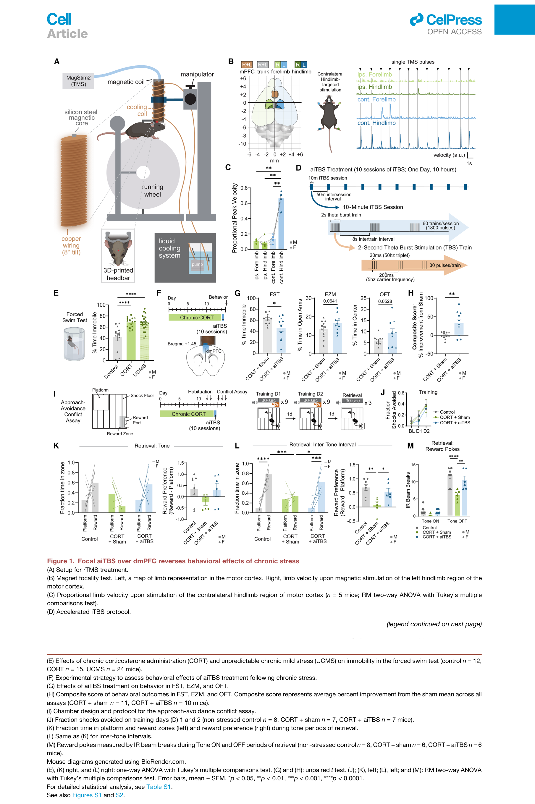
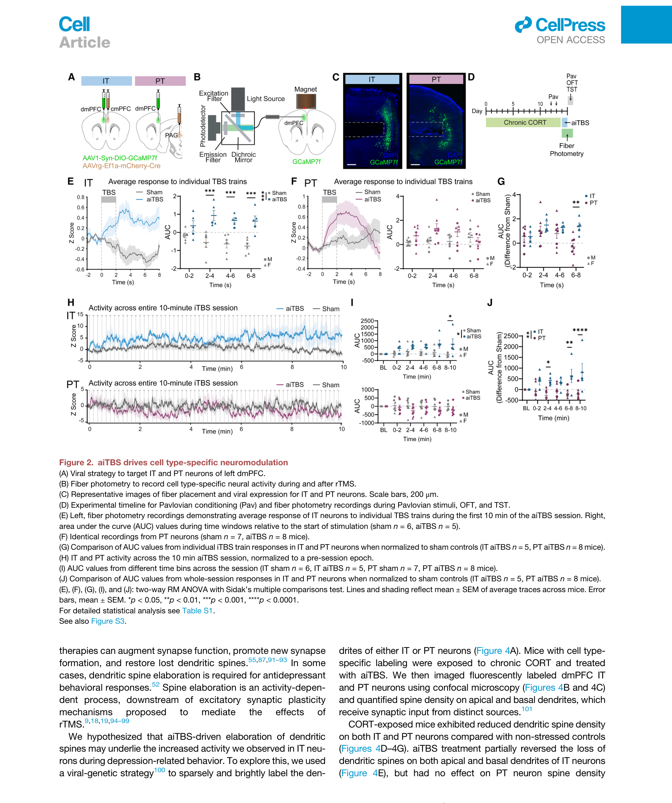
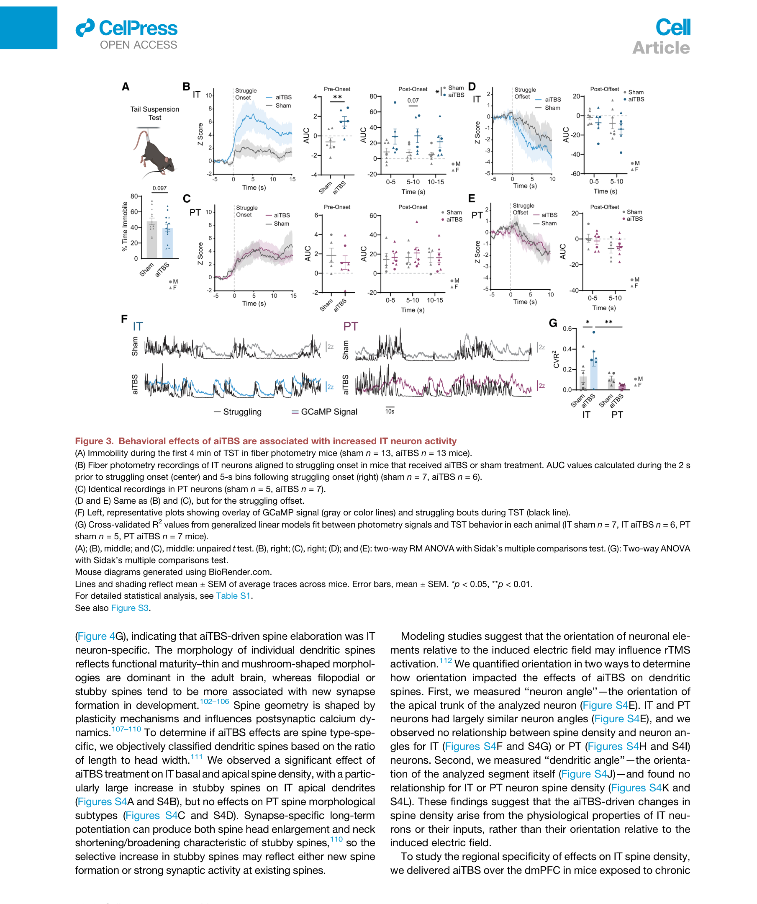
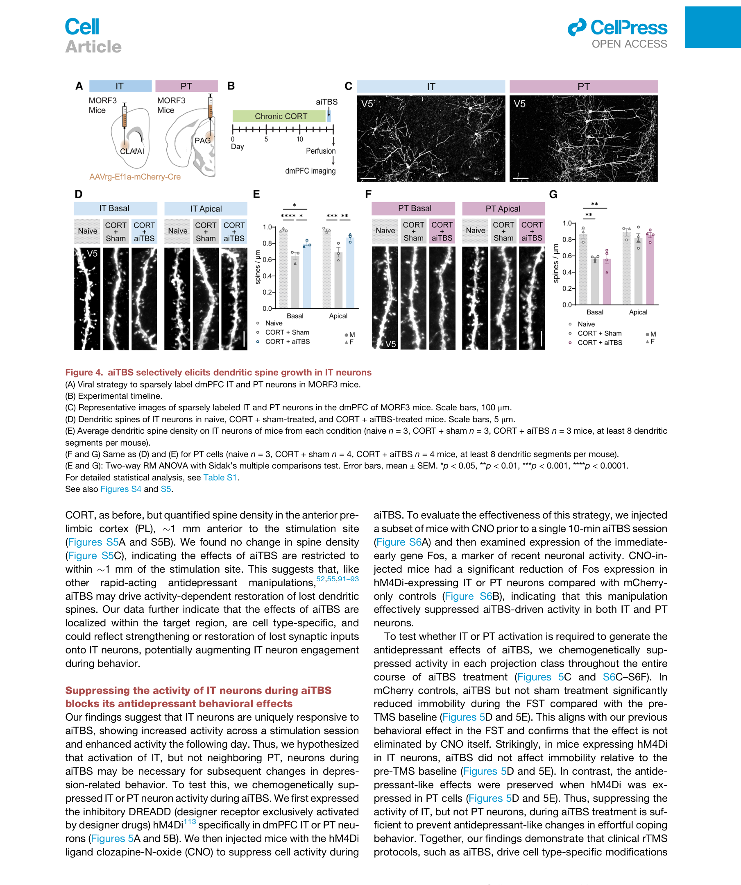
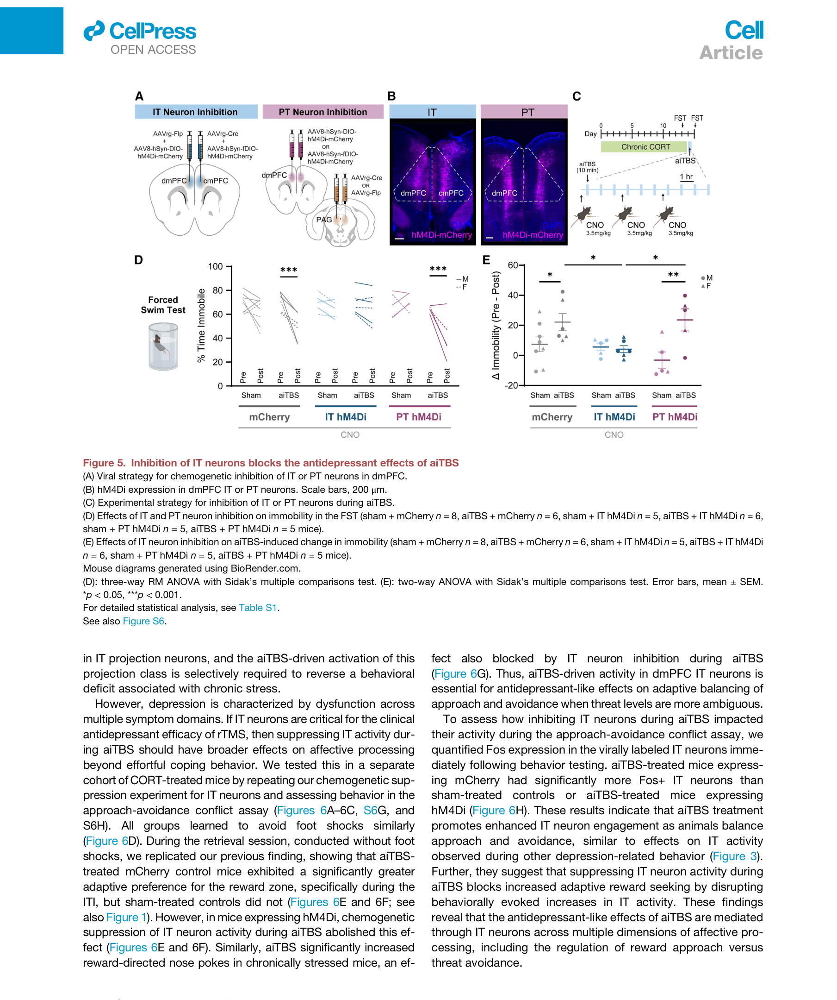
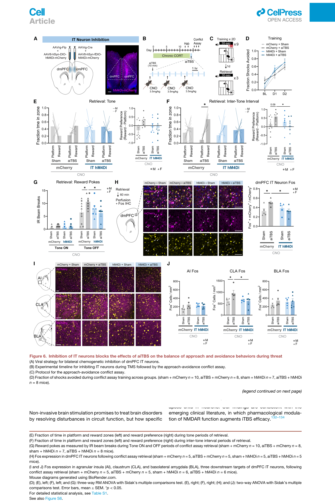
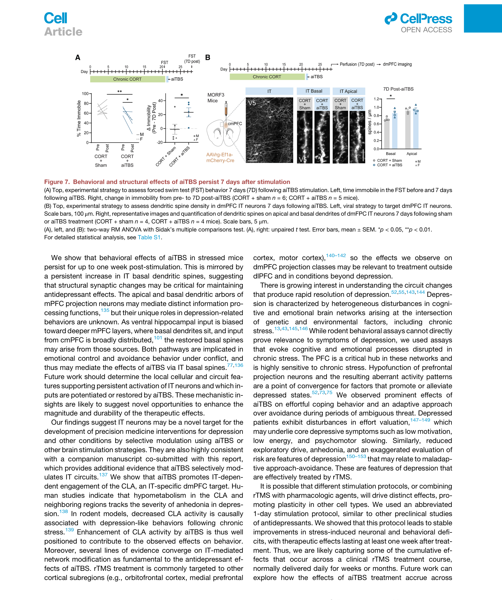

# 论文精读笔记

## 论文信息
- **标题**：A cell type-specific mechanism driving the rapid antidepressant effects of transcranial magnetic stimulation
- **作者**：Michael W. Gongwer, Alex Qi, Alexander S. Enos, Sophia A. Rueda Mora, Sabahaddin Taha Solakoglu, Russell N. Ahmed, Cassandra B. Klune, Meelan Shari, Adrienne Q. Kashay, Owen H. Williams, Aliza Hacking, Jack P. Riley, Gary A. Wilke, Yihong Yang, Hanbing Lu, Andrew F. Leuchter, Laura A. DeNardo\*, Scott A. Wilke\*
- **单位**：UCLA David Geffen School of Medicine (Physiology / Neuroscience Interdepartmental / MSTP / Semel Institute), NIDA-NIH (Neuroimaging Research Branch)
- **通讯作者**：Laura A. DeNardo (ldenardo@ucla.edu)、Scott A. Wilke (swilke@mednet.ucla.edu)
- **期刊**：Cell 189, 3052–3070 (May 14, 2026)
- **DOI**：[10.1016/j.cell.2025.12.040](https://doi.org/10.1016/j.cell.2025.12.040)
- **License**：CC-BY 4.0 Open Access

### 本地文件
- `Cell - 2026 - Gongwer - A cell type-specific mechanism driving the rapid antidepressant effects of transcranial magnetic stimulation.pdf`
- `figures/Fig1.png ... Fig7.png`

---

## 一、这篇文章在问什么问题

**核心问题**：rTMS（重复经颅磁刺激）能在临床上快速缓解抑郁，但它到底是通过**改变了哪种神经元、哪条环路**实现的？过去几十年没人能给出"细胞类型分辨"层面的因果证据。

**为什么值得问**：
- 临床上 rTMS 是 FDA 批准的抑郁治疗手段，但 1/3 患者无应答、机制不清，无法理性优化方案。
- 现有动物模型大多用**麻醉**＋**线圈太大或太弱**，无法重现临床场景（清醒、focal、suprathreshold）。
- 已有研究只证明 rTMS "能引起 LTP/LTD 样可塑性"，但**不知道是哪类细胞**承担了治疗效应。
- PFC 内的兴奋性投射神经元至少分两个大类：IT（intratelencephalic，投射到对侧 PFC、皮层和纹状体）和 PT（pyramidal tract，投射到中脑、桥脑、丘脑），它们的输入、分子谱、功能都不一样——但没人测过 rTMS 对它们的差异性影响。
- 没法做这种实验，主要是**没有一套既能 mimic 临床 rTMS、又能在清醒小鼠脑里做细胞类型分辨的工具**。

**一句话概括**：作者搭了一套清醒小鼠 focal rTMS 系统，用 fiber photometry + 化学遗传 + 稀疏标记证明 aiTBS 抗抑郁效应**只通过 IT 神经元**起作用——是 rTMS 第一个细胞类型分辨的因果机制。

---

## 二、背景知识补充

这篇论文跨度比较大，做的是**在体、行为、群体钙信号、细胞类型环路**，和你做的"离体脑片、单细胞 patch-clamp、电场刺激下的膜电位"差得比较远。先把关键概念用你熟悉的语言翻译一遍。

### 2.1 aiTBS 是什么

**TBS = Theta Burst Stimulation**：把磁脉冲组织成"5 Hz 重复出现的 3 脉冲爆发（50 Hz 簇内频率）"，模拟海马 theta 节律对突触的诱导效率。
**iTBS = intermittent TBS**：每 10 秒做 2 秒爆发（共 600 脉冲，约 3 分钟），更倾向 LTP-like。
**aiTBS = accelerated iTBS**：把临床上 6 周的疗程压缩到 1 天，做 10 个 session、间隔 50 分钟、共 1800×10 = 18000 脉冲。这是临床上 Stanford SAINT 协议的小鼠对应版。

**和你最熟悉的对比**：
- 你的胞外电场刺激（EFS）：单脉冲或短脉冲串，脉宽 100 μs–10 ms、幅度 mA 级别，作用范围 ≈ 电极对之间的小区域（≤ mm）。
- TMS：单脉冲是 ~100 μs 的磁感应电流，通过线圈在脑组织里诱导电场（~100 V/m 级别），作用范围由线圈尺寸决定。作者的小鼠线圈做到了 **focal < 2 mm** 的临床面型。
- 共同点：**底层都是电场驱动神经元跨膜去极化**——只是诱导方式不同。

### 2.2 IT 和 PT 是什么，为什么作者要分

皮层第 5 层有两大类锥体神经元，靠**投射目标**定义：

| 类型 | 投射目标 | 输入特征 | 在 PFC 里的功能假设 |
|---|---|---|---|
| **IT**（intratelencephalic） | 对侧 PFC、其它皮层区、纹状体、屏状核 | 接收更广泛的皮层和海马输入 | 高级认知整合、effort、reward 评估 |
| **PT**（pyramidal tract） | 中脑、PAG、脑干、丘脑 | 接收更多本地输入，分子谱不同 | 运动输出、自主神经、threat response |

两者**不重叠**（互斥的两群细胞），跨物种保守。在脑片 patch-clamp 里它们的内在性质也不同（PT 通常更大、Ih 更强）。作者用 **AAVrg-Cre 逆行病毒**把 Cre 限定到投射特定靶区的那群细胞——IT 群打到对侧 PFC（cmPFC），PT 群打到 PAG。

### 2.3 Fiber photometry 是什么

光纤记录"群体钙信号"——把表达 GCaMP（钙指示剂）的细胞激发出荧光，光纤把发射光收回来。

**和你的 patch-clamp 对比**：
- patch-clamp：单细胞、毫秒级、直接测电位/电流，但只能在脑片上做。
- fiber photometry：群体平均（一根光纤探针下成百上千个 Cre+ 细胞）、~10 ms 时间分辨率、只是钙活动间接反映"放电多少"，但**可以在清醒动物行为时连续记录**。
- 类比：你的"单细胞示波器" vs 它的"群体功率计"。两者各有损失。
- 关键限制：fiber photometry 没法分辨"是更多细胞被激活"还是"同一群细胞更活跃"。

### 2.4 化学遗传（DREADD/hM4Di + CNO）

**hM4Di** = 改造过的人 M4 毒蕈碱受体，只对外源配体 **CNO**（clozapine-N-oxide）敏感，结合后激活 Gi 通路，**超极化神经元、抑制放电**。
做法：用 Cre 依赖 AAV 把 hM4Di 限定到 IT 或 PT 细胞 → 在 rTMS 期间腹腔注射 CNO → "因果敲掉"特定细胞类型的活动，看抗抑郁效应还在不在。

这是过去 15 年神经科学的标准"因果探针"。对你来说理解到"它就是一个可药物诱导的细胞类型选择性 silencer"就够了。

### 2.5 树突棘（dendritic spine）的形态分类和它的意义

**棘的形状反映突触状态**：thin/mushroom 是成熟、强突触；filopodial/stubby 是新生或重塑中。棘头大小约和后突触 AMPA 受体数目正相关。
- 慢性应激 → 棘减少（结构性的"突触剪枝"）
- 快速起效抗抑郁药（氯胺酮、 psilocybin）→ 棘修复
- 本文最重要的结构发现：aiTBS **只修复 IT 神经元**的棘损失，PT 神经元不动

### 2.6 行为学 paradigm 速查表

| 缩写 | 全称 | 测什么 | 用于本文 |
|---|---|---|---|
| FST | Forced Swim Test | 强迫游泳中不动时间 → 被动应对/绝望 | 主要抗抑郁指标 |
| TST | Tail Suspension Test | 倒挂中挣扎 vs 不动 | 用 photometry 记录挣扎相关活动 |
| EZM | Elevated Zero Maze | 开放臂时间 → 焦虑 | 焦虑维度 |
| OFT | Open Field Test | 中心时间 + 运动量 | 焦虑/运动 |
| SPT | Sucrose Preference Test | 糖水偏好 → anhedonia | 应激和恢复的金指标 |
| AAC | Approach-Avoidance Conflict | 在威胁（电击）和奖励（液体）之间权衡 | 模拟临床抑郁的决策偏差 |
| CORT | chronic corticosterone | 慢性外源皮质酮 → 应激模型 | 抑郁样状态诱导 |

### 2.7 和你研究的关联（重点）

这是 adjacent 领域，但有几个**和你直接相关的点**：

1. **场强和细胞响应的关系**：作者承认 modeling 提示"神经元相对于诱导电场的取向影响 rTMS 激活效率"（引文献 112，对应 cable theory 的经典预测），但他们用神经元角度/树突角度做了相关分析，**没找到 IT/PT 差异的几何解释**（Fig S4E–S4L）。也就是说，**仅靠几何无法解释为什么 IT 响应、PT 不响应**——这意味着差异来自细胞内在性质或局部输入（intrinsic/synaptic difference）。
   → 这刚好是你做差分测量、想要回答的层次：**胞外电场到底在不同类型细胞上产生了多大的 $V_m$？是否真的趋于一致？**

2. **IT/PT 异质响应 vs 你的 EFS 实验**：你做 EFS 时观察到不同细胞对相同刺激的响应差异——按本文逻辑，部分异质性可能来自细胞类型本身（IT vs PT 在内禀膜性质、突触接受场上的差异），而不只是电极几何或封接质量。这是你结果讨论时可以引的细胞生物学背景。

3. **TBS 模式的可塑性效应**：5 Hz 间歇高频簇 → LTP-like 持续抬升。这和你脉宽扫描里看到的"短脉冲多次刺激累积效应"是同一物理底层——**胞外刺激诱导的去极化在突触上的钙整合**。

---

## 三、实验设计与结果逐层拆解

### 第 1 层：搭一套 focal、suprathreshold、clinically-faithful 的小鼠 rTMS 系统 + 验证抗抑郁行为（Figure 1）

**做了什么**：
- 用作者前期发表的微型线圈（focal < 2 mm，可达 suprathreshold），配 3 轴显微定位器 + 头固定 + 跑轮，让小鼠**清醒**接受 rTMS。
- 线圈外套**液冷散热**（这是关键技术 hack——临床高频协议会让小线圈烫熟），保证可以做完整 1800-脉冲协议。
- 线圈定位用 motor cortex 后肢区评价（单脉冲 → 对侧后肢抽动）确认 focal。
- 慢性应激模型：长期注射皮质酮（CORT）或 UCMS 不可预测温和应激 → 增加 FST 不动时间（Fig 1E）。
- 用 1 天 10-session aiTBS 协议（Fig 1D）治疗 → 测 FST、EZM、OFT、SPT、Sinking platform、Approach-avoidance conflict 一系列行为。

**结果**：
- aiTBS 显著降低 CORT 小鼠 FST 不动时间（Fig 1G），OFT 中心 / EZM 开放臂趋势改善，复合评分显著（Fig 1H）。
- approach-avoidance conflict 任务里：训练期三组学得一样好（Fig 1J），retrieval 期 aiTBS 治疗组在威胁低（ITI）时段显著更倾向 reward zone（Fig 1L）、reward poke 显著更多（Fig 1M）。**关键：tone 期（高威胁）的回避行为没差异**——说明 aiTBS 选择性提升"模糊威胁下的奖励驱动"，不是单纯降焦虑。
- 把线圈挪到 M1 上方做对照：无效果（Fig S1I）。**部位特异性建立。**

> **Fig. 1 — Focal aiTBS over dmPFC reverses behavioral effects of chronic stress**
> **(A)** rTMS 实验装置：水冷 focal 线圈 + 3 轴显微定位器 + 头固定 + 跑轮。
> **(B–C)** 后肢运动皮层 focality 验证：focal 刺激对侧后肢运动振幅显著高于其它部位（n=5, RM 2-way ANOVA）。
> **(D)** aiTBS 协议：1 天内 10 个 session、间隔 50 分钟。
> **(E)** CORT 和 UCMS 都显著增加 FST 不动时间。
> **(F–H)** CORT + aiTBS 显著降低 FST 不动、复合行为评分改善（CORT+sham n=11 vs CORT+aiTBS n=10）。
> **(I–M)** approach-avoidance conflict assay：aiTBS 选择性恢复 ITI 期奖励驱动，不影响 tone 期回避。

**怎么理解**：
- 这一层完全是"face validity"的搭建：把临床 aiTBS 缩到 1 天、focal 打到小鼠 dmPFC（相当于人 dlPFC 的功能类似区）、得到行为学逆转。
- 用你熟悉的工程语言：**他们把临床上的"刺激-效应黑箱"在小鼠上重建了，并且保留了 focal/suprathreshold/awake/clinical-protocol 这四个关键约束**。后面所有机制工作都站在这个平台上。
- 对你的研究角度的启发：这种"先搭一个能复现临床现象的最小可行模型"的写法，和你 IEEE TIM 论文里"先搭一套能在强 EFS 下测真实 $V_m$ 的差分测量"是同一种范式——都是先建工具，再做物理/生物上的发现。

---

### 第 2 层：fiber photometry 看 aiTBS 期间 IT vs PT 神经元的活动差异（Figure 2）

**做了什么**：
- AAVrg-Cre 逆行病毒打 cmPFC（标 IT）或 PAG（标 PT），dmPFC 局部打 AAV-DIO-GCaMP7f，光纤从侧面斜插（避开线圈）。
- 记录第 1 个 10-min iTBS session 期间的 GCaMP 信号。
- 对齐到每个 2-s TBS train 起点；分别对比 aiTBS vs sham，并把 aiTBS 信号除以同步 sham 信号（normalize 掉声音/振动等非磁感应干扰）。

**结果**：
- IT 神经元：每个 2-s TBS 串内出现 ramping 上升，**结束后 8 s 内活动仍显著高于 baseline**（Fig 2E）；
- PT 神经元：TBS 串内也 ramping，但**串结束后立刻回到 baseline，inter-train interval 末期甚至比 baseline 还低**（Fig 2F）；
- 对 sham 归一化后直接比较：6–8 s 后窗口 IT 显著高于 PT（Fig 2G）。
- 看整 10-min session：IT 累积升高，PT 反而趋势性下降（Fig 2H–J）。

> **Fig. 2 — aiTBS drives cell type-specific neuromodulation**
> **(A)** AAVrg 逆行病毒选择性标记 IT（投 cmPFC）和 PT（投 PAG）。
> **(B–C)** 侧向光纤植入策略 + 光纤位置和病毒表达确认。
> **(D)** Pavlovian 条件 + photometry 记录时间线。
> **(E)** IT 在每个 TBS train 后保持升高 8 s（aiTBS n=5 vs sham n=6）。
> **(F)** PT 在 train 内升高、train 结束立即回落（aiTBS n=8 vs sham n=7）。
> **(G)** 对 sham normalize 后 IT 显著高于 PT。
> **(H–J)** 整个 10-min session：IT 累积升高、PT 反向（2-way RM ANOVA + Sidak）。

**怎么理解**：
- 这是全文最关键的物理观察：**同样的磁脉冲，IT 和 PT 的活动响应差异巨大**。
- 在你熟悉的等效电路框架下：磁感应电场对所有皮层 5 层锥体都施加近似相同的胞外电场（场强差异 < 因细胞位置和取向带来的几何差异），但实际触发的"持续活动"差异巨大——这说明**激活效率和 train 后"余热"取决于细胞内禀性质 + 突触整合，不只是看磁场打到哪儿**。
- 这和你做 EFS 时观察到"同样强度刺激下不同细胞响应不一样"是物理上同源的现象——他们直接用细胞类型解释了一部分变异性，而你的 EFS 实验可以反过来在脑片单细胞尺度上验证：**如果对 IT 和 PT 做差分测量，$V_m$ 时程会不会真的不同？**

---

### 第 3 层：aiTBS 后第二天，IT 在挣扎行为中活动更强（Figure 3）

**做了什么**：
- aiTBS 后第二天做 TST（侧向光纤不适合 FST 的窄缸）。
- 把 photometry 信号对齐到挣扎 bout 的开始和结束。
- 用 GLM 拟合 photometry 信号 vs 自动标定的挣扎 vigor，提取交叉验证 R²。

**结果**：
- IT：挣扎 onset 前已有 ramping，onset 后持续 15 s 高于 sham（Fig 3B）；
- PT：完全不动（Fig 3C）；
- GLM R²：aiTBS 让 IT–挣扎相关性变强，PT 不变（Fig 3F–G）。

> **Fig. 3 — Behavioral effects of aiTBS are associated with increased IT neuron activity**
> **(A)** TST 4 分钟内 immobility 时间（sham n=13 vs aiTBS n=13）。
> **(B)** IT 挣扎 onset 对齐：aiTBS 组前/后窗口都显著升高。
> **(C)** PT 同分析无效。
> **(D–E)** 挣扎 offset 都无效。
> **(F–G)** GLM 拟合 photometry vs 挣扎 vigor：aiTBS 显著提升 IT 的 R²，PT 不变。

**怎么理解**：
- aiTBS 不是"普遍提高 IT 活动"——OFT 和奖励/厌恶 Pavlovian 刺激下 IT 活动都没变（Fig S3）。**它只在"需要努力应对应激"的行为窗口里增强 IT 招募**。
- 这是行为状态依赖的可塑性：IT 神经元的"基础放电"没有抬升，但在调用 IT 的特定行为里"响应增益"被放大了。

---

### 第 4 层：aiTBS 选择性修复 IT（不动 PT）的树突棘损失（Figure 4）

**做了什么**：
- MORF3 sparse labeling（mosaic 稀疏标记，每只小鼠只点亮少量神经元，可以清晰看到树突棘）。
- AAVrg-Cre 限定到 IT 或 PT。
- 共聚焦成像，分别量化 apical 和 basal 树突棘密度。
- 用 length/head-width 比把棘分类（thin/mushroom/stubby/filopodial）。

**结果**：
- CORT 让 IT 和 PT 棘密度都下降。
- aiTBS **只在 IT 上**部分恢复棘密度（apical 和 basal 都有效），PT 没动（Fig 4D–G）。
- 形态分类：IT 的 stubby（短粗）棘特别显著增加（Fig S4A–B），PT 全无变化。
- 几何对照：神经元角度、树突段角度都和棘密度无相关——**取向不能解释 IT/PT 差异**（Fig S4E–L）。
- 区域对照：把 spine 量化挪到刺激位点前方 1 mm 的 anterior PL → 无变化（Fig S5）。**结构修复局限在 < 1 mm 范围。**

> **Fig. 4 — aiTBS selectively elicits dendritic spine growth in IT neurons**
> **(A)** MORF3 + AAVrg-Cre 稀疏标记 IT/PT 树突。
> **(B)** 实验时间线：CORT 应激 → aiTBS → 灌注成像。
> **(C)** IT/PT 树突共聚焦代表图。
> **(D–E)** IT：naive vs CORT+sham vs CORT+aiTBS，aiTBS 显著抬升棘密度（apical 和 basal）。
> **(F–G)** PT 同分析无效（RM 2-way ANOVA + Sidak）。

**怎么理解**：
- 这是结构层面的"细胞类型分辨"证据：**抗抑郁结构可塑性是 IT 选择性的**。
- 联系第 2 层电生理证据：IT 在 inter-train interval 持续高活动 → 持续高钙 → 突触增强 → 棘维持/重建。PT 没这种"余热"，所以没获得结构恢复。
- "取向无关"是个关键反证：消除了"几何上 PT 不平行电场所以没被激活"这种简单解释。剩下的可能性集中在**细胞内禀性质或局部输入**——这是后续 mechanism 的悬念。

---

### 第 5 层：化学遗传抑制 IT 在 aiTBS 期间，抗抑郁效应消失（Figure 5）

**做了什么**：
- AAVrg-Cre 限定 hM4Di 到 IT 或 PT。
- aiTBS 前 30 min 注射 CNO（cell silencing）→ 全 10 个 session 期间 IT 或 PT 都被抑制。
- 测 FST。
- 控制：mCherry only + CNO + aiTBS 应该还有效（CNO 本身不影响）。

**结果**：
- mCherry control：aiTBS 显著降 FST 不动时间（Fig 5D 第一组对照）。
- IT-hM4Di + CNO + aiTBS：**FST 不动时间不再下降，效应完全消失**（Fig 5D, E）。
- PT-hM4Di + CNO + aiTBS：FST 效应完全保留（Fig 5D, E）。

> **Fig. 5 — Inhibition of IT neurons blocks the antidepressant effects of aiTBS**
> **(A)** 化学遗传抑制 IT 或 PT 的病毒策略。
> **(B)** hM4Di 在 IT/PT 中的代表性表达。
> **(C)** 实验时间线：CNO + aiTBS 同步进行。
> **(D)** FST 不动时间：mCherry 和 PT-hM4Di 组里 aiTBS 仍然降低，IT-hM4Di 组完全失效。
> **(E)** "aiTBS 引起的不动时间变化"在 IT-hM4Di 里被打到 0（3-way / 2-way RM ANOVA）。

**怎么理解**：
- 这是 causality 的关键证据——前面的相关性（Fig 2、3、4）都靠这个实验"封顶"成因果。
- 用工程语言：**给 IT 通路装个 kill switch，aiTBS 的输出立刻归零；给 PT 装 kill switch，aiTBS 输出不变**。等价于电路上的"通路验证"。
- 这种 loss-of-function 必要性实验对你而言可以这样看：等价于在你做差分测量的脑片上加一个 cell-type-specific 通道阻断 → 看哪种细胞的 $V_m$ 响应消失。可惜你做脑片 patch 没法做 cell-type 选择性药理这种东西（要病毒+长时间表达），但概念上是同一类实验设计。

---

### 第 6 层：抑制 IT 也阻断 approach-avoidance conflict 改善 + 下游 CLA 被招募（Figure 6）

**做了什么**：
- 重复 Fig 5 的化学遗传抑制，但只在 IT 上做，行为切换到 approach-avoidance conflict assay。
- conflict assay 后做 Fos 染色（神经元最近 1–2 h 活动的 IHC 标记）量化以下区域：dmPFC IT、agranular insula（AI）、claustrum（CLA）、basolateral amygdala（BLA）。CLA、AI、BLA 是 dmPFC IT 的下游靶。

**结果**：
- conflict assay 行为：mCherry-aiTBS 组在 ITI 期奖励驱动显著增强；IT-hM4Di 组完全没了（Fig 6E–G）。
- dmPFC IT Fos：aiTBS 显著抬升 IT Fos+ 细胞数；IT-hM4Di 把它压回 sham 水平（Fig 6H）。
- 下游：AI、BLA 在 aiTBS 后 Fos 都没显著变化；**只有 CLA** Fos 显著增加，并且 IT-hM4Di 把 CLA Fos 也压下去（Fig 6J）。

> **Fig. 6 — Inhibition of IT neurons blocks the effects of aiTBS on the balance of approach and avoidance behaviors during threat**
> **(A–C)** 双侧 IT 化学遗传抑制 + conflict assay 时间线。
> **(D)** 训练期 shock avoidance 三组都学会。
> **(E–F)** Retrieval 期：mCherry-aiTBS 组 reward 偏好显著抬升，IT-hM4Di 失效；tone 期一致。
> **(G)** Reward poke 数量：IT-hM4Di 阻断 aiTBS 提升。
> **(H)** dmPFC IT Fos：aiTBS↑ → IT-hM4Di 压回。
> **(I–J)** 下游 AI/CLA/BLA Fos：只有 CLA 被 aiTBS 选择性招募，IT-hM4Di 阻断。

**怎么理解**：
- 行为维度从"effortful coping"（FST）扩展到"reward-threat tradeoff"（conflict），说明 IT-aiTBS 通路不只管单一抑郁症状，而是涉及多个 affective 维度。
- 网络层面：dmPFC IT → CLA 是激活轴。CLA（屏状核）是近年讨论很多的"信息整合枢纽"，临床抑郁的代谢减低也常涉及它。作者引了 ref 138 说 CLA 代谢低和 anhedonia 相关。
- 一个有趣的点：BLA（杏仁核基底外侧）没被招募。意味着抗抑郁不是简单的"杏仁核压下来"，而是"屏状核被点亮"。这反过来支持 IT（不投杏仁核但投屏状核）的选择性意义。

---

### 第 7 层：行为和结构效应持续 7 天（Figure 7）

**做了什么**：
- aiTBS 一次（1 天 10 session）后第 7 天再测 FST 和 IT 树突棘。

**结果**：
- FST 不动时间仍然显著低于 sham，效应持续（Fig 7A）。
- IT basal 棘密度仍显著高于 sham；apical 棘 7 天后差异不再显著（Fig 7B）。

> **Fig. 7 — Behavioral and structural effects of aiTBS persist 7 days after stimulation**
> **(A)** 7 天后 FST 不动时间仍降低（CORT+aiTBS n=5）。
> **(B)** IT basal 棘密度 7 天后仍保持升高；apical 衰退到 baseline。

**怎么理解**：
- basal 棘是更稳定的结构记忆载体（接收 hippocampal/cmPFC 输入，更深层位置）。
- apical 棘 7 天后退回去——说明结构修复有分区时间常数，basal > apical。
- 行为持续 vs basal 棘持续呼应起来，但因果（basal 棘是不是 7 天行为效应的必要载体）还没证。

---

## 四、证据链评估

### 强在哪里
1. **方法论闭环非常严密**：每一层（行为—活动—结构—因果）都做了 IT 和 PT 对照；并且对每个潜在 confounding（M1 对照、anterior PL 区域对照、神经元/树突取向对照、PT-hM4Di 对照、CNO 单独对照、声音振动 sham 对照）都做了消除实验。
2. **第一个把 rTMS 抗抑郁效应做到细胞类型分辨**：以前都是"PFC 总体活动"或"LTP/LTD 样可塑性"，没人能说出"是 IT 这一群"。
3. **临床 face validity 非常高**：focal、suprathreshold、awake、clinical-protocol 四个约束同时满足，这在小鼠 rTMS 圈是史无前例的。
4. **下游环路的细化**（CLA 而不是 BLA 或 AI）有解剖一致性（CLA 是 IT 的主要下游之一，BLA 不是）。

### 不够硬的地方
1. **fiber photometry 的群体平均性**：所有"IT 活动升高"都是群体均值，不知道是"更多 IT 细胞被招募"还是"同一群 IT 更强放电"。配上 2P 或 in vivo patch 才能分清。
2. **没有真正的电生理机制层**：作者承认"IT vs PT 的差异不是几何能解释的"，但没做 patch-clamp 验证 IT 和 PT 在相同磁感应电场下的内在膜响应/突触整合差异。**这是你的专长，可以做。**
3. **棘密度修复机制留白**：是新生还是稳定？只说 stubby 增多，但没分子层面证据（PSD-95 / SV2A / AMPA 受体量化）。
4. **CORT 模型 ≠ 临床抑郁**：作者自己在 Limitations 里承认。
5. **样本量普遍偏小**（n=3–8/组）：在结构和因果实验里 n=3 mice/group + 8 segments/mouse，统计势能虚高（每只小鼠提供多段数据但作者用 segment 作为 RM 测度，已经规避了部分伪复制，但 n=3 mice 仍偏少）。
6. **没排除"IT-hM4Di 长期表达导致 baseline 改变"**：CNO 之外的细胞效应没单独剥离。

---

## 五、对你的研究的直接影响

### 5.1 引文价值

- **IEEE TIM 论文 Introduction / Discussion 引用**：可以作为"细胞类型差异是 rTMS/EFS 效果异质性的重要来源之一"的高强度证据。结合你已经在用的 Radman 2009（cell type/morphology in EFS），形成"从离体单细胞场反应 → 在体 cell-type-specific 抗抑郁机制"的引文链。
- **公众号选题候选**：这篇 Cell 2026 是"细胞类型分辨临床机制"的标志性工作，可以做一期"为什么 rTMS 抗抑郁只通过 IT 神经元起作用"的科普，连接你已发的 patch-clamp/差分测量内容。

### 5.2 方法 / 技术启示

- **fiber photometry vs 你的 patch-clamp**：体内群体记录和离体单细胞记录是互补的——他们能看到行为对齐的活动模式，你能看到单细胞精确的 $V_m$ 时程。两者结合是未来方向：用你的差分测量在脑片上验证"为什么 IT 比 PT 对 TBS 更敏感"。
- **稀疏标记 + 共聚焦量化棘密度的范式**：MORF3 + 病毒稀疏标记是很标准的工具链，万一你后续要研究"差分测量是否影响细胞结构"可以借鉴。
- **化学遗传 cell-type-specific silencing**：你目前的 EFS + patch 实验如果想加一个"细胞类型必要性"维度，可以引入 hM4Di。
- **"先搭最小可行模型再做发现"的写作范式**：他们 Fig 1 完全是"工具搭建+复现现象"，第 2 层才进入机制。这和你 IEEE TIM 的"先建差分测量框架再做 EFS 物理测量"是同构的。

### 5.3 物理 / 参数层面的启示

- **TBS 模式 vs 你的脉宽扫描**：5 Hz 间歇 50 Hz 簇 → 累积可塑性。你的脉宽扫描（100 μs–10 ms）可以补充对照实验：在同样总能量下，比较不同时序模式（连续 vs 簇式）对单细胞 $V_m$ 的整合差异——直接和 TBS 物理底层对话。
- **取向 vs 内禀性质的反证**：作者用大量数据排除了"几何取向决定 IT/PT 差异"。这给你一个明确的"未解之谜"：**到底是什么内禀性质让 IT 在相同电场下产生更长时间的去极化？** 你的差分测量正好能直接测这个——在脑片上对 IT 和 PT 分别做同样 EFS 强度的 $V_m$ 测量，看持续时间常数差异。
- **"持续 8 秒后去极化"** 这个数字（Fig 2E）非常有趣。在你的等效电路里，膜时间常数 $\tau_m = R_m C_m$ 通常 10–50 ms，但 IT 在 TBS train 后 8 s 仍升高——这不可能是单纯被动电学，必然涉及活跃机制（NMDAR 后电流、Ca²⁺/CaMK 介导的 plateau potential、或局部网络 reverberation）。这是一个值得你拿来做物理建模和验证的目标信号。

---

## 六、待讨论的问题

1. 用你的差分测量框架去测 IT 和 PT 在脑片上对同等强度 TBS-like 电刺激的 $V_m$ 响应，最可能看到的差异是什么？是 plateau potential 时长？还是 supratheshold 阈值？这个实验能不能在你现有的设备配置下做？
2. 作者强调 "几何取向不能解释 IT/PT 差异"，但他们用的是"神经元角度"和"树突段角度"这种几何描述。你的等效电路 + 3D 点电流源模型能不能给一个更定量的预测——比如对 IT 和 PT 用不同的 $R_m$、$C_m$、Ih 参数后，是否能复现 8 秒后去极化的差异？
3. fiber photometry 看到的"群体钙信号"对应你的单细胞 $V_m$ 测量是什么关系？在你的脑片实验里，能不能用 GCaMP + patch 同时测，验证"钙信号上升幅度 ≈ 阈下/阈上 $V_m$ 整合"？
4. 这篇文章把抗抑郁效应归到 dmPFC IT → CLA 通路。你的 EFS 实验如果未来扩展到行为模型，会选择 cortex 还是 spinal cord？两个系统的细胞类型分辨意义有什么不同？
5. **你最想搞清楚的一件事是什么？** 是想知道 TBS 这种短时序模式在你的差分测量框架下的实际波形，还是想从理论上理解为什么 IT/PT 会有差异响应？或者是其它角度？
