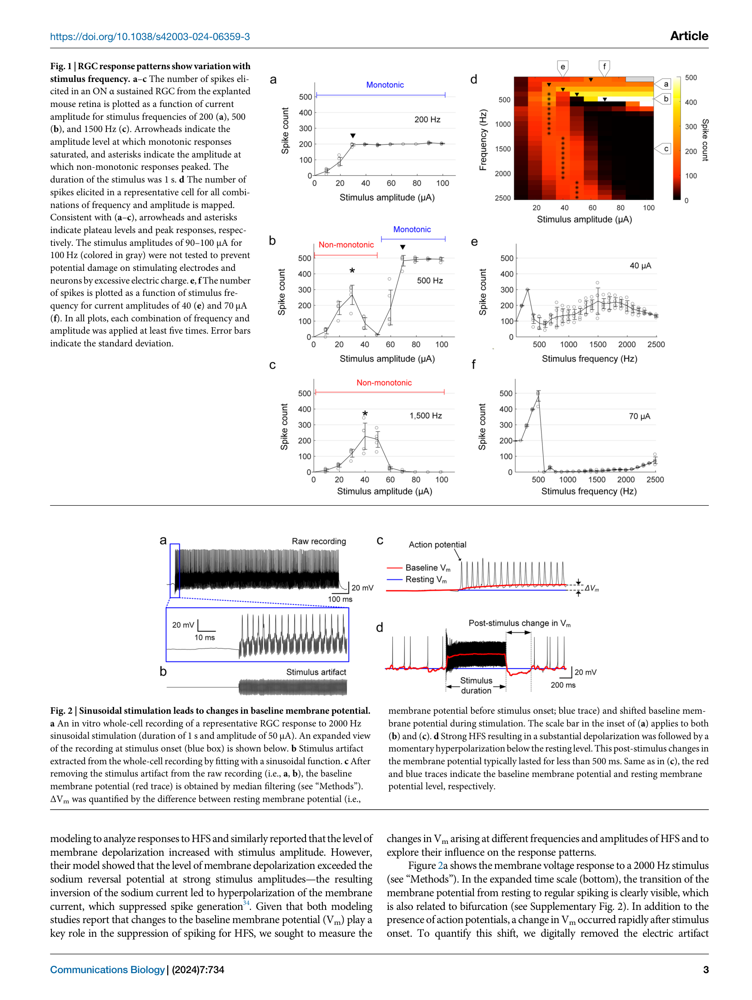
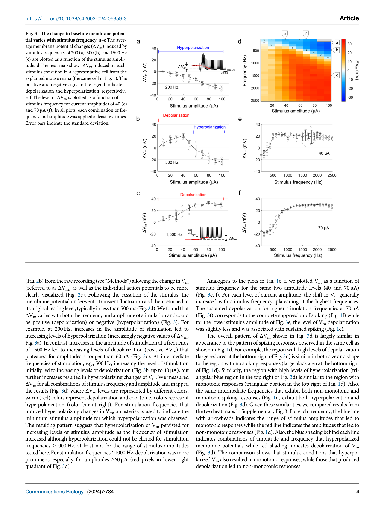
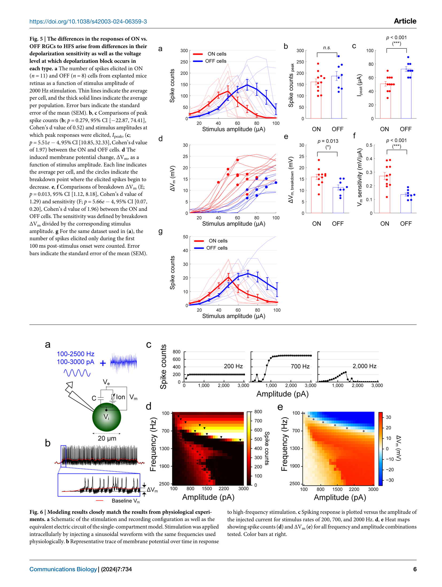

# 论文精读笔记

## 论文信息

- **标题**：Membrane Depolarization Mediates Both the Inhibition of Neural Activity and Cell-Type-Differences in Response to High-Frequency Stimulation
- **作者**：Jae-Ik Lee*, Paul Werginz, Tatiana Kameneva, Maesoon Im, Shelley I. Fried
- **单位**：Massachusetts General Hospital / Harvard Medical School (Lee, Werginz, Fried); TU Wien (Werginz); Swinburne University of Technology (Kameneva); KIST / Kyung Hee University (Im); Boston VA Healthcare System (Fried)
- **通讯作者**：Jae-Ik Lee (jaeikjq@gmail.com)
- **期刊**：Communications Biology (Nature), 2024, 7:734
- **DOI**：[10.1038/s42003-024-06359-3](https://doi.org/10.1038/s42003-024-06359-3)
- **数据/代码**：[OSF - https://doi.org/10.17605/osf.io/hnpq4](https://doi.org/10.17605/osf.io/hnpq4)
- **许可**：CC BY 4.0

### 本地文件

- `Communications Biology - 2024 - Lee - Membrane depolarization mediates both the inhibition of neural activity and cell-type-differences in response to HFS.pdf`：原文 PDF

---

## 一、这篇文章在问什么问题

**核心问题**：高频电刺激（HFS, high-frequency stimulation, >1 kHz）可以抑制神经元放电活动，但抑制的生物物理机制到底是什么？之前的建模研究给出了相互矛盾的解释——有的说是持续去极化导致 Na 通道失活（depolarization block，去极化阻滞），有的说是强超极化电流阻止了放电。能否通过直接测量刺激期间的膜电位（Vm）变化来一锤定音？

**为什么值得问**：
- HFS 有重要的临床应用前景：疼痛管理（kHz 频率脊髓刺激）、视网膜假体（选择性激活不同类型 RGC）、肥胖治疗（迷走神经阻断）等
- HFS 的一个独特能力是**选择性调控**：在异质神经元群体中，不同细胞类型对 HFS 有不同的敏感性。例如 ON 和 OFF 视网膜神经节细胞（RGCs, retinal ganglion cells）对 HFS 有差异响应——这为视网膜假体实现更接近自然信号编码的刺激策略提供了可能
- 但优化选择性的前提是理解机制，而之前的建模研究给出了矛盾结论：Kameneva 2016 说是去极化阻滞，Guo 2019 说是 Na 电流反转引起的超极化。**需要直接的生理学测量来裁判**
- **关键技术难点**：HFS 产生的刺激伪迹（stimulus artifact）极其严重（每秒上千个脉冲叠加），传统电生理记录很难在刺激期间测量真实的 Vm

**一句话概括**：本文在离体小鼠视网膜上，用全细胞膜片钳（whole-cell patch clamp）记录了 ON 和 OFF α sustained RGCs 在 100-2500 Hz 正弦波胞外电刺激下的 Vm 和放电响应。发现 HFS 诱导的基线膜电位偏移（ΔVm）决定了放电模式——强去极化导致 depolarization block（Na 通道失活）；ON 细胞比 OFF 细胞对刺激更敏感（相同电流产生更大的去极化），但 ON 细胞进入 block 需要更高的 ΔVm 阈值。计算建模揭示 Na/K 通道时间常数差异是频率依赖的 ΔVm 极性反转的根本原因。

---

## 二、这篇论文和你的研究**直接高度相关**

### 2.1 这是你的"姊妹论文"——同样的核心技术挑战，不同的解决策略

**Lee 和你做的是几乎完全相同的事情**：用全细胞膜片钳在胞外电刺激（EES）条件下测量真实的跨膜电压 Vm。但你们处理刺激伪迹的策略不同：

| | 你的 TIM 论文 | Lee 2024 (本文) |
|---|---|---|
| **制备** | 急性脑片 | 离体视网膜 |
| **记录模式** | Current clamp + Voltage clamp | Current clamp (whole-cell) |
| **刺激波形** | 短脉冲（μs 级） | 正弦波 100-2500 Hz（连续 1 s） |
| **伪迹去除策略** | **差分测量**：分别记录 Vi 和 Ve，$V_m = V_i - V_e$ | **波形拟合减法**：拟合正弦伪迹并从原始数据中减去 |
| **Ve 处理** | 实际测量 Ve(t)，作为物理量 | 将 Ve 视为"伪迹"，拟合后丢弃 |
| **膜电位提取** | 逐时间点差分 | 减去伪迹后中值滤波（40 ms 窗口） |
| **时间分辨率** | μs 级（保留完整波形细节） | ~ms 级（中值滤波平滑了快速变化） |

### 2.2 Lee 的伪迹去除方法——对你方法的一个有用对比

Lee 的伪迹去除方法（Figure 2b, c）：
1. 拟合一个与刺激频率匹配的正弦函数（频率、相位、幅度匹配）
2. 从原始记录中减去该正弦函数
3. 对结果进行 40 ms 窗口的中值滤波，得到基线 Vm 轨迹

**这个方法的优点**：
- 简单、直接
- 对于纯正弦波刺激效果好（频率精确已知）

**这个方法的局限（你的方法的优势所在）**：
1. **只适用于正弦波**：Lee 自己也说选择正弦波是因为其"discrete and focused frequency spectrum"便于伪迹去除。对于临床实际使用的双相矩形脉冲，这种简单的正弦拟合不可行——而你的差分方法对任意波形都适用
2. **假设 Ve 的波形与刺激波形完全匹配**：实际上 Ve 经过组织传播后可能有畸变（色散、衰减），简单正弦拟合可能引入残余伪迹
3. **牺牲了快速 Vm 动态的信息**：40 ms 中值滤波会抹平任何快于 ~25 Hz 的 Vm 变化。Lee 只关心缓慢的基线偏移（ΔVm），但如果你想看刺激脉冲时间尺度（μs 级）上的 Vm 动态，这个方法就不够了
4. **无法区分 Ve 和真实 Vm 变化**：如果刺激确实在膜上产生了与刺激同频的跨膜电流（它一定会——因为容性电流 $I_C = C_m \cdot dV_m/dt$），那减去正弦函数时也会把这部分真实的膜电位响应一起减掉。Lee 在 Methods 中承认了这一点，但认为影响不大

**你的差分方法在每一个方面都更优**：
- 适用于任何波形
- 不需要假设 Ve 的函数形式
- 保留完整的时间分辨率
- 正确区分 Ve（被减去）和 Vm（被保留）

### 2.3 Lee 的结果为你的测量方法提供了直接的应用验证场景

Lee 测到的最核心结果——HFS 诱导频率和幅度依赖的 ΔVm——正是你的差分方法可以更精确测量的量。具体来说：

1. **Lee 的 ΔVm 热图（Figure 3d）**：显示不同频率×幅度组合下的膜电位偏移（去极化或超极化）。如果用你的差分方法重做这个实验，可以获得更高时间分辨率的 Vm 动态，可能揭示 Lee 的中值滤波平滑掉的细节
2. **ON vs OFF 细胞的敏感性差异（Figure 5）**：Lee 发现 ON 细胞对给定电流更敏感（产生更大的 ΔVm）。你的方法可以直接测量 Ve 的贡献——如果 ON 和 OFF 细胞的位置、形态不同，它们"看到"的 Ve 也可能不同，这是 Lee 的方法无法区分的

### 2.4 Lee 的离子通道动力学分析和你的等效电路模型的互补

Lee 的计算模型（单隔室 Fohlmeister 模型）揭示了一个优雅的机制：

**频率依赖的 ΔVm 极性反转源于 Na/K 通道时间常数差异**：
- **低频刺激（~200 Hz）**：每个刺激周期足够长，让快速 Na 通道先激活（去极化）→ 然后慢速 K 通道跟上（超极化）→ K 通道开放持续时间更长 → **净超极化**
- **高频刺激（~2000 Hz）**：周期太短，慢速 K 通道来不及充分激活 → Na 电流占主导 → **净去极化**

这个机制和你的等效电路分析框架完美契合。你的 Rs/Cm/Rm 等效电路描述的是被动膜性质的频率响应；Lee 的模型添加了主动离子通道的频率响应。两者合在一起，构成了对膜电位在电刺激下的完整描述：

$$V_m(t) = V_{passive}(t) + V_{active}(t)$$

其中 $V_{passive}$ 由你的等效电路决定（Rs, Cm, Rm 的 RC 滤波特性），$V_{active}$ 由 HH 型离子通道动力学决定（Na/K 通道的差异时间常数）。

---

## 三、实验设计与结果逐层拆解

### 第一层：RGC 对不同频率/幅度的放电模式（Figure 1）

**做了什么**：
- 离体小鼠视网膜，whole-cell patch clamp 记录 ON α sustained RGCs
- 正弦波胞外刺激：频率 100-2500 Hz，幅度 10-100 μA，持续 1 s
- Pt-Ir 电极，尖端距 soma ~25 μm

**结果——两种响应模式**：
- **单调响应（monotonic）**：放电数随幅度增加而增加直到饱和。主要见于低频（<500 Hz）
- **非单调响应（non-monotonic）**：放电数先增后减，中等幅度最大。主要见于高频（>1000 Hz）
- **中间频率（500-700 Hz）**：低幅度非单调，高幅度变单调——**二者共存**

> **Fig. 1** — RGC 放电模式随频率变化。(a-c) 200/500/1500 Hz 下放电数 vs 电流幅度。(d) 完整的频率×幅度热图。(e-f) 固定幅度 40/70 μA 下放电数 vs 频率。
> **Fig. 2** — 正弦刺激导致基线膜电位偏移。(a) 2000 Hz 刺激下的原始全细胞记录。(b) 正弦伪迹拟合。(c) 去伪迹后的记录和 ΔVm 定量。(d) 强 HFS 后的短暂超极化反弹。

### 第二层：ΔVm 的频率/幅度依赖性——核心发现（Figure 3）

**做了什么**：
- 去除刺激伪迹后，用中值滤波提取基线 Vm 的偏移（ΔVm）
- 绘制完整的频率×幅度 ΔVm 热图

**结果——ΔVm 的极性反转**：
- **低频 + 高幅度 → 超极化**（ΔVm < 0）
- **高频 + 高幅度 → 去极化**（ΔVm > 0）
- **中间频率 → 先去极化后超极化**（随幅度增加极性反转）
- ΔVm 热图的模式与放电热图高度匹配：去极化区对应非单调响应（spiking suppression），超极化区对应单调响应

> **Fig. 3** — ΔVm 随刺激频率和幅度变化。(a-c) 200/500/1500 Hz 下 ΔVm vs 幅度。(d) 完整的 ΔVm 热图：暖色 = 去极化，冷色 = 超极化。**与 Fig. 1d 的放电热图高度对应。**

### 第三层：过度去极化导致放电抑制——因果关系确认（Figure 4）

**关键实验**：将所有频率的数据汇总，以 ΔVm（而非电流幅度）为 x 轴绘制放电数

**结果**：
- 不同频率的数据在 ΔVm 坐标下完美重合——放电数的峰值出现在相同的 ΔVm 水平（~10 mV 去极化）
- 但以电流幅度为 x 轴时，不同频率的曲线有显著偏移
- ΔVm 与放电数的线性相关性（r = 0.86）远优于电流幅度与放电数（r = 0.66）

**结论**：是 ΔVm 本身（而非刺激幅度）决定了放电模式。当去极化超过 ~10 mV 时，发生 depolarization block。

> **Fig. 4** — 过度去极化导致放电抑制。(a-c) 不同去极化水平下的 patch clamp 记录（去伪迹后）。(d-e) 放电数 vs ΔVm（统一）vs 电流幅度（分散）。(f-g) 2000 Hz 下所有细胞的汇总：ΔVm 是更好的预测因子。

### 第四层：ON vs OFF 细胞的差异——两个因素的共同作用（Figure 5）

**做了什么**：
- 2000 Hz 正弦刺激，比较 ON (n=11) 和 OFF (n=8) α sustained RGCs

**结果——两个关键差异**：
1. **去极化敏感性不同**：ON 细胞对相同电流产生更大的 ΔVm（sensitivity: 0.27 vs 0.14 mV/μA）
2. **Block 阈值不同**：ON 细胞进入 depolarization block 需要更高的 ΔVm（15.89 ± 3.86 mV vs 11.24 ± 3.20 mV）

**两个因素的竞争**：ON 细胞虽然 block 阈值更高，但由于敏感性更高，仍然在更低的电流幅度下就进入了 block。这解释了为什么 ON 细胞更容易被 HFS 抑制。

> **Fig. 5** — ON vs OFF RGC 的差异来自去极化敏感性和 block 阈值的双重差异。(a) 两类细胞的放电-幅度曲线。(b-c) 峰值放电数无差异，但峰值出现的电流幅度有差异。(d-f) ΔVm vs 幅度、breakdown ΔVm、和 sensitivity 的比较。

### 第五层：计算模型——Na/K 时间常数差异解释频率依赖的极性反转（Figures 6-9）

**模型**：单隔室球形细胞（∅20 μm），Fohlmeister RGC 离子通道模型（gNa=50, gK=25 mS/cm²），胞内注入正弦电流

**核心发现**：
- **低频（200 Hz）**：每个周期中 Na 先激活→快速失活，K 跟上后持续开放时间更长 → K+ 外流总电荷 > Na+ 内流总电荷 → **净超极化**
- **高频（2000 Hz）**：周期太短，慢速 K 通道来不及开放 → Na+ 内流占主导 → **净去极化**
- 净电荷与 ΔVm 呈完美线性关系（r² = 0.99）

**Depolarization block 的机制**：
- 持续去极化导致 Na 通道失活门（h gate）无法恢复（de-inactivate）
- $m^3 \times h$ 驱动力坍塌 → 无法产生动作电位

> **Fig. 6** — 模型与实验定性吻合。**Fig. 7** — Na/K 通道在低频和高频下的不同动力学。**Fig. 8** — 离子电流不平衡导致差异化的膜极化。

### 第六层：内在特性决定细胞类型差异（Figure 10）

**模型参数扫描**：改变胞体大小或 K 通道密度可以移动 depolarization block 发生的电流阈值，支持内在特性（而非突触输入）介导 ON/OFF 差异的假说。

> **Fig. 9** — Na 通道失活是 depolarization block 的基础。**Fig. 10** — 胞体大小和 K 通道密度影响 block 阈值。

---

## 四、证据链评估

### 强在哪里

1. **直接测量了之前只能建模的量**：之前关于 HFS 机制的争论完全基于模型（Kameneva 2016 vs Guo 2019）。Lee 用全细胞膜片钳直接测量了刺激期间的 ΔVm，提供了一锤定音的生理学证据
2. **完整的参数空间覆盖**：频率 100-2500 Hz × 幅度 10-100 μA 的系统扫描，不是只看几个条件点
3. **ΔVm 作为统一框架**：不同频率的数据在 ΔVm 坐标下重合（Fig. 4d vs 4e），优雅地统一了看似复杂的频率依赖响应模式
4. **实验+建模互相验证**：生理数据确认了去极化阻滞假说，单隔室模型定性再现并揭示了 Na/K 时间常数差异这一根本机制
5. **开放数据和代码**：OSF 上公开了全部源数据和计算模型代码

### 不够硬的地方

1. **刺激伪迹去除方法的局限性**：正弦拟合减法假设 Ve 波形严格为正弦——但实际 Ve 经过组织传播可能有畸变。更重要的是，与刺激同频的真实跨膜电流被一起减掉了。这是你的差分方法可以做得更好的地方
2. **只测试了正弦波刺激**：临床 HFS 通常使用双相矩形脉冲，不是正弦波。作者选择正弦波主要是为了便于伪迹去除。正弦波和矩形脉冲在频谱上有显著差异（正弦波是单频，矩形脉冲包含多次谐波），响应可能不完全相同
3. **离体视网膜的外推性**：RGC 的离子通道组成和皮层/脊髓神经元不同。虽然作者推测 Na/K 时间常数差异是通用机制，但不同脑区的量化结果可能显著不同
4. **空间电场分布未考虑**：单隔室模型用胞内电流注入模拟胞外刺激，忽略了真实胞外电场在胞体-树突-轴突上的空间异质性。这正是你的 3D 点电流源模型所处理的
5. **样本量有限**：ON 11 个细胞，OFF 8 个细胞。虽然统计显著，但离子通道表达的细胞间变异可能没有被充分捕捉

---

## 五、对你的研究的直接影响

### 5.1 这是你的 TIM 论文最应该引用的论文之一

Lee 做了和你非常类似的事情——测量 EES 下的 Vm。但他的方法有明确的局限性（只适用于正弦波、减掉了同频跨膜电流、40 ms 中值滤波损失了时间分辨率），而你的差分方法在原理上更通用、更精确。在 TIM 论文的 Discussion 中，你可以这样构建叙述：

> 胞外电刺激下测量真实跨膜电压是一个持续的技术挑战。Lee et al. (Communications Biology, 2024) 使用正弦拟合减法从全细胞记录中去除 HFS 伪迹来测量 ΔVm，揭示了去极化阻滞介导 HFS 抑制的机制。然而，该方法受限于正弦波刺激形式，且无法区分 Ve 伪迹和真实的跨膜电流成分。本文提出的差分测量方法通过独立记录 Ve(t) 并逐时间点差分，适用于任意波形的胞外电刺激，并保留了 μs 级时间分辨率。

### 5.2 你的差分方法可以直接解决 Lee 论文中的三个技术局限

1. **波形通用性**：Lee 被迫使用正弦波刺激（为了伪迹去除）。你的方法不需要假设刺激波形的函数形式 → 可以直接使用临床相关的双相矩形脉冲
2. **Ve 与 Vm 的正确分离**：Lee 的正弦减法会把与刺激同频的跨膜电流一起减掉。你的方法保留了真实的 Vm 全部频率成分
3. **时间分辨率**：Lee 用 40 ms 中值滤波只能测量缓慢的 ΔVm 偏移。你的方法可以在 μs 尺度上看到 Vm 的逐脉冲动态

### 5.3 Lee 的结果为你的方法提供了明确的生物学应用场景

Lee 测到的关键量——频率依赖的 ΔVm、depolarization block 阈值、ON/OFF 敏感性差异——都是你的差分方法可以更精确测量的。如果在脑片上用你的方法重做 Lee 的实验（用双相脉冲替代正弦波），可能会发现：
- 短脉冲下的 ΔVm 动态不同于正弦波（因为矩形脉冲的谐波成分会产生额外的膜电位响应）
- 单个脉冲尺度上的 Vm 振荡（Lee 的中值滤波看不到的）
- Ve 本身的空间分布对不同细胞类型的影响（ON/OFF 细胞的形态差异导致"看到"的 Ve 不同）

### 5.4 和你已有的论文文献网络的整合

现在你的 "patch clamp 伪迹地图" 扩展为五篇：

| 论文 | 刺激条件 | 测量问题 | 伪迹处理策略 |
|---|---|---|---|
| **Lesperance 2018** | EFS + CC (PCA) | PCA 反馈伪迹 | 换用 VFA |
| **你的 TIM 论文** | EFS + CC/VC | Ve ≠ 0 叠加 | 差分测量 $V_m = V_i - V_e$ |
| **Lei 2025** | VC（无 EFS）| Rs 控制误差 | 计算模型后处理 |
| **Yuan 2025** | DBS + 在体 | DBS 刺激伪迹 | 绕开（光学记录） |
| **Lee 2024** | **HFS + CC (WC)** | **HFS 伪迹** | **正弦拟合减法** |

你的差分方法在这个地图中的独特位置是：**它是唯一适用于任意波形、保留完整时间分辨率、并正确分离 Ve 和 Vm 的方法**。Lee 的方法在 HFS 正弦波场景下工作，但受限于波形假设；你的方法无此限制。

---

## 六、待讨论的问题

1. **你能用差分方法重做 Lee 的实验吗？** 在急性脑片上对皮层/海马神经元施加正弦或双相脉冲 HFS（100-2500 Hz），用差分膜片钳测量 ΔVm。对比 Lee 的 RGC 结果，看 Na/K 时间常数差异介导的极性反转是否在其他神经元类型中也存在。

2. **Lee 的正弦减法 vs 你的差分方法：能否定量比较两种方法的精度？** 在同一细胞上同时用两种方法处理同一段数据——先用差分方法得到"真实的"Vm(t)，再用 Lee 的正弦减法得到"近似的"Vm(t)，计算两者的差异。这个差异就是 Lee 方法的系统误差。

3. **De polarization block 阈值（~10-15 mV ΔVm）是否是通用常数？** Lee 发现 ON 和 OFF RGC 的 block 阈值分别为 ~16 和 ~11 mV。这个值在不同神经元类型中是否相似？如果你在皮层神经元中测到类似的值，就可以建立一个通用的 "depolarization block 预测模型"。

4. **频率依赖的 ΔVm 极性反转是否影响你的 EES 实验？** 你的 TIM 论文使用的是短脉冲刺激（μs 级），但如果使用重复脉冲（脉冲串），有效频率可能进入 Lee 描述的范围。例如 130 Hz 的 DBS 脉冲串，每个脉冲宽度 100 μs → 有效占空比 ~1.3%，不是正弦波但有类似的频率成分。你的差分方法可以精确测量这种条件下的 ΔVm。

5. **Lee 的模型中缺失了 Ve 的空间分布效应**。他的单隔室模型用胞内电流注入来模拟胞外刺激——这忽略了一个关键事实：胞外电场在神经元表面是空间不均匀的。一个延伸方向和电场方向一致的树突会比垂直于电场的树突"看到"更大的 Ve 梯度。你的 3D 点电流源模型可以提供这个空间信息。如果把你的 Ve 分布模型和 Lee 的 HH 离子通道模型结合，就可以构建一个完整的"胞外刺激→Ve 分布→Vm 响应→放电模式"的计算框架。

6. **你最想搞清楚的一件事是什么？**
