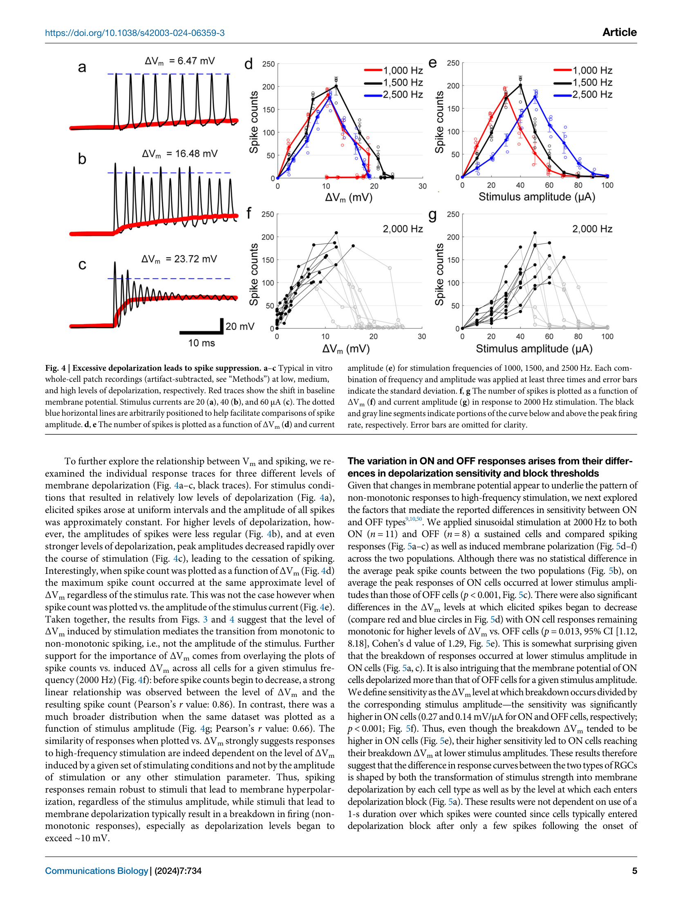
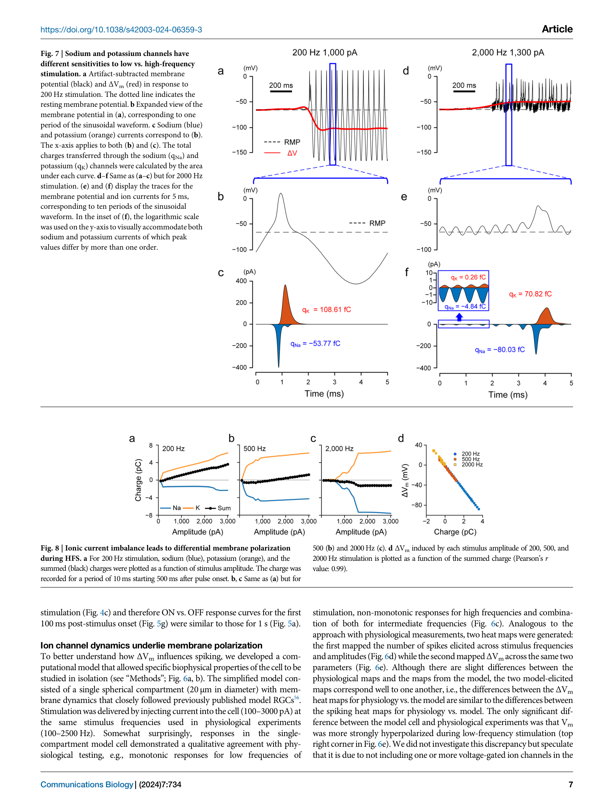
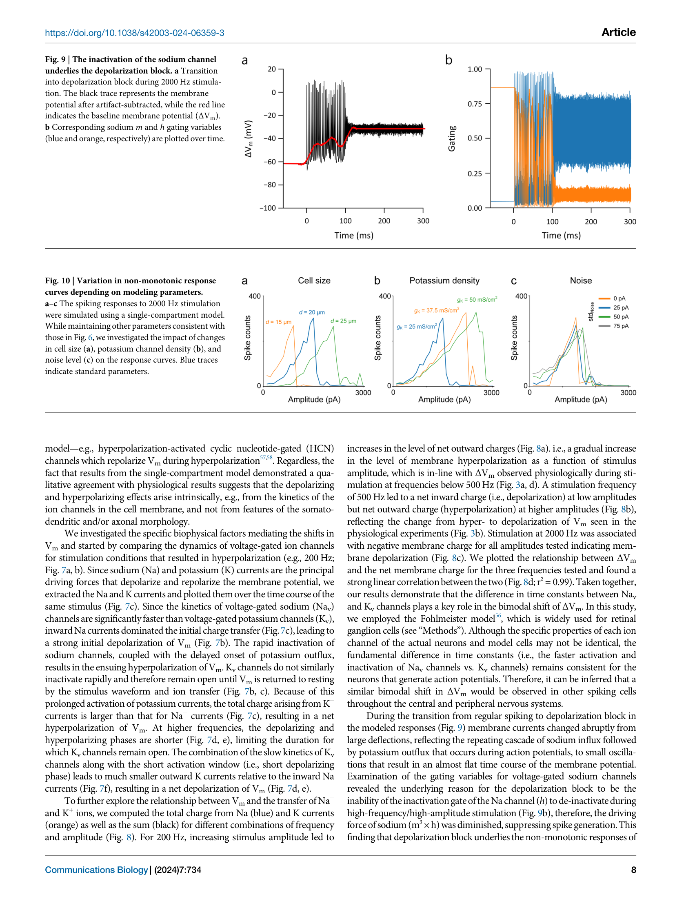

# 高频电刺激能让神经元"闭嘴"，但你确定测到的膜电位是真的吗？

**论文题目**：Membrane Depolarization Mediates Both the Inhibition of Neural Activity and Cell-Type-Differences in Response to High-Frequency Stimulation

**作者**：Jae-Ik Lee, Paul Werginz, Tatiana Kameneva, Maesoon Im, Shelley I. Fried

**单位**：Massachusetts General Hospital / Harvard Medical School; TU Wien; Swinburne University of Technology; KIST

**期刊**：Communications Biology (Nature), 2024, 7:734

**DOI**：[10.1038/s42003-024-06359-3](https://doi.org/10.1038/s42003-024-06359-3)

---

> 一句话讲完这篇论文：高频电刺激（HFS）抑制神经元放电的机制是过度去极化导致 Na 通道失活（depolarization block），而不是超极化。作者用正弦拟合减法从全细胞记录中剥离刺激伪迹，拿到了刺激期间的膜电位偏移数据——但这个伪迹去除方法本身，限定了他们只能用正弦波做刺激、只能看到慢变化、而且会把一部分真实的跨膜响应也一起减掉。

---

## 为什么要读这篇论文

做膜片钳的人都知道，胞外电刺激（extracellular electrical stimulation）会在记录电极上叠加一个巨大的刺激伪迹（stimulus artifact）。单脉冲刺激还好办——伪迹就那么短短一下，等它过去再看就行了。

但换成**高频电刺激**，情况就完全不同了。

以 2000 Hz 正弦波为例，每秒 2000 个完整周期，伪迹从头到尾不间断。你的放大器看到的信号里，刺激伪迹的幅度可以比真实的膜电位变化大几个数量级。**整个刺激期间，你看到的几乎全是伪迹**——真实的膜电位变化被完全淹没了。

这正是一个老问题迟迟没有答案的原因：HFS 能可逆地抑制神经元放电，这在临床上很有用（kHz 脊髓刺激治疼痛、视网膜假体选择性激活、迷走神经阻断治肥胖），但**抑制放电的机制到底是什么**，建模的人吵了好几年——Kameneva 2016 说是去极化阻滞，Guo 2019 说是超极化阻断。没人能拿出直接的生理学证据，因为没人能在 HFS 期间测出膜电位。

Lee 等人这篇 2024 年的论文，就是要**直面伪迹问题**，把刺激期间的膜电位变化测出来，给这场争论一锤定音。

---

## 先抓住三件事

1. 作者为了能去除伪迹，特地选用了**正弦波**作为刺激波形——因为正弦波频谱集中在单一频率，伪迹可以用正弦函数拟合后减掉。这是一个聪明的实验设计，但也是一个有代价的妥协。
2. 去伪迹后发现，HFS 引起的膜电位偏移（$\Delta V_m$）的方向取决于频率：**低频偏超极化，高频偏去极化**。当去极化超过约 10 mV，放电就被抑制了——这就是 depolarization block。
3. ON 和 OFF 视网膜神经节细胞对 HFS 的敏感性不同，差异来自**去极化敏感性**和 **block 阈值**两个因素的竞争。

---

## 实验怎么做的

离体小鼠视网膜，全细胞膜片钳（whole-cell patch clamp）记录 ON 和 OFF α sustained RGCs（retinal ganglion cells，视网膜神经节细胞）。Pt-Ir 电极距胞体约 25 μm，施加正弦波胞外刺激：频率覆盖 100–2500 Hz，幅度覆盖 10–100 μA，持续 1 s。

为什么用正弦波而不是临床常用的双相矩形脉冲？作者在 Methods 里说得很直白：正弦波有"discrete and focused frequency spectrum"，便于伪迹去除。换句话说，**刺激波形的选择是被伪迹去除方法倒逼的**。

---

## 逐图拆解

### Figure 1 & 2：放电模式和伪迹去除方法

Figure 1 是全文的主线入口。对 ON α sustained RGC 做完整的频率×幅度扫描，发现两种放电模式：

- **单调型（monotonic）**：放电数随幅度增加而增加，主要出现在低频（<500 Hz）
- **非单调型（non-monotonic）**：放电数先增后减，中等幅度最大，主要出现在高频（>1000 Hz）

非单调——也就是说高频强刺激反而**把放电压下去了**。这就是 HFS 抑制效应的行为学表现。

Figure 2 是全文的方法核心——**伪迹去除的三步走**：

1. 对原始记录拟合一个与刺激频率匹配的正弦函数
2. 从原始信号中减去拟合的正弦
3. 对残差做 40 ms 窗口中值滤波，提取基线膜电位偏移 $\Delta V_m$

这个方法简洁有效，但后面我们会看到它的代价。

### Figure 3：$\Delta V_m$ 热图——频率和幅度怎样决定极化方向

这是全文最核心的一张图。

去伪迹后的 $\Delta V_m$ 铺成频率×幅度的热图，一眼就能看清全局：

- **暖色（去极化）**主要出现在高频 + 高幅度区域
- **冷色（超极化）**主要出现在低频 + 高幅度区域
- 中间频率区存在一条**极性翻转带**——随幅度增大，$\Delta V_m$ 从去极化翻转为超极化

把这张热图和 Figure 1 的放电热图对比，几乎完美吻合：去极化区对应非单调响应（放电被抑制），超极化区对应单调响应（放电不被抑制）。

**膜电位偏移的方向，直接预测了放电模式。**

### Figure 4：$\Delta V_m$ 才是放电命运的真正预测因子

Figure 4 做了一件很漂亮的事：把所有频率的数据汇到一起，横轴换成 $\Delta V_m$ 而不是电流幅度。

结果：不同频率的放电曲线在 $\Delta V_m$ 坐标下**完美重合**——放电峰值都出现在 $\Delta V_m \approx 10$ mV 处，超过这个值后放电被压下去。而以电流幅度为横轴时，不同频率的曲线分散得很开。

线性相关系数：$\Delta V_m$ vs 放电数 $r = 0.86$，电流幅度 vs 放电数 $r = 0.66$。

这说明真正决定神经元放电命运的不是你给了多大的电流，而是**膜电位被推了多远**。过度去极化导致 Na 通道失活门（h gate）无法恢复，$m^3 h$ 乘积趋近于零，动作电位发生机制瘫痪——这就是 depolarization block。

### Figure 5：ON 和 OFF 细胞为什么不一样

用 2000 Hz 正弦波比较 ON（n=11）和 OFF（n=8）α sustained RGCs，发现两个关键差异：

- **去极化敏感性不同**：相同电流下，ON 细胞产生更大的 $\Delta V_m$（sensitivity: 0.27 vs 0.14 mV/μA）
- **Block 阈值不同**：ON 细胞进入 depolarization block 需要更高的 $\Delta V_m$（15.9 ± 3.9 mV vs 11.2 ± 3.2 mV）

两个因素方向相反：ON 细胞"更难被打倒"（阈值高），但"更容易被推到悬崖边"（敏感性高）。竞争的结果——ON 细胞在更低的电流幅度下就进入了 block。

这为视网膜假体的**选择性刺激策略**提供了量化依据：利用 ON/OFF 细胞对 HFS 的差异响应，可以设计更精细的刺激方案来模拟自然的视觉信号编码。

### Figures 6–8：计算模型揭示 Na/K 时间常数差异

为什么低频导致超极化而高频导致去极化？单隔室 Fohlmeister 模型给出了一个优雅的解释：

- **低频（~200 Hz）**：每个刺激周期足够长。Na 通道先激活（快）→ K 通道跟上（慢）→ K 通道开放持续时间更长 → K$^+$ 外流总电荷 > Na$^+$ 内流总电荷 → **净超极化**
- **高频（~2000 Hz）**：周期太短，慢速 K 通道来不及充分激活 → Na$^+$ 内流占主导 → **净去极化**

本质上就是 Na/K 通道的时间常数差异在不同频率下导致了不同方向的离子电流不平衡。净电荷与 $\Delta V_m$ 呈完美线性关系（$r^2 = 0.99$）。

### Figures 9, 10：Na 通道失活和细胞类型差异的机制

Figure 9 从模型角度确认了 depolarization block 的机制：持续去极化使 Na 通道失活门 h 无法恢复，$m^3 h$ 乘积坍塌。

Figure 10 通过参数扫描揭示了 ON/OFF 差异的可能来源：改变胞体大小或 K 通道密度都可以移动 block 发生的电流阈值。这支持了一个假说——**内在膜性质**（而非突触输入）决定了不同细胞类型对 HFS 的差异响应。

---

## 回到伪迹：Lee 的方法到底牺牲了什么

读完全文的结果，让我们回到这篇论文最值得同行深思的方法论问题。

Lee 的正弦拟合减法解决了"能不能测"的问题，但它有四个代价：

**第一，波形被限死了。** 选择正弦波刺激本身就是对伪迹方法的妥协。临床 HFS 用的是双相矩形脉冲，频谱包含基频加大量谐波，简单正弦拟合搞不定。所以这个方法不能直接推广到临床相关的刺激参数。

**第二，真实的跨膜电流被一起减掉了。** 电刺激在膜上必然产生容性电流 $I_C = C_m \cdot dV_m/dt$，这个电流驱动的膜电位变化和刺激同频。正弦减法分不清"电极看到的胞外场"和"膜电位中与刺激同频的成分"——一刀切，全减了。Lee 在 Methods 里承认了这一点，认为对缓慢的 $\Delta V_m$ 影响不大。

**第三，时间分辨率被砍了。** 40 ms 中值滤波意味着只能看到 >~25 Hz 的变化。对于 Lee 关心的缓慢偏移足够了，但单个刺激周期内（0.5–10 ms）的 $V_m$ 动态被完全抹平。

**第四，假设 Ve 是完美正弦波。** 实际上胞外电位经过组织传播后可能有畸变。残余伪迹可能被误读为真实的膜电位变化。

归根到底，**伪迹处理方法的选择框定了你能问什么问题**。Lee 选择正弦波让伪迹可去除，代价是只能研究正弦波刺激的缓慢膜电位效应。如何在保留临床相关刺激波形的同时精确分离 $V_e$ 和 $V_m$，仍然是这个领域的一个开放问题。

---

## 这篇论文最终告诉我们什么

压缩成四条：

1. HFS 抑制神经元放电的机制是**去极化阻滞**（depolarization block），不是超极化。这场持续多年的建模争论，被直接的膜电位测量一锤定音了。
2. $\Delta V_m$ 是比刺激参数更好的放电预测因子——**膜电位偏移量**才是决定神经元命运的变量。
3. ON/OFF RGC 对 HFS 的差异响应来自**去极化敏感性**和 **block 阈值**的双重差异，两者竞争决定了最终表现。
4. 伪迹去除方法不是免费的——**方法的选择限定了科学问题的边界**。Lee 用正弦拟合减法巧妙地绕过了 HFS 伪迹，但这同时也把他锁在了正弦波刺激和慢变化测量的框架里。

---

> 一句话总结：HFS 下的神经元不是"被关掉了"，而是"被推过头了"——去极化太深，Na 通道失活，动作电位发不出来。而测量这件事本身，就是一场和刺激伪迹的贴身搏斗。

---

## 参考信息

- **论文**：Lee JI, Werginz P, Kameneva T, Im M, Fried SI. Membrane depolarization mediates both the inhibition of neural activity and cell-type-differences in response to high-frequency stimulation. *Communications Biology*. 2024;7:734.
- **DOI**：[10.1038/s42003-024-06359-3](https://doi.org/10.1038/s42003-024-06359-3)
- **数据与代码**：[OSF](https://doi.org/10.17605/osf.io/hnpq4)（CC BY 4.0）
