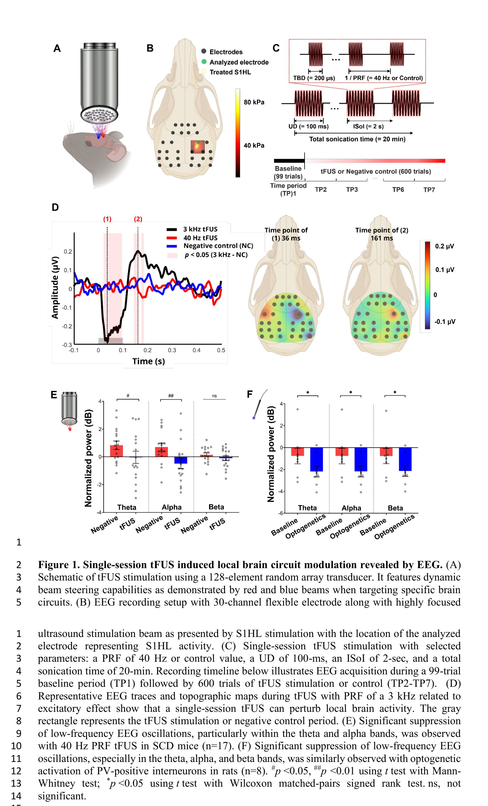
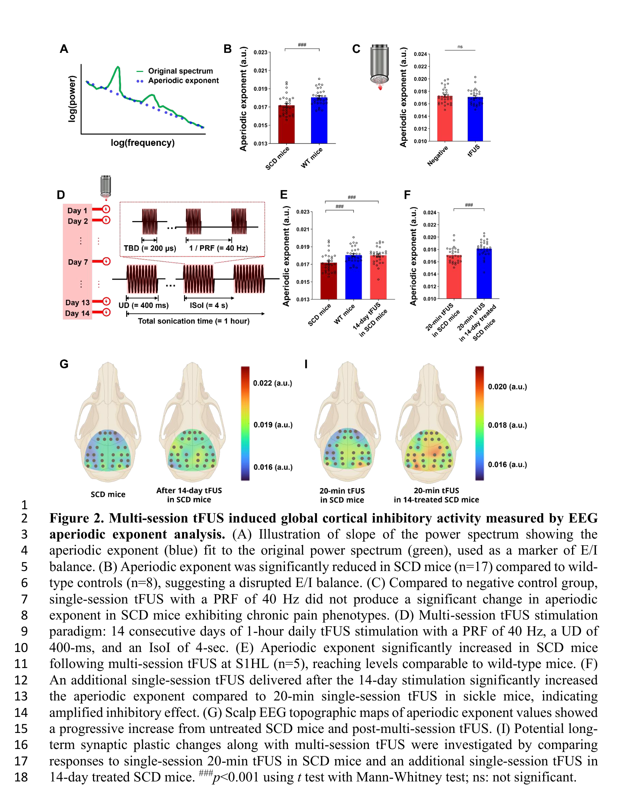
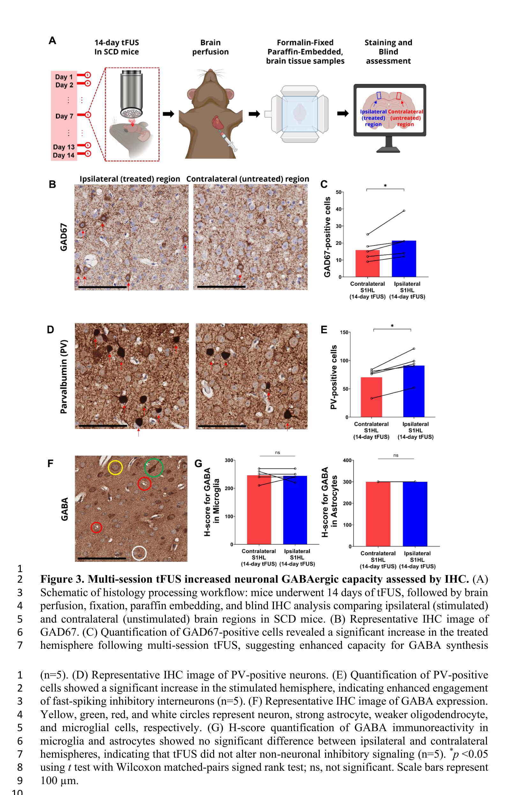
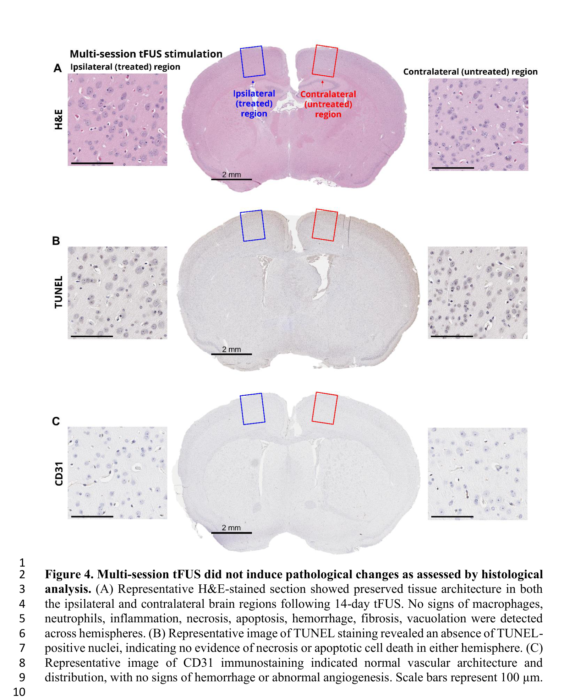

# 论文精读笔记

## 论文信息

- **标题**：Low-intensity transcranial focused ultrasound engages parvalbumin-positive GABAergic interneurons in a humanized mouse model of chronic pain: From electrophysiology to cellular investigation
- **作者**：Min Gon Kim†, Chih-Yu Yeh†, Huan Gao, Keunhyung Lee, Kalpna Gupta, Bin He*
- **单位**：Carnegie Mellon University (BME + Neuroscience Institute)；UC Irvine；U Minnesota
- **通讯作者**：Bin He（CMU BME）
- **期刊**：Journal of Neural Engineering (2026-03-19 online)
- **预印本**：bioRxiv 2025-10-08
- **DOI**：10.1088/1741-2552/ae54cd

### 来源链接

- [PubMed](https://pubmed.ncbi.nlm.nih.gov/41855581/)
- [期刊页面](https://iopscience.iop.org/article/10.1088/1741-2552/ae54cd)
- [bioRxiv](https://www.biorxiv.org/content/10.1101/2025.10.08.680737v1)

### 本地文件

- `Journal of Neural Engineering - 2026 - Kim - Low-intensity tFUS engages PV GABAergic interneurons in chronic pain.pdf`：bioRxiv 预印本 PDF
- `paper.txt`：抽取的纯文本
- `fig_pages/`：Figure 1–4 的 300 DPI 截图

---

## 一、这篇文章在问什么问题

**核心问题**：低强度经颅聚焦超声（tFUS）能不能通过招募 PV 阳性 GABA 能抑制性中间神经元，来纠正慢性痛模型中的兴奋/抑制失衡？

**为什么值得问**：
- 慢性痛的药物治疗有成瘾和副作用问题，非药物手段是刚需
- tFUS 相比 TMS/tDCS 有更好的空间分辨率和穿透深度，但**机制不清楚**——之前的工作主要停留在"行为改善了"，没有从电生理到细胞层面串起来
- 如果能确定 tFUS 的特定参数（40 Hz PRF）确实优先作用于 PV 中间神经元，这对参数优化和临床转化都有直接意义

---

## 二、背景知识补充

### 2.1 tFUS 和你熟悉的胞外电刺激的本质区别

你做的是胞外电刺激（extracellular electrical stimulation），刺激电流直接在导电介质中建立电场，通过改变细胞外电位来极化膜电位。你在 IEEE TIM 的工作就是在解决这个过程中 $V_m = V_i - V_e$ 的精确测量问题。

tFUS 的物理机制完全不同：
- **能量形式**：机械波（超声），不是电流
- **作用机制**：目前认为主要通过以下途径影响神经元：
  - **辐射力（acoustic radiation force）**：超声在组织中传播时产生的稳态力，可以引起微小的组织位移
  - **机械敏感离子通道**：Piezo1/2、TREK、MscL 等通道可被机械刺激激活或调制
  - **热效应**：低强度下通常可忽略
- **关键区别**：电刺激直接改变 $V_e$，tFUS 则通过机械力间接改变通道状态，最终影响膜电位。从你的等效电路视角看，电刺激是在电路的"电压源"端操作，tFUS 更像是在改变电路中的"电导"（通道开关）

### 2.2 PRF（脉冲重复频率）——tFUS 的关键参数

在你的电刺激工作中，关键参数是脉冲宽度、幅度、波形。在 tFUS 中，参数体系不同：

| 参数 | 含义 | 本文使用值 |
|---|---|---|
| **TBD** (Tone Burst Duration) | 每个超声脉冲持续时间 | 200 μs（单次）/ 200 μs（多次） |
| **PRF** (Pulse Repetition Frequency) | 超声脉冲的重复率 | **40 Hz**（抑制）vs 3 kHz（兴奋） |
| **UD** (Ultrasound Duration) | 一次连续超声的总持续时间 | 100 ms（单次）/ 400 ms（多次） |
| **ISoI** (Inter-Sonication Interval) | 两次超声之间的间隔 | 2 s（单次）/ 4 s（多次） |

**PRF 为什么重要**：这篇文章的一个关键发现是 PRF 决定了效应方向——40 Hz 偏向抑制，3 kHz 偏向兴奋。这有点类似你在电刺激中看到的频率依赖效应，只是物理基础不同。作者的假说是：低 PRF（40 Hz）的时间结构恰好匹配 PV 中间神经元的放电节律，因此优先"entrainment"（夹带）这类快放电的抑制性神经元。

### 2.3 Aperiodic Exponent——EEG 层面的 E/I 指标

你在细胞层面直接测 $V_m$，所以兴奋/抑制可以通过膜电位去极化/超极化的幅度和方向来判断。但在群体层面（scalp EEG），不能这样直接看。

Aperiodic exponent 是 EEG 功率谱的**非周期成分的斜率**：
- EEG 功率谱 = 周期成分（alpha、theta 等振荡峰）+ 非周期成分（1/f 样的背景）
- 非周期成分在 log-log 坐标下近似直线，其斜率就是 aperiodic exponent
- **斜率更陡（绝对值更大）→ 抑制占优**；**斜率更平 → 兴奋占优**
- 直觉理解：抑制性活动增强时，高频噪声被抑制得更快，功率谱在高频端衰减更快

这个指标的局限性：它是一个**网络层面的代理指标**，不是直接测量突触电流的 E/I ratio。但在无创条件下，它是目前最常用的 E/I balance 估计方法之一。

### 2.4 疾病模型：HbSS-BERK 镰状细胞病小鼠

- 这是一个人源化转基因小鼠，表达 >99% 的人类镰状血红蛋白
- 表现出**慢性痛和痛觉过敏**，且随年龄加重（本文用了 13-17 月龄的老鼠）
- 慢性痛的一个重要特征是皮层 E/I 失衡——抑制不足，兴奋过度
- 选这个模型的优势：它是人源化的，比普通炎症痛模型更接近临床

---

## 三、实验设计与结果逐层拆解

### 第一层：单次 tFUS 的即时效应（Figure 1）


> **Fig. 1 — Single-session tFUS induced local brain circuit modulation revealed by EEG**
> **(A)** 128 阵元随机阵列换能器的 tFUS 刺激示意图，红蓝光束展示动态波束控向能力
> **(B)** 30 通道柔性电极 EEG 记录装置与高度聚焦超声束的联合设置，绿色电极为分析的 S1HL 位点
> **(C)** 单次 tFUS 参数：PRF 40 Hz 或对照，UD 100 ms，ISoI 2 s，总超声时间 20 min；下方时间线展示 99 trial 基线（TP1）后接 600 trial 刺激/对照（TP2-TP7）
> **(D)** 3 kHz PRF tFUS 的代表性 EEG 波形和脑地形图，显示单次 tFUS 可扰动局部脑活动（灰色矩形为刺激/对照期）
> **(E)** 40 Hz PRF tFUS 显著抑制 SCD 小鼠 theta 和 alpha 频段的低频 EEG 振荡（n=17）
> **(F)** 光遗传激活大鼠 PV 阳性中间神经元同样显著抑制 theta、alpha 和 beta 频段的低频 EEG 振荡（n=8）

**做了什么**：
- 在 SCD 小鼠的 S1HL（初级躯体感觉皮层后肢区）上，用 128 阵元聚焦换能器做单次 20 min tFUS
- 比较 40 Hz PRF vs 3 kHz PRF vs 负对照
- 用 30 通道 scalp EEG 记录

**结果**：
- 3 kHz PRF → S1HL 局部出现明显的兴奋性诱发响应（Fig. 1D 左图黑色曲线）
- 40 Hz PRF → theta 和 alpha 频段功率显著降低（Fig. 1E）
- **光遗传对照**：在大鼠 S1 中用 ChR2 特异性激活 PV 中间神经元 → theta/alpha/beta 都降低（Fig. 1F）

**怎么理解**：
- 40 Hz tFUS 和 PV 光激活的频谱效应方向一致，支持"tFUS 可能在招募 PV 细胞"
- 但两者不完全一致（beta 频段在 tFUS 中不显著），说明 tFUS 的作用可能不只限于 PV
- 这里的逻辑是"相关性支持"而不是因果证明

### 第二层：多次 tFUS 的累积效应（Figure 2）


> **Fig. 2 — Multi-session tFUS induced global cortical inhibitory activity measured by EEG aperiodic exponent analysis**
> **(A)** Aperiodic exponent 示意：蓝色虚线为功率谱非周期分量的斜率拟合（绿色为原始功率谱），作为 E/I 平衡的标志
> **(B)** SCD 小鼠的 aperiodic exponent 显著低于野生型对照（n=17 vs n=8），提示 E/I 失衡
> **(C)** 与阴性对照相比，单次 40 Hz PRF tFUS 未能显著改变 SCD 小鼠的 aperiodic exponent
> **(D)** 多次 tFUS 方案：连续 14 天每天 1 小时，PRF 40 Hz，UD 400 ms，ISoI 4 s
> **(E)** 多次 tFUS 后 SCD 小鼠 aperiodic exponent 显著升高，接近野生型水平（n=5）
> **(F)** 14 天刺激后追加单次 20 min tFUS，aperiodic exponent 较未经预处理的单次刺激显著增大，提示抑制效应增强
> **(G)** 头皮 EEG 脑地形图显示 aperiodic exponent 从未处理 SCD 到多次 tFUS 后逐步升高
> **(I)** 比较单次 20 min tFUS（初治 SCD）与 14 天预处理后追加单次 tFUS 的效应差异，探索长期突触可塑性变化

**做了什么**：
- 单次 20 min → 测 aperiodic exponent → 没有显著变化
- 14 天 × 每天 1 h → 次日测 resting-state EEG → aperiodic exponent 显著升高
- 额外实验：在 14 天处理后的鼠上再加一次 20 min → 效应比 naive 鼠上的单次显著增强

**结果**：
- SCD 鼠的 aperiodic exponent 本身就比 wild-type 低（Fig. 2B）→ E/I 失衡，兴奋偏高
- 单次刺激改变不了全局 E/I（Fig. 2C）
- 14 天重复刺激后恢复到接近 wild-type 水平（Fig. 2E）
- 14 天后再加单次，效果比直接单次强得多（Fig. 2F, 2I）

**怎么理解**——用你的电生理直觉：
- **单次 = acute modulation**：相当于你在切片上给一个短暂的刺激，可以看到即时的膜电位变化，但不会改变突触权重
- **多次 = plasticity induction**：相当于重复刺激诱导 LTP/LTD。14 天刺激后，即使不刺激（次日的 resting-state），E/I balance 仍然改变了 → 说明发生了持久的可塑性变化
- 14 天后再加单次效果增强 → 多次刺激"预调制"了网络，让后续的每次刺激都更有效。类似于你如果先用亚阈值刺激做 priming，再给测试刺激，响应会增大

### 第三层：细胞水平的分子证据（Figure 3）


> **Fig. 3 — Multi-session tFUS increased neuronal GABAergic capacity assessed by IHC**
> **(A)** 组织学处理流程：SCD 小鼠接受 14 天 tFUS → 灌注 → 固定 → 石蜡包埋 → 盲法 IHC 分析（对比刺激侧 vs 对侧）
> **(B)** GAD67 的代表性 IHC 图像（刺激侧 vs 对侧）
> **(C)** GAD67 阳性细胞计数：刺激侧显著高于对侧，提示 GABA 合成能力增强（n=5）
> **(D)** PV 阳性神经元的代表性 IHC 图像
> **(E)** PV 阳性细胞计数：刺激侧显著增多，表明快放电抑制性中间神经元参与增强（n=5）
> **(F)** GABA 表达的代表性 IHC 图像（黄/绿/红/白圈分别标记神经元、强星形胶质细胞、较弱的少突胶质细胞和小胶质细胞）
> **(G)** 小胶质细胞和星形胶质细胞中 GABA 的 H-score 量化：两侧无显著差异，表明 tFUS 未改变非神经元的抑制性信号通路（n=5）

**做了什么**：
- 14 天 tFUS 后取脑，做 IHC
- 比较刺激侧（ipsilateral）vs 对侧（contralateral）
- 标记物：GAD67（GABA 合成酶）、PV（parvalbumin）、GABA、Iba1（小胶质细胞）

**结果**：
- GAD67 阳性细胞数：刺激侧 > 对侧（Fig. 3B-C）
- PV 阳性细胞数：刺激侧 > 对侧（Fig. 3D-E）
- 胶质细胞和星形胶质细胞中的 GABA H-score：两侧无差异（Fig. 3F-G）
- Iba1：无变化 → 没有明显的胶质激活

**怎么理解**：
- GAD67 是 GABA 合成的关键酶。GAD67 上调 → GABA 合成能力增强 → 抑制性输出增强
- PV 上调 → PV 阳性中间神经元的活动或表达增加
- 胶质细胞 GABA 不变 → tFUS 的效应是**神经元特异性**的，不是泛化的胶质反应
- 但注意：IHC 看到的是 expression，不是 activity。PV 阳性细胞数增多可能是表达上调，也可能是原本低表达的细胞被"rescue"到了检测阈值以上

### 第四层：安全性（Figure 4）


> **Fig. 4 — Multi-session tFUS did not induce pathological changes as assessed by histological analysis**
> **(A)** H&E 染色代表性切片：14 天 tFUS 后刺激侧和对侧脑区组织结构完整，无巨噬细胞、中性粒细胞浸润，无炎症、坏死、凋亡、出血、纤维化或空泡化迹象
> **(B)** TUNEL 染色代表性图像：未见 TUNEL 阳性细胞核，表明无坏死或凋亡性细胞死亡
> **(C)** CD31 免疫染色代表性图像：血管结构和分布正常，无出血或异常血管生成迹象（标尺 = 100 um）

**做了什么**：H&E（组织形态）、TUNEL（凋亡）、CD31（血管内皮）

**结果**：全部阴性——没有组织损伤、没有凋亡、没有血管异常

**为什么重要**：
- SCD 小鼠的血管本身比较脆弱（镰状红细胞会损伤血管），所以在这个模型里证明 tFUS 不损伤血管，说服力比在正常动物里做更强
- 同一批脑组织既做了机制分析（IHC）又做了安全性评估——数据利用效率高

---

## 四、证据链评估

这篇文章构建的机制链条：

```
40 Hz PRF tFUS → PV 中间神经元被优先招募
                → 局部抑制增强（theta/alpha 降低）
                → 全局 E/I balance 恢复（aperiodic exponent 升高）
                → GAD67/PV 表达上调（分子证据）
                → 无组织损伤（安全性）
```

### 强在哪里

1. **多层级交叉验证**：EEG（系统层）+ IHC（细胞层）+ 光遗传对照（细胞类型验证）+ 安全性，四条线索相互支撑
2. **光遗传是一个聪明的对照设计**：不是直接证明 tFUS 作用于 PV，而是说"如果 PV 被激活，EEG 应该长这样"，然后证明 tFUS 的 EEG 确实"长这样"
3. **单次 vs 多次的区分**：不是笼统地说"tFUS 有效"，而是区分了急性调制和可塑性诱导，这对临床方案设计有直接意义
4. **双向对比（40 Hz vs 3 kHz）**：进一步说明效应不是非特异性的声波扰动，而是参数依赖的

### 不够硬的地方

1. **PV 的因果性还差一步**：
   - 目前：tFUS EEG 模式 ≈ PV 光激活 EEG 模式 + PV 表达上调
   - 缺少：**阻断 PV 后 tFUS 效应是否消失**（比如用 DREADD 化学遗传学沉默 PV → 再做 tFUS → 看效应是否减弱）
   - 类比你的工作：如果你只看到"刺激后膜电位变了"但没有做通道阻断实验，你会觉得机制证据够不够？

2. **Aperiodic exponent 作为 E/I 指标的局限**：
   - 它是功率谱斜率的统计特征，不等于突触层面的 E/I ratio
   - 作者自己也承认这是一个 proxy，但在 in vivo 无创条件下很难做得更好

3. **IHC 是终点测量，缺少时间动态**：
   - 只看了 14 天后的 snapshot，不知道 GAD67/PV 是第几天开始上调的
   - 不知道停止刺激后多久这些变化会消退
   - 如果能做不同时间点的 IHC（比如第 3、7、14 天），机制链条会更完整

4. **行为学不在本文范围内**：
   - 之前的工作已经发表了行为数据，但本文没有直接 pair 行为和电生理/分子结果
   - 读者不能从这一篇文章里直接看到"PV 上调 → 痛行为改善"的闭环

5. **从小鼠到人的参数缩放是未解问题**：
   - 小鼠颅骨薄（~0.3 mm），人颅骨厚得多（~6-7 mm），超声衰减和焦域都会完全不同
   - 40 Hz PRF 在人脑是否还能优先招募 PV，需要大动物和建模验证

---

## 五、和你的研究的关联

### 5.1 互补的视角

这篇文章的思路和你的工作形成有趣的对称：

| | Kim et al. (tFUS) | 你的工作 (电刺激) |
|---|---|---|
| **刺激模态** | 超声（机械波） | 电流（电场） |
| **观测尺度** | 系统层（scalp EEG）+ 分子层（IHC） | 细胞层（patch-clamp $V_m$） |
| **核心挑战** | 不知道 tFUS 在细胞层面到底做了什么 | 知道细胞层面发生了什么，但需要精确测量 |
| **证据类型** | 间接推断（EEG 模式 + 表达上调） | 直接测量（$V_m$ 动态） |

你做的差分测量方法论，恰好是这类 in vivo 研究在细胞层面最缺的东西。如果能在超声刺激条件下做 patch-clamp——虽然技术上极具挑战——那就能直接回答"tFUS 到底怎么改变单个神经元的膜电位"。

### 5.2 可以思考的问题

1. **tFUS 的 $V_e$ 贡献**：超声通过机械敏感通道改变电导，这和电刺激直接注入电流不同。但如果 tFUS 引起了局部神经元群的同步放电，是否也会在胞外产生可测的 $V_e$ 变化？这和你关心的"$V_e \neq 0$"问题有概念上的联系。

2. **参数-效应映射**：你在切片上发现了刺激强度、电极距离对波形的影响。这篇文章发现 PRF 决定兴奋/抑制方向。两者的共同主题是：**刺激参数如何映射到细胞级效应**，这是神经调控机制研究的核心问题。

3. **测量方法学的启示**：这篇文章用 aperiodic exponent 作为 E/I balance 的 proxy，某种程度上是因为在 in vivo 条件下没有更好的选择。你的差分测量如果能推广到更复杂的刺激条件（比如超声场下），可能会为这类研究提供更底层的细胞证据。

---

## 六、待讨论的问题

1. **证据强度**：你觉得"PV 被招募"这个结论，用目前的 EEG + IHC + 光遗传对照，已经到了什么证据等级？还差什么才能说"confirmed"？

2. **单次 vs 多次的机制**：单次改变了频谱但没改变 E/I balance，多次才改变——你怎么从 plasticity 的角度理解这个差异？在电刺激领域有没有类似的 dose-response 现象？

3. **PRF 为什么 matters**：40 Hz 偏向抑制、3 kHz 偏向兴奋——你觉得从生物物理角度，这个参数窗口的选择性可能来自什么机制？是 PV 本身的放电特性，还是超声的某种频率选择性？

4. **方法学缺口**：如果你来设计下一步实验补强这个机制链条，你会优先做什么？PV-silencing？in vitro patch-clamp + 超声？还是其他？

5. **你最想搞清楚的一件事是什么**？
