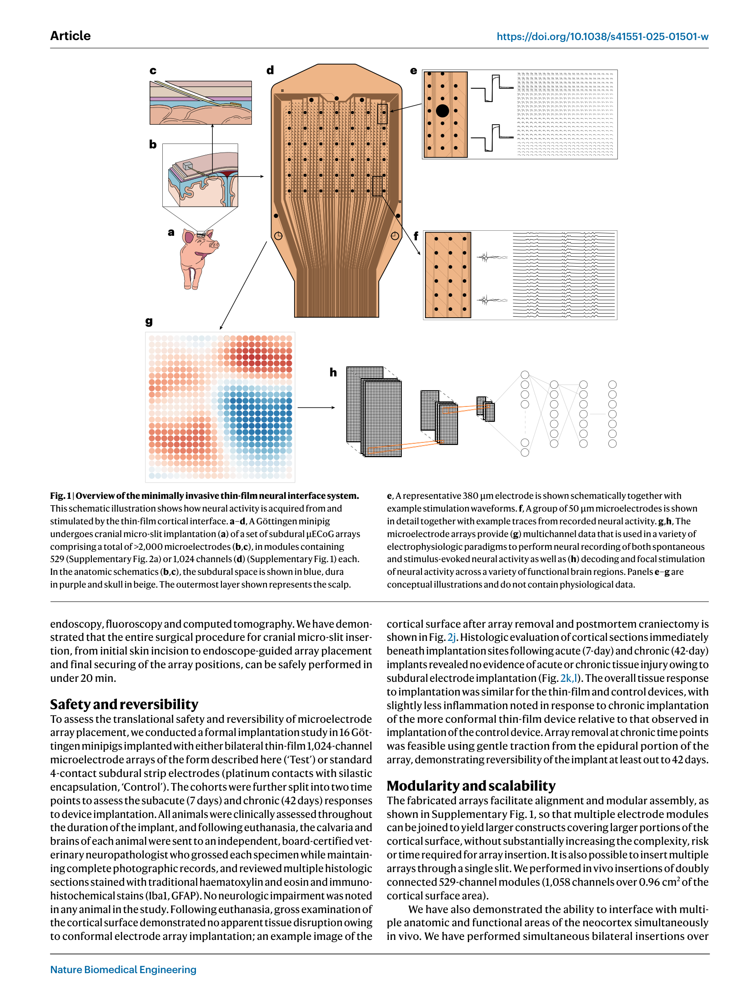
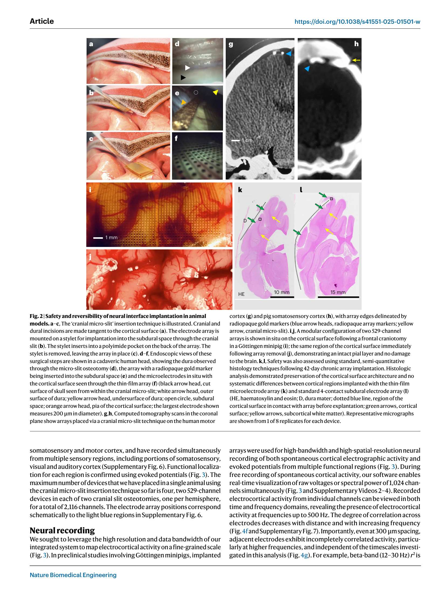
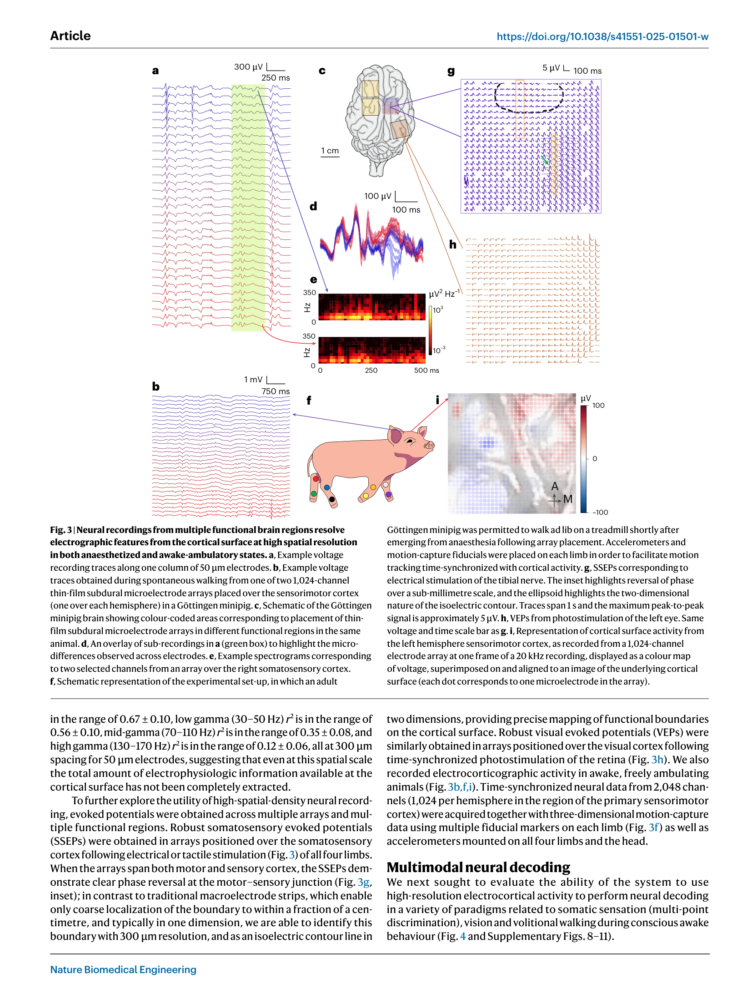
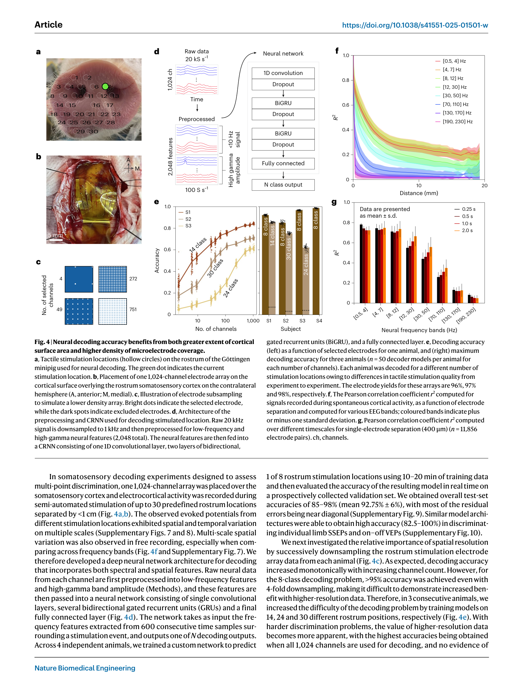
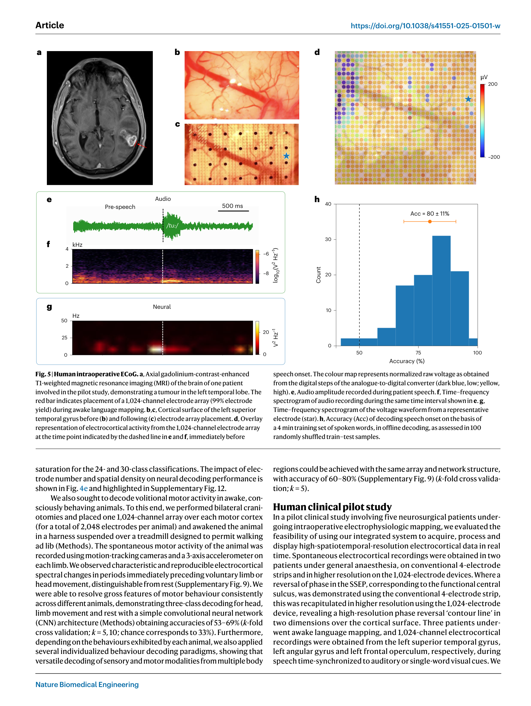
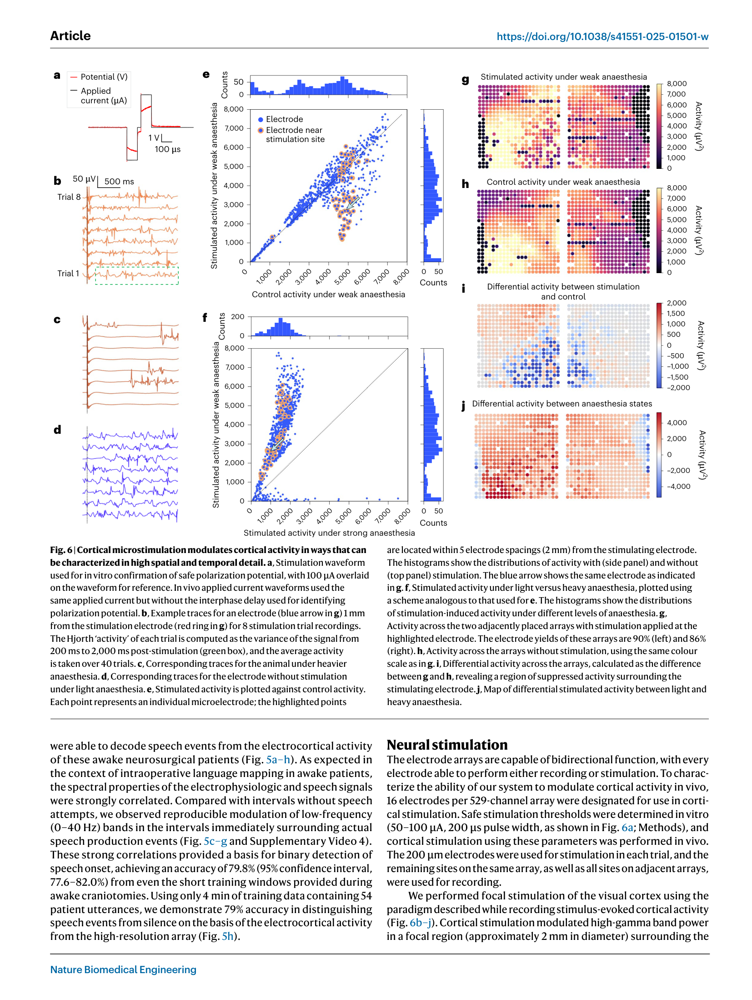

# 论文精读笔记

## 论文信息

- **标题**：Minimally Invasive Implantation of Scalable High-Density Cortical Microelectrode Arrays for Multimodal Neural Decoding and Stimulation
- **作者**：Mark Hettick*, Elton Ho*, Adam J. Poole, Manuel Monge, Demetrios Papageorgiou, Kazutaka Takahashi, Morgan LaMarca, Daniel Trietsch, Kyle Reed, Mark Murphy, Stephanie Rider, Kate R. Gelman, Yoon Woo Byun, Joshua S. Miller, Timothy Hanson, Vanessa Tolosa, Sang-Ho Lee, Sanjay Bhatia, Peter E. Konrad, Michael Mager, Craig H. Mermel, Benjamin I. Rapoport
- **单位**：Precision Neuroscience Corporation, New York (Hettick, Ho, Rapoport 等); West Virginia University (Gelman, Bhatia, Konrad)
- **通讯作者**：Benjamin I. Rapoport (ben@precisionneuro.io)
- **期刊**：Nature Biomedical Engineering, 2025
- **DOI**：[10.1038/s41551-025-01501-w](https://doi.org/10.1038/s41551-025-01501-w)
- **代码/数据**：[GitHub - precision-neuroscience/nbme2025](https://github.com/precision-neuroscience/nbme2025)

### 本地文件

- `Nature Biomedical Engineering - 2025 - Hettick - Minimally invasive implantation of scalable high-density cortical microelectrode arrays.pdf`：原文 PDF

---

## 一、这篇文章在问什么问题

**核心问题**：高性能脑机接口（BCI, brain-computer interface）需要大量电极和高空间密度来实现准确的神经解码，但现有的植入方法要么需要开颅手术（创伤大），要么依赖穿透性电极（会损伤脑组织且难以取出）。能否开发一种 **微创、可扩展、可逆** 的皮层表面微电极阵列系统，在不开颅、不穿透脑组织的前提下实现高密度神经记录、解码和刺激？

**为什么值得问**：
- 脑机接口已在瘫痪患者中展示了恢复运动控制和语言的潜力，但全球仅有极少数患者通过临床试验获得了这些高度定制化的系统
- 瓶颈在于 **手术侵入性和扩展性的矛盾**：穿透性电极（如 Utah 阵列、Neuralink 线程）提供高质量单神经元信号，但组织损伤随电极数量线性增长；传统 ECoG 电极创伤小但空间分辨率低
- **关键需求**：通道数和植入时间不应随电极数量线性增长——如果要将来部署数十万通道的全皮层接口，手术时间和风险必须保持可控
- 微电极皮层表面记录（μECoG, micro-electrocorticography）是一个有前途的折中方案，但其信息提取极限尚未被充分表征

**一句话概括**：本文描述了 Precision Neuroscience 公司的 1,024 通道薄膜微电极阵列（Layer 7 Cortical Interface），展示了其通过 "颅骨微缝" 技术实现的微创植入（无需开颅），在 Göttingen 小型猪和 5 名人类患者中验证了高密度神经记录、多模态神经解码（体感、视觉、运动、语言）和局灶性皮层刺激的可行性。

---

## 二、这篇论文和你的研究的关联

### 2.1 看似不直接相关，但有深层技术联系

你的研究聚焦于 **细胞水平** 的膜片钳测量方法改进，而 Hettick 的工作是 **系统水平** 的脑机接口技术。但两者有几个重要的技术交叉点：

**1. 电极-组织界面的电化学**：
Hettick 描述的薄膜微电极（50 μm 直径 Pt 电极，400 μm 间距）的 **阻抗特性** 和你在膜片钳实验中处理的电极特性有共同的物理基础：
- 他们的电极阻抗：802 ± 30 kΩ（20 μm 电极）至 8.25 ± 0.65 kΩ（380 μm 电极）@1 kHz
- 阻抗随电极面积变化遵循同样的界面电化学规律（双电层电容、电荷转移电阻）
- 你在膜片钳中处理的 pipette 电容（Cp）和接入电阻（Rs）本质上也是电极-溶液界面的问题

**2. 刺激伪迹的处理**：
论文中描述了皮层微刺激实验（100 μA, 200 μs 双相脉冲），他们观察到刺激在 ~2 mm 范围内调制了高伽马功率。这里也涉及刺激伪迹（stimulation artifact）的处理——虽然论文没有详细讨论，但他们分析的是刺激后 200 ms 到 2000 ms 的 Hjorth 活动值，回避了刺激期间的伪迹窗口。你的差分方法原则上可以应用于这种场景，使得分析窗口可以扩展到刺激期间。

**3. 空间分辨率与 Ve 分布的关联**：
论文发现即使在 300 μm 间距下，相邻电极信号的相关性在高频段仍不完全（高伽马段 r² ≈ 0.12）。这意味着 **皮层表面的电场在亚毫米尺度上有显著的空间异质性**——这和你研究中 Ve 的空间分布特性直接相关。你用 3D 点电流源模型计算 Ve 时假设的空间衰减特性，可以和 Hettick 的实测空间相关性进行对照。

### 2.2 更宏观的视角：你的方法在神经接口生态系统中的位置

如果把神经记录/刺激技术画一个谱：

```
单细胞 patch clamp ←--→ 多电极阵列 ←--→ μECoG ←--→ 标准 ECoG ←--→ 头皮 EEG
    (你的工作)                                (Hettick)
    空间: ~1 μm                              空间: 300-400 μm
    时间: ~1 μs                              时间: 50 μs (20 kHz)
    侵入性: 高                               侵入性: 中低
    通道数: 1-2                              通道数: 1,024-2,048
```

你的差分膜片钳方法解决的是这个谱的 **最左端** 的测量准确性问题。但你解决的核心问题——**胞外电场对记录信号的污染**——在所有电极技术中都存在，只是表现形式不同：
- Patch clamp：Ve 叠加在 Vm 记录上
- μECoG：参考电极选择和共模抑制比决定了记录质量
- DBS 场景：刺激伪迹远大于神经信号

---

## 三、实验设计与结果逐层拆解

### 第一层：系统设计与电极表征（Figure 1, Supplementary）

**系统架构**：
- 两个版本的薄膜微电极阵列：529 通道（300 μm 间距）和 1,024 通道（400 μm 间距）
- 1,024 通道版：977 个 50 μm 记录电极 + 42 个 380 μm 刺激电极 + 5 个 500 μm 参考电极
- 基底材料：聚酰亚胺（polyimide），~10 μm 厚；导线材料：Ti/Pt（后续版本加入 Au 降低走线阻抗）
- 模块化设计：多个阵列可以对齐拼接，实现更大皮层覆盖（已演示 2,116 通道双阵列）
- 硬件：基于 Intan RHD2164 芯片的定制放大/数字化板

**电极选择的权衡**：
- 较小电极（20 μm）捕获更多独特高频信息，但阻抗高、制造变异大
- 较紧间距（300 μm）增加相邻电极相关性
- 最终选择 50 μm + 400 μm 间距作为平衡方案
- 工艺良率：529 通道版 >93%，1,024 通道版 >91%


> **Fig. 1 — 系统总览**。(a) Göttingen 小型猪接受颅骨微缝植入。(b-d) 模块化薄膜 μECoG 阵列在硬膜下空间的放置示意图。(e) 380 μm 刺激电极和示例波形。(f) 50 μm 记录电极和示例神经信号。(g-h) 多通道数据用于神经记录、解码和刺激。

### 第二层：微创植入技术——颅骨微缝（Figure 2）

**"Cranial micro-slit" 技术**：
- 使用 400-800 μm 厚的微型锯片在颅骨上切一个与皮层表面切线方向的微缝
- 通过 350 μm 光纤内窥镜观察硬膜，在内窥镜引导下切开硬膜
- 将薄膜阵列通过微缝滑入硬膜下空间
- 使用 X 线透视或 CT 确认位置
- **整个手术可在 20 分钟内完成**

**安全性与可逆性**：
- 16 只 Göttingen 小型猪的 GLP 级植入研究（7 天和 42 天时间点）
- 组织学评估：没有观察到由于电极阵列植入导致的急性或慢性组织损伤
- 42 天后可通过轻柔牵引取出电极，皮层表面完整无损


> **Fig. 2 — 颅骨微缝植入技术的安全性和可逆性**。(a-c) 微缝技术步骤。(d-f) 人尸体中的内窥镜视图。(g-h) CT 扫描确认阵列位置。(i-j) 小型猪皮层在阵列放置和取出后的照片——皮层表面完整。(k-l) 42 天慢性植入后的组织学——无系统性组织损伤差异。

### 第三层：高分辨率神经记录（Figure 3）

**多脑区、多状态记录**：
- 麻醉状态下：自发皮层活动 + 诱发电位（体感、视觉）
- 清醒自由行走状态：双侧 2,048 通道 + 运动捕捉 + 加速度计
- 实时可视化 1,024 通道的原始电压或频谱功率

**关键发现**：
- 皮层活动在高达 500 Hz 的频率上都有可检测的信息
- **相邻电极信号不完全相关**：在 300 μm 间距下，高伽马段（130-170 Hz）r² 仅 ~0.12——说明皮层表面信息的空间分辨率极限尚未被完全提取
- 体感诱发电位（SSEP）可以以 300 μm 分辨率定位运动-感觉皮层交界处的相位反转——传统宏电极只能在厘米级、一维方向上定位


> **Fig. 3 — 多脑区高分辨率神经记录**。(a) 50 μm 电极列的电压记录。(b) 清醒行走中的记录。(c) 多脑区阵列放置。(d-e) 微差异和频谱图。(f) 清醒行走实验设置。(g) SSEP 相位反转的亚毫米级定位。(h) 视觉诱发电位。(i) 皮层表面活动的电压彩图。

### 第四层：多模态神经解码（Figure 4）

**体感解码**：
- 1,024 通道阵列覆盖猪吻部（rostrum）体感皮层
- 使用气动阵列刺激吻部 8-30 个不同位置
- 深度学习架构（CRNN）：1D 卷积 + 双向 GRU + 全连接层
- **结果**：8 类位置辨别 85-98% 准确率；更难的 24/30 类任务仍可获得高准确率

**空间密度的价值**：
- 随着电极数增加，解码准确率单调递增
- 对于简单任务（8 类），4× 降采样就够用
- 对于困难任务（30 类），需要全部 1,024 通道才能达到最高准确率——**没有观察到饱和**

**运动解码**：
- 清醒自由行走猪，双侧 2,048 通道
- 3 类解码（头部运动、肢体运动、静止）：53-69% 准确率（机会水平 33%）


> **Fig. 4 — 高密度空间覆盖和高密度电极间距对神经解码均有贡献**。(a-b) 猪吻部刺激位置和阵列放置。(c) 电极降采样示意。(d) CRNN 解码架构。(e) 解码准确率随通道数增加——更难的任务（更多类别）从更多通道中受益更大。(f-g) 不同频段的空间相关性随距离衰减。

### 第五层：人类临床先导研究（Figure 5）

**5 名神经外科患者的术中记录**：
- 2 名全麻患者：自发活动 + SSEP
- 3 名清醒开颅患者：语言区域的电皮层记录
- 1,024 通道阵列在手术中使用 ≤15 分钟

**结果**：
- 传统 4 电极条带定位的中央沟相位反转，在 1,024 通道阵列上被高分辨率重现——揭示了二维相位反转"等电位线"
- 清醒患者语言映射：从 4 分钟训练数据（54 个单词发音）中解码语音事件，准确率 ~80%
- 强调了该系统在临床术中使用的可行性


> **Fig. 5 — 人类术中 ECoG**。(a) MRI 显示左侧颞叶肿瘤和阵列放置。(b-c) 阵列放置前后的皮层表面。(d) 语音起始前的皮层活动电压图。(e-g) 音频和神经信号的时频谱。(h) 基于 4 分钟训练数据的语音检测准确率 ~80%。

### 第六层：皮层微刺激（Figure 6）

**双向功能**：
- 同一阵列既可记录又可刺激
- 刺激参数：100 μA，200 μs 双相脉冲，0.25 Hz
- 使用 200 μm 电极刺激，其余电极记录

**结果**：
- 刺激调制了 ~2 mm 直径范围内的高伽马功率
- 效应在加深麻醉时减弱 → 证明是生理效应而非电伪迹
- 效应跨阵列边界传播 → 进一步证实生理性


> **Fig. 6 — 皮层微刺激在高时空分辨率下调制皮层活动**。(a) 刺激波形。(b-d) 不同条件下的单电极记录。(e-f) 刺激 vs 对照活动的散点图。(g-j) 阵列级别的活动图：刺激效应是局灶的（~2 mm），受麻醉深度调制，跨阵列边界传播。

---

## 四、证据链评估

### 强在哪里

1. **从动物到人类的完整验证链**：不是单纯的工程演示，而是从体外表征 → 猪模型 → 人尸体 → 人类患者的渐进验证
2. **GLP 级安全性研究**：16 只猪的规范化生物相容性研究，由独立的兽医神经病理学家评估，达到了 FDA 审查的标准
3. **多模态功能演示**：记录 + 解码 + 刺激在同一个平台上实现，展示了闭环 BCI 的完整能力
4. **可扩展性论证充分**：从 529 到 1,024 到 2,116 通道的渐进扩展，且植入时间不随通道数线性增长
5. **空间分辨率的系统分析**：不是简单声称"更多通道更好"，而是通过控制变量的降采样实验定量展示了通道数 vs 解码精度的关系

### 不够硬的地方

1. **未展示慢性无线系统**：目前系统是有线的，需要经皮连接。慢性植入的无线版本仍在开发中——这是临床应用的关键瓶颈
2. **解码性能在简单范式中展示**：体感辨别是在麻醉猪上做的被动刺激，运动解码是未训练动物的粗粒度行为分类（3 类 53-69%）。与 BrainGate 或 Neuralink 在瘫痪患者中展示的精细运动控制还有距离
3. **刺激功能较初步**：只展示了单电极刺激在视觉皮层上的局灶调制，没有展示功能性的感觉反馈或闭环控制
4. **长期信号稳定性数据缺失**：ECoG 的一大优势是长期信号稳定性，但论文没有展示超过 42 天的电生理数据
5. **μECoG vs 穿透性电极的信号质量定量比较缺失**：论文多次暗示 μECoG 可以替代穿透性电极，但没有直接比较两者在相同任务上的解码性能

---

## 五、对你的研究的直接影响

### 5.1 间接但重要的技术启示

虽然 Hettick 的 μECoG 系统和你的 patch clamp 方法在技术层面差异很大，但有几个值得借鉴的思想：

**1. 等效电路思维是通用的**：
Hettick 的电极-组织界面可以用你熟悉的等效电路描述（电极阻抗 = 界面电容 + 电荷转移电阻 + 溶液电阻）。他们发现的阻抗随电极面积的关系（802 kΩ @20 μm → 8.25 kΩ @380 μm）本质上反映了界面电容与面积成正比的基本规律。

**2. 空间相关性分析对你理解 Ve 的空间分布有参考价值**：
他们发现高伽马功率在 300 μm 距离上 r² 仅 ~0.12——这意味着皮层表面的电场有非常精细的空间结构。这对你在脑片实验中建模 Ve 的空间分布有参考意义：如果皮层表面（二维）的电场在 300 μm 尺度上已经显著变化，那么三维组织中距离刺激电极 200 μm 处的 Ve 分布可能比你的点电流源模型预测的更复杂。

### 5.2 论文的大图景价值

从更宏观的角度看，Hettick 的工作展示了神经接口领域正在向 **大规模、微创、可逆** 的方向发展。在这个趋势中，对电极-组织界面的精确理解变得越来越重要——这正是你的等效电路建模方法所擅长的。

### 5.3 Precision Neuroscience vs Neuralink 的技术路线对比

这篇论文实际上代表了 BCI 领域两大技术路线之一的最新进展：

| | Precision Neuroscience (Hettick) | Neuralink |
|---|---|---|
| **电极类型** | 非穿透性 μECoG | 穿透性柔性线程 |
| **手术方式** | 颅骨微缝（微创） | 机器人穿刺植入 |
| **信号类型** | LFP + 高伽马 | 单神经元动作电位 + LFP |
| **可逆性** | 已验证 42 天后可取出 | 穿透性电极取出有组织损伤风险 |
| **空间分辨率** | ~400 μm | ~μm（单神经元级别） |
| **扩展性** | >2,000 通道，可快速部署 | 1,024 通道/线程，需要逐根植入 |

两条路线各有优势，最终哪条更适合临床还有待观察。但 Hettick 的工作展示了一个重要信号：**皮层表面信号包含的信息量可能被长期低估了**——即使不穿透脑组织，高密度 μECoG 也可能实现临床可用的 BCI 性能。

---

## 六、待讨论的问题

1. **μECoG 信号的物理极限在哪里？** Hettick 发现 300 μm 间距下高伽马段信号仍未完全相关（r² ~0.12），暗示更密的电极间距仍能提取更多信息。但理论上，皮层表面电位是体积导体中的远场信号（volume conduction），空间分辨率受组织导电性和距离的根本限制。μECoG 的信息提取极限到底在哪里？

2. **刺激伪迹的处理**：论文中皮层刺激实验分析的是刺激后 200-2000 ms 窗口（回避了刺激伪迹）。如果能分析刺激期间的神经响应，将获得更丰富的信息。你的差分方法（或其在 ECoG 上的类比——公共模式去除）是否可以帮助？

3. **这类大规模 μECoG 数据如何与你在单细胞水平的 patch clamp 数据桥接？** 一个有趣的科学问题是：单个神经元的跨膜电压动态（你的测量对象）如何映射到皮层表面的场电位（Hettick 的测量对象）？这需要正向建模（从单细胞到 LFP/ECoG）和逆向建模（从 ECoG 反推细胞活动）。

4. **商业 BCI 公司的技术文献可靠性**：Precision Neuroscience 是一家商业公司（Neuralink 联合创始人 Benjamin Rapoport 创立），论文中难免有选择性报告正面结果的倾向。例如，运动解码仅 53-69%（3 类）在 BCI 文献中并不突出，但被包装在一个"多模态演示"的叙事中。阅读此类论文时需要注意区分技术原理验证和临床性能宣称。

5. **你最想搞清楚的一件事是什么？**
