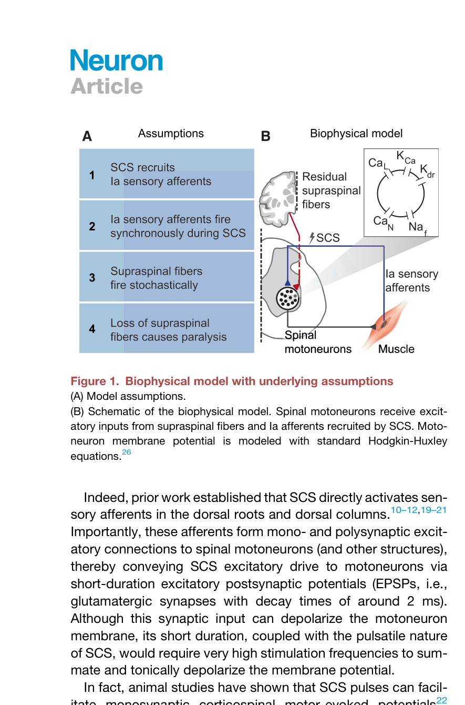
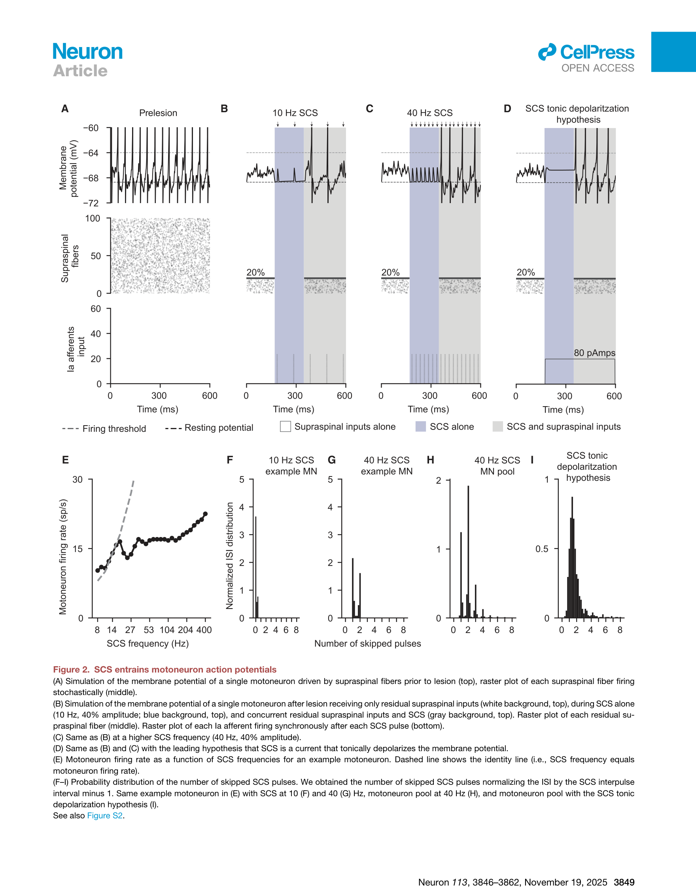
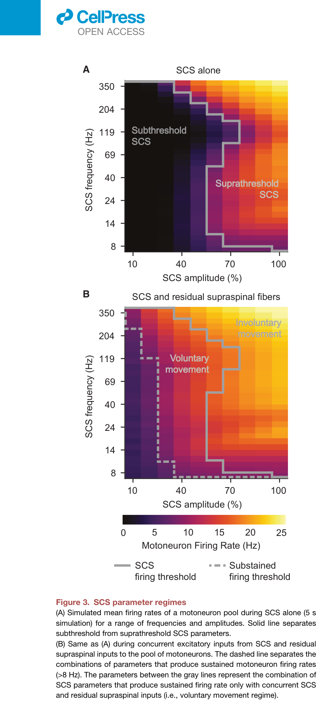
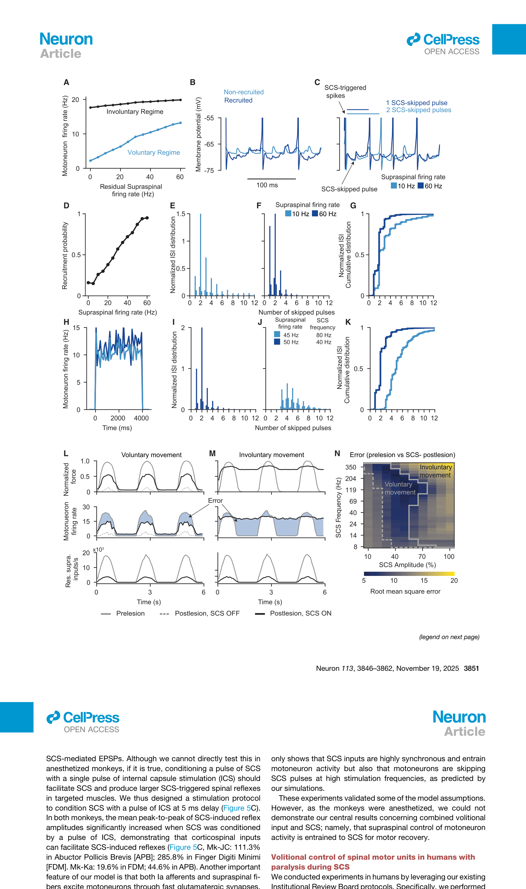
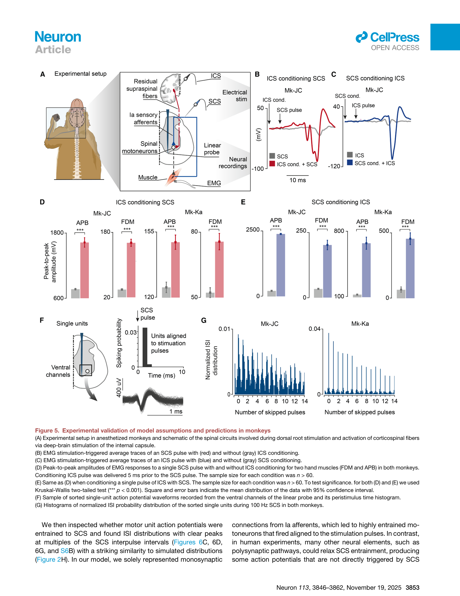
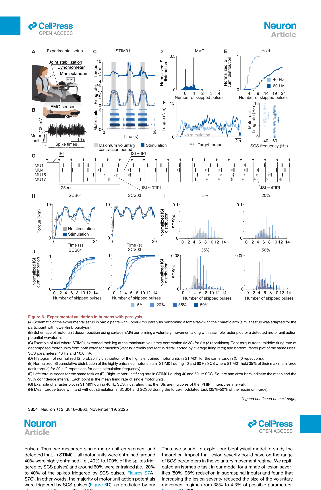
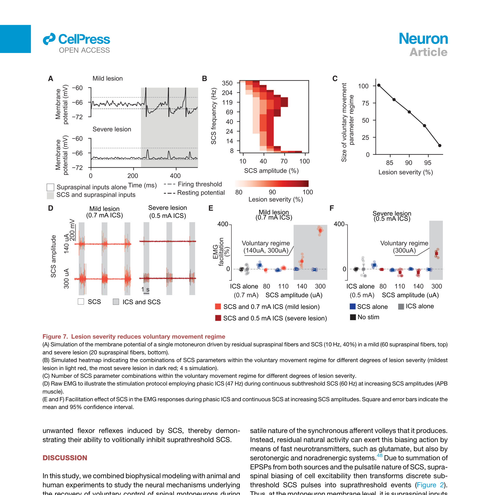
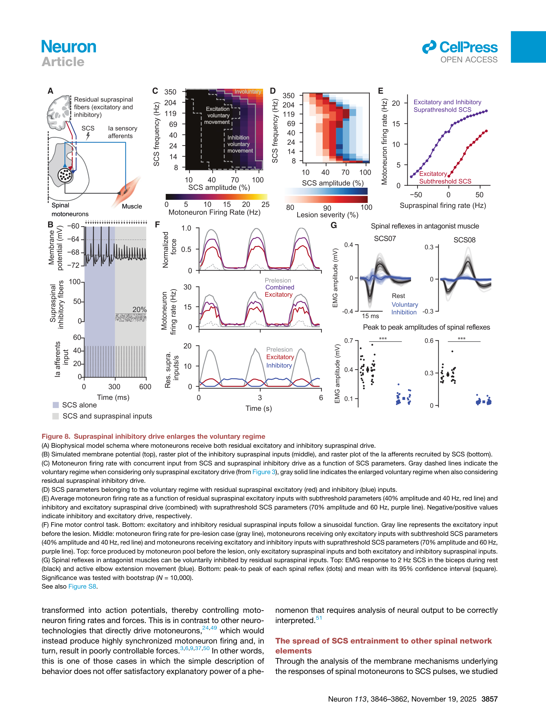

# 论文精读笔记

## 论文信息
- **标题**：Neural mechanisms underlying the recovery of voluntary control of motoneurons after paralysis with spinal cord stimulation
- **作者**：Josep-Maria Balaguer, Genis Prat-Ortega, Julia Ostrowski, Luigi Borda, Nikhil Verma, Prakarsh Yadav, Erynn Sorensen, Roberto de Freitas, Scott Ensel, Serena Donadio, Lucy Liang, Jonathan Ho, Arianna Damiani, Erinn M. Grigsby, Daryl P. Fields, Jorge A. Gonzalez-Martinez, Peter C. Gerszten, Lee E. Fisher, Douglas J. Weber, Elvira Pirondini, Marco Capogrosso*
- **单位**：Rehab Neural Engineering Labs, University of Pittsburgh; Department of Bioengineering, University of Pittsburgh; Carnegie Mellon University
- **通讯作者**：Marco Capogrosso (mcapo@pitt.edu)
- **期刊**：Neuron 113, 3846–3862 (November 19, 2025)
- **DOI**：[10.1016/j.neuron.2025.08.023](https://doi.org/10.1016/j.neuron.2025.08.023)
- **收稿/接收**：Received February 21, 2025; Accepted August 22, 2025

### 来源链接
- [Neuron (Cell Press)](https://doi.org/10.1016/j.neuron.2025.08.023)

### 本地文件
- `Neuron - 2025 - Balaguer - Neural mechanisms underlying the recovery of voluntary control of motoneurons after paralysis with spinal cord stimulation.pdf`：原文 PDF

---

## 一、这篇文章在问什么问题

**核心问题**：脊髓电刺激（SCS）恢复瘫痪后自主运动控制的神经机制究竟是什么？

**为什么值得问**：
- 过去二十年的临床试验一致表明，SCS 能让脊髓损伤和卒中患者恢复对瘫痪肢体的自主控制，但**为什么 SCS 促进的是"自主"运动而非单纯的被动激活**，一直没有令人信服的机制解释
- 主流假说认为 SCS 通过"持续去极化"使运动神经元膜电位更接近阈值，从而使其对残余脑信号更敏感——但这一假说**从未被实验验证过**，且与脉冲式刺激的物理特性相矛盾
- 搞清楚机制才能指导临床参数优化：目前参数选择近乎盲调，理解机制才能系统地缩小最优参数空间
- SCS 对严重损伤患者疗效有限，理解机制才能预测 SCS 的适用边界
- 这一机制可能推广到所有脉冲式神经刺激技术（DBS、VNS 等）

**一句话概括**：本文通过生物物理建模结合猴/人实验，证明残余脑信号通过调控运动神经元膜电位将阈下 SCS 脉冲转化为动作电位，从而实现对 SCS-entrained 发放频率的自主控制，并揭示了损伤严重度对自主运动参数空间的内在限制。

---

## 二、背景知识补充

### 2.1 脊髓电刺激（SCS）的基本原理

SCS 是一种通过植入硬膜外电极在脊髓背侧施加电脉冲的技术。其直接激活的靶点是**背根 Ia 类感觉传入纤维**（不是直接激活运动神经元），这些纤维通过单突触和多突触连接将兴奋性突触后电位（EPSPs）传递给脊髓运动神经元。

关键概念：
- **Ia afferents**：本体感觉传入纤维，感受肌梭牵张，通过 fast glutamatergic synapses 直接连接运动神经元
- **Supraspinal fibers**：残余的皮层脊髓束等下行纤维，在损伤后只保留一部分
- **SCS 参数空间**：由刺激频率（Hz）和刺激幅度（% 纤维激活）两个维度定义

### 2.2 此前的主流假说："增强兴奋性"

SCS 领域长期存在一个广为接受但从未被严格验证的假说：

> SCS 持续提升运动神经元的兴奋性（"neuromodulation"），使膜电位更接近阈值，从而放大残余脑信号的效果。

这一假说的核心困难在于：SCS 是脉冲式的（例如 40 Hz），而运动神经元膜时间常数约 2 ms，脉冲之间膜电位早已回到静息水平，根本无法"持续去极化"。

### 2.3 本文提出的新机制：Entrainment + Pulse-skipping

本文提出了一个完全不同的框架：

1. **Entrainment（锁频）**：每个 SCS 脉冲产生一个短暂的 EPSP；如果此时膜电位足够高（由残余脑信号抬升），这个 EPSP 就能触发动作电位。于是运动神经元的发放被**锁定到 SCS 脉冲的时间点**
2. **Pulse-skipping（跳脉冲）**：在自主运动 regime 下，并非每个 SCS 脉冲都触发动作电位——脑信号通过调节膜电位基线，控制"跳过"多少个脉冲，从而调控发放频率
3. **关键预测**：ISI（脉冲间隔）分布应该是 SCS 脉冲间隔的整数倍

---

## 三、实验设计与结果逐层拆解

### 第1层：生物物理模型的构建与基本预测（Figure 1–2）

**做了什么**：
- 使用 NEURON 仿真器构建了包含 100 个 Hodgkin-Huxley 运动神经元、60 条 Ia 传入纤维和可变数量脑脊髓纤维的生物物理模型
- 脊髓损伤通过减少 40% 的 Ca²⁺-activated K⁺ 通道电导和减少突触连接来建模
- 模拟了三种条件：损伤前、SCS alone、SCS + 残余脑信号

**结果**：
- SCS alone 在低频（10 Hz）时产生亚阈值 EPSPs，不足以触发动作电位
- SCS alone 在高频（40 Hz）时，虽然单个 EPSP 仍不足以持续去极化（因膜时间常数 ~2 ms 太短），但脉冲式去极化可以触发动作电位
- 关键发现：**当加入残余脑信号时，即使是亚阈值的 SCS 脉冲也被转化为动作电位**——脑信号抬升了膜电位基线，使 EPSP 跨过阈值
- 运动神经元发放被严格锁定到 SCS 脉冲时间（entrainment），ISI 分布在 SCS 脉冲间隔的整数倍处出现离散峰

> **Fig. 1 — Biophysical model with underlying assumptions**
> **(A)** 模型假设：SCS 激活 Ia 传入纤维，与残余脑脊髓纤维同时突触至运动神经元
> **(B)** 模型示意图：运动神经元接收来自 Ia 传入和脑脊髓纤维的双源兴奋性输入，膜电位用标准 Hodgkin-Huxley 方程描述

> **Fig. 2 — SCS entrains motoneuron action potentials**
> **(A)** 损伤前单个运动神经元的膜电位：脑信号驱动不规则发放
> **(B)** 10 Hz SCS alone 后：SCS 产生亚阈值 EPSPs（蓝色），加入脑信号（灰色）后每个 EPSP 都可触发动作电位，发放完全锁定到 SCS 脉冲
> **(C)** 40 Hz SCS：脑信号仍能抬升膜电位，但并非每个 SCS 脉冲都触发发放（pulse-skipping）
> **(D)** "持续去极化"假说对照：即使假设 SCS 是持续电流，仍无法解释 10 Hz 时的动作电位产生
> **(E)** 发放频率随 SCS 频率变化：低频时发放频率 = SCS 频率（完全 entrainment）；高频时出现跳脉冲
> **(F–I)** ISI 分布在 SCS 脉冲间隔整数倍处出现离散峰，证实 entrainment 和 pulse-skipping

**怎么理解**：
传统假说把 SCS 想象成一个"调高基线"的直流旋钮。本文的模型表明，SCS 更像是一台**节拍器**：每个脉冲提供一个短暂的"过阈机会窗口"，而脑信号决定运动神经元在每个窗口是否能跨阈值。这解释了为什么 SCS 下的运动既是"自主的"（脑信号控制发放与否），又是"人工的"（发放时间被锁定到 SCS 脉冲）。

---

### 第2层：SCS 参数的三种 regime（Figure 3）

**做了什么**：
- 系统扫描 SCS 频率（8–350 Hz）× 幅度（10%–100%）参数空间
- 分别在 SCS alone 和 SCS + 脑信号两种条件下观察运动神经元发放

**结果**：
- **Subthreshold regime**（左下方黑色区域）：SCS alone 不产生任何发放
- **Suprathreshold regime**（右上方暖色区域）：SCS alone 已经产生发放 → 不需要脑信号 → **involuntary movement**
- **Voluntary movement regime**（仅当加入脑信号时才有发放的区域）：这是临床有用的参数窗口——SCS 本身不触发运动，但脑信号能通过 SCS 产生运动

> **Fig. 3 — SCS parameter regimes**
> **(A)** SCS alone 热力图：subthreshold（黑色）和 suprathreshold（暖色）的分界线
> **(B)** SCS + 脑信号热力图：出现新的 "voluntary movement" regime（虚线内），灰线区分 voluntary 和 involuntary 区域

**怎么理解**：
这张图是本文的核心概念框架。它告诉临床医生：参数不是越大越好。太大进入 involuntary regime（不需要脑信号就产生运动 → 患者无法控制 → 痉挛/共收缩）；太小则完全无效。最优参数在 voluntary regime 的**窄窗口**内——这个窗口的大小取决于残余脑信号的强度，也就是损伤严重度。

---

### 第3层：脑信号如何在 entrainment 下调控发放频率（Figure 4）

**做了什么**：
- 在 voluntary regime 参数下（40 Hz, 40% 幅度），改变残余脑信号的发放频率（10–60 Hz）
- 观察运动神经元发放频率如何响应
- 在 involuntary regime 参数下做同样的实验作为对照
- 模拟了自主力跟踪任务（sinusoidal force target）

**结果**：
- Voluntary regime 下：脑信号发放频率升高 → 膜电位基线升高 → 跳过的 SCS 脉冲减少 → 运动神经元发放频率**线性增加**
- Involuntary regime 下：运动神经元发放频率随脑信号变化**很小**（已经接近 SCS 频率的天花板）
- ISI 分布验证：高脑信号发放频率 → ISI 分布向左移（跳脉冲减少）
- 力跟踪任务：voluntary regime 下可以准确跟踪正弦力目标；involuntary regime 下产生大误差

> **Fig. 4 — Residual supraspinal inputs can modulate motoneuron firing rate during SCS**
> **(A)** Voluntary regime 下发放频率随脑信号线性增加；involuntary regime 下几乎不变
> **(B–C)** 单个运动神经元膜电位示例：脑信号频率从 10 Hz 到 60 Hz 时，跳脉冲数减少
> **(D)** 被招募的运动神经元比例随脑信号增加
> **(E–K)** ISI 分布验证 pulse-skipping 机制
> **(L–N)** 力跟踪任务：voluntary movement 下可精确控制力输出，involuntary movement 下误差大；**N 面板的热力图**清晰展示最优参数区域

**怎么理解**：
尽管运动神经元被"锁定"到 SCS 节拍上（表面上完全失去了独立性），大脑仍然可以通过一个精巧的机制实现"频率调制"——控制跳过多少个节拍。这就像一个鼓手被限制只能在节拍器的拍点上敲鼓，但可以选择跳过某些拍点来控制节奏快慢。

---

### 第4层：猴子实验验证模型假设（Figure 5）

**做了什么**：
- 在 2 只麻醉猕猴（Mk-JC, Mk-Ka）中进行实验
- 通过硬膜外电极刺激颈椎脊髓（SCS），通过深部脑刺激（ICS，内囊后肢）模拟皮层脊髓输入
- 记录手部肌肉 EMG 和脊髓腹侧单元活动
- 验证三个模型假设：(1) SCS 和 ICS 的 EPSP 在运动神经元膜上整合；(2) SCS 同步激活传入纤维；(3) 运动神经元发放锁定到 SCS 脉冲

**结果**：
- **ICS conditioning SCS**：在 ICS 脉冲 5 ms 前发一个 SCS 脉冲 → EMG 反应显著增大（两个猴 p < 0.001），证明 SCS EPSP 和 ICS EPSP 在膜上线性叠加
- **SCS conditioning ICS**：反向顺序同样增大反应，且增大幅度在长延迟时减小（因为 EPSP 衰减），与模型预测的 2 ms 时间常数一致
- **单元活动 entrainment**：100 Hz SCS 下记录到的脊髓腹侧单元 ISI 分布在 SCS 脉冲间隔的整数倍处出现清晰的离散峰

> **Fig. 5 — Experimental validation of model assumptions and predictions in monkeys**
> **(A)** 实验装置：麻醉猴，硬膜外 SCS + 深部脑刺激 ICS + 脊髓线性探针 + EMG
> **(B–C)** SCS 和 ICS 条件配对刺激的 EMG trace
> **(D–E)** 两个猴的 APB/FDM 肌肉峰-峰幅度在 paired stimulation 下显著增大
> **(F)** 单脉冲 ICS 叠加 SCS：验证 EPSP 时间窗口
> **(G)** 归一化 ISI 分布显示在 SCS 间隔整数倍处的离散峰（100 Hz SCS）

**怎么理解**：
这一层用经典的 paired-pulse 电生理范式验证了模型的两个核心假设：(1) 来自 SCS（via Ia）和来自脑（via 皮层脊髓束）的 EPSPs 能在同一个运动神经元上时间叠加；(2) SCS 确实在固定的时间点上产生同步 EPSP。局限是猴子是麻醉的，无法验证"自主控制"。

---

### 第5层：人类瘫痪患者的实验验证（Figure 6）

**做了什么**：
- 在 1 名脊髓损伤患者（STIM01, ASIA A 完全运动感觉损伤）和 2 名卒中患者（SCS03, SCS04）中测试
- STIM01：膝关节伸展等长最大力量任务，有/无 SCS
- SCS03/SCS04：用 surface EMG decomposition 提取单个运动单元
- 分析运动单元的 ISI 分布、entrainment 程度、跳脉冲分布

**结果**：
- **STIM01**：无 SCS 时完全没有力输出；SCS 在 voluntary regime 参数下恢复了力输出，验证了自主运动恢复
- **STIM01 单运动单元**：ISI 分布在 SCS 间隔整数倍处出现峰，40 Hz 和 60 Hz SCS 下 ISI 分布随 SCS 频率移动——直接验证了 entrainment
- **SCS03/SCS04**（卒中）：voluntary movement 和 involuntary movement 两种 regime 下的发放行为符合模型预测
  - Voluntary regime：运动单元发放可被自主调制（力跟踪）
  - Involuntary regime：发放频率被 SCS 控制，自主调制受限
- **SCS03**：35% entrainment 的运动单元在 SCS 参数升高后 entrainment 增至 50%

> **Fig. 6 — Experimental validation in humans with paralysis**
> **(A–B)** 实验设置和 EMG decomposition 示例
> **(C–E)** STIM01 的运动单元 ISI 分布在 40 Hz 和 60 Hz SCS 下的离散峰
> **(F)** SCS 频率 vs 发放频率关系
> **(G)** SCS03 的多个运动单元同时记录，ISI ≈ 3*IPI
> **(H–I)** SCS04 在 SCS 有/无时的力输出对比
> **(J–K)** 不同 entrainment 程度（5%, 20%, 35%, 50%）下的 ISI 分布

**怎么理解**：
这是本文最重要的临床验证层。在完全瘫痪（ASIA A）和部分瘫痪（卒中）两类患者中，都观察到了与模型预测一致的 entrainment 和 pulse-skipping 现象。特别是 STIM01 的数据极具说服力：这是一个完全没有自主运动能力的患者，SCS 在正确参数下恢复了力输出，而单运动单元分析证实了 entrainment 机制。

---

### 第6层：损伤严重度限制自主运动参数空间（Figure 7）

**做了什么**：
- 在模型中系统改变损伤严重度（残余脑脊髓纤维数量从 80% 减少到 5%）
- 计算每种损伤程度下 voluntary regime 的参数空间大小
- 在猴子实验中用 EMG 验证损伤效应
- 在 STIM01（严重损伤）和卒中患者（中度损伤）中比较

**结果**：
- 轻度损伤（60 条残余纤维）：膜电位在脑信号 + SCS 下明显高于阈值 → voluntary regime 范围大
- 严重损伤（20 条残余纤维）：膜电位勉强达到阈值 → 必须使用更大 SCS 幅度 → 迅速进入 involuntary regime
- Voluntary regime 大小随损伤严重度**非线性减小**：85% lesion severity 时仍有 ~75% 参数空间可用，但 95% severity 时骤降至 ~35%
- 猴子实验验证：continuous SCS + phasic ICS 在低 SCS 幅度时展示 facilitation，高 SCS 幅度时 SCS alone 已足以产生 EMG 反应

> **Fig. 7 — Lesion severity reduces voluntary movement regime**
> **(A)** 轻度 vs 重度损伤时运动神经元的膜电位轨迹
> **(B)** 不同损伤严重度下 voluntary regime 的热力图——损伤越重，voluntary 区域（红色）越小
> **(C)** Voluntary regime 大小 vs 损伤严重度：非线性衰减
> **(D–F)** 猴子和人类的 EMG 验证

**怎么理解**：
这一层揭示了 SCS 的一个**内在物理限制**。它不是技术不够好的问题，而是机制本身的约束：当脑信号太少时，为了补偿缺失的兴奋性驱动，SCS 幅度不得不升高到 suprathreshold 水平，此时运动神经元被 SCS 直接驱动而非脑控制。这解释了为什么 SCS 在 ASIA A（完全损伤）患者中的效果远不如轻度损伤患者。

---

### 第7层：抑制性脑信号扩展自主运动范围（Figure 8）

**做了什么**：
- 在模型中引入抑制性脑脊髓纤维（inhibitory supraspinal drive）
- 测试在 suprathreshold SCS 参数下，抑制性信号能否"沉默"不需要的运动神经元活动
- 模拟精细运动控制任务（force ramp）
- 在卒中患者（SCS07, SCS08）中通过自主抑制脊髓反射任务验证

**结果**：
- 仅有兴奋性脑信号时，voluntary regime 受限于 subthreshold → threshold 的窄窗口
- 加入抑制性脑信号后：voluntary regime 显著扩大，因为即使 SCS 在 suprathreshold，脑信号也可以**主动抑制**不想要的发放
- 精细运动任务：在 suprathreshold SCS 下，兴奋性 + 抑制性脑信号组合可以实现正弦力跟踪
- 人类验证（SCS07, SCS08）：自主伸肘时脊髓反射在拮抗肌中被抑制，休息时则不被抑制——证明抑制性信号可以在 SCS 期间发挥作用

> **Fig. 8 — Supraspinal inhibitory drive enlarges the voluntary regime**
> **(A)** 模型扩展：运动神经元同时接收兴奋性和抑制性脑脊髓输入
> **(B)** 带抑制性输入后的膜电位轨迹：抑制信号可以压低膜电位使发放停止
> **(C–D)** 热力图：仅兴奋性 vs 兴奋+抑制性输入的 voluntary regime 对比——后者显著扩大
> **(E)** 抑制性信号的效果取决于损伤严重度
> **(F)** 精细运动控制：兴奋+抑制信号组合实现 sinusoidal force tracking
> **(G)** 人类验证：自主伸展时拮抗肌反射被抑制，休息时不被抑制

**怎么理解**：
这一层带来了一个重要的临床启示：**最优参数可能在 slightly suprathreshold 区域**，而非传统认为的 subthreshold。因为如果患者能学会利用抑制性信号（类似于正常运动中的拮抗肌抑制），就可以在 suprathreshold SCS 下"雕刻"出想要的运动模式。这意味着 SCS 训练应该同时训练兴奋和抑制两个方向。

---

## 四、证据链评估

### 强在哪里
1. **计算-实验闭环设计**：先用生物物理模型产生定量预测（entrainment, ISI 分布, pulse-skipping），再在猴子和人类中逐一验证，每个预测都有对应的实验证据
2. **跨物种验证**：从计算模型 → 麻醉猴 → 清醒人类（SCI + stroke），逻辑链条完整
3. **推翻主流假说的同时提出替代框架**：不是简单否定"兴奋性增强"假说，而是提供了一个更精确的生物物理解释（entrainment + pulse-skipping），且这个框架能解释更多现象
4. **单运动单元分析**：在人类中用 surface EMG decomposition 提取单运动单元，提供了发放层面的直接证据
5. **临床可操作的预测**：voluntary regime 的参数空间概念可以直接指导临床参数调优

### 不够硬的地方
1. **猴子实验在麻醉下进行**：ICS 不等于真正的皮层自主信号。虽然在人类中补充了清醒实验，但猴子数据中 ICS 的 paired-pulse 实验无法证明"自主性"
2. **模型仅考虑单突触连接**：只建模了 Ia 传入的单突触通路，忽略了多突触通路（Ib, II 类纤维, 中间神经元）。虽然作者在 limitation 中讨论了这一点，但多突触通路可能在低频 SCS 下提供更持久的 EPSP，部分支持"兴奋性增强"机制
3. **人类样本量极小**：1 名 SCI + 2 名 stroke 用于主要验证，2 名 stroke 用于抑制实验。个体差异可能很大
4. **未考虑长期可塑性**：模型只关注即时效应，无法解释 SCS 长期训练后的功能改善（这可能涉及突触可塑性和环路重组）
5. **Force model 简化**：从运动神经元发放到力输出的转换用了 Fuglevand 模型，未考虑肌肉疲劳、共收缩等因素
6. **抑制性通路的验证较间接**：Figure 8G 中证明自主抑制脊髓反射的实验设计（rest vs. voluntary extension）不能直接证明是皮层脊髓抑制性投射在起作用

---

## 五、对神经刺激研究的直接影响

### 5.1 引用/参考价值
- 如果你的研究涉及**脊髓电刺激、DBS 或任何脉冲式神经刺激**，本文提供了一个通用的计算框架来理解人工脉冲与自然神经活动如何在神经元膜上整合
- Entrainment + pulse-skipping 机制可能适用于其他脉冲式刺激技术（DBS、VNS、tDCS）中观察到的自主调制现象

### 5.2 方法学启示
- **Surface EMG decomposition 用于提取单运动单元**：在运动障碍患者中应用 MUAP decomposition 来研究发放层面的刺激效应——这个方法可以迁移到其他神经刺激研究
- **ISI 分布分析作为 entrainment 指标**：用归一化 ISI 概率分布在 SCS 脉冲间隔整数倍处是否出现峰来量化 entrainment 程度——这是一个简单但有力的分析方法
- **参数空间热力图**：系统扫描频率 × 幅度参数空间并分类为 subthreshold / voluntary / involuntary regime——这种可视化方法可以推广到任何刺激参数优化研究

### 5.3 对电生理记录的启示
- 在 SCS 同时进行神经记录时，运动神经元的发放时间将被锁定到刺激脉冲——**这对伪迹去除和信号解释有重要影响**
- 传统上看到的"SCS 增强皮层诱发电位"可能不是因为兴奋性增强，而是因为 SCS EPSP 和 ICS EPSP 的时间叠加——这改变了如何解释 paired-pulse 实验的结果

---

## 六、待讨论的问题

1. **多突触通路的贡献**：在 40 Hz 以下的 SCS 频率，多突触通路（尤其是通过 central pattern generator 的通路）是否能提供比单突触 EPSP 更长的时间窗口，从而部分支持"持续兴奋性增强"假说？模型只考虑了 Ia 单突触通路是否过于简化？

2. **Entrainment 与自然运动的差异**：自然运动中运动单元的发放是不规则的（CV ~0.2），而 SCS 下被 entrained 的发放本质上是离散的（只能取 SCS 频率的整数分频）。这种离散化对精细运动控制（例如手指操作）的影响是什么？是否存在一个"足够好"的 SCS 频率使得离散化效应可以忽略？

3. **抑制性训练的临床路径**：Figure 8 预测患者可以利用抑制性脑信号在 suprathreshold SCS 下"雕刻"运动模式。但如何训练 ASIA A 患者使用他们几乎不存在的抑制性通路？是否需要 neurofeedback 或 BCI 辅助？

4. **急性 vs 慢性效应**：本文的模型只能解释即时效应。但临床上 SCS 的疗效往往在数周训练后才显现。这种长期效应是否涉及 Hebbian 可塑性（同时激活的脑信号和 SCS 信号可能强化突触连接）？

5. **你最想搞清楚的一件事是什么？**
