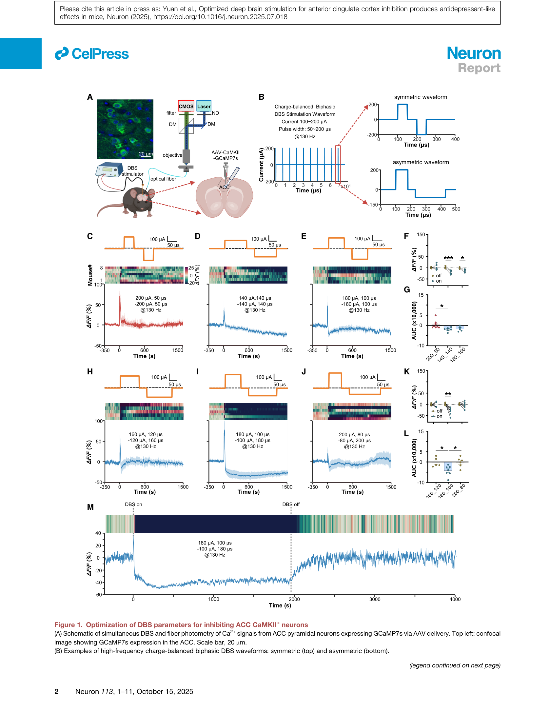
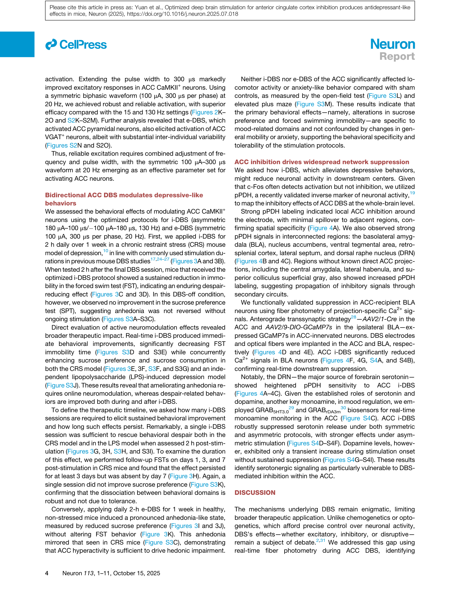
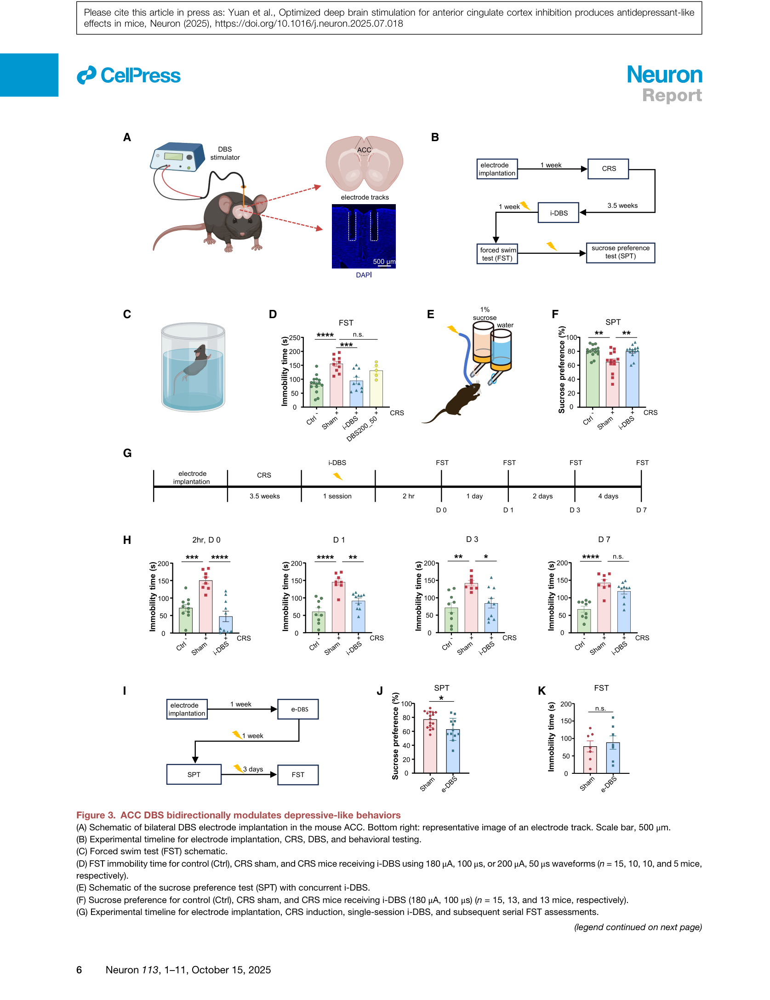
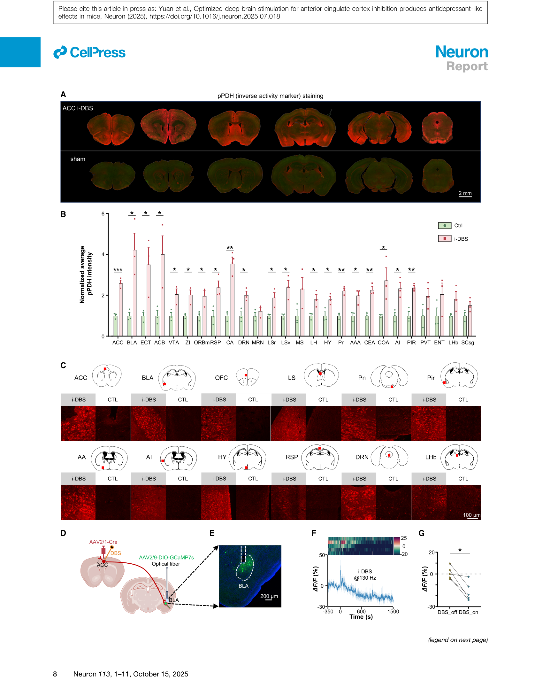

# 论文精读笔记

## 论文信息

- **标题**：Optimized Deep Brain Stimulation for Anterior Cingulate Cortex Inhibition Produces Antidepressant-Like Effects in Mice
- **作者**：Zhengwei Yuan*, Haonan Yang, Peng Wang, Xiaoning Hou, Ke Xu, Yu Zhou, Ruicheng Dai, Yuan Gao, Xinwei Gao, Qingchun Guo, Yulong Li, Jianning Zhang, Zhiqi Mao*, Minmin Luo*
- **单位**：Beijing Institute for Brain Research / Chinese Institute for Brain Research (Yuan, Luo 等); Department of Neurosurgery, Chinese PLA General Hospital (Yang, Zhang, Mao); Peking University (Li)
- **通讯作者**：Zhengwei Yuan (yuanzhengwei@cibr.ac.cn), Zhiqi Mao (markmaoqi@163.com), Minmin Luo (luominmin@cibr.ac.cn)
- **期刊**：Neuron, Vol. 113, 1–11, October 15, 2025
- **DOI**：[10.1016/j.neuron.2025.07.018](https://doi.org/10.1016/j.neuron.2025.07.018)
- **许可**：Elsevier, All rights reserved

### 本地文件

- `Neuron - 2025 - Yuan - Optimized deep brain stimulation for anterior cingulate cortex inhibition produces antidepressant-like effects.pdf`：原文 PDF

---

## 一、这篇文章在问什么问题

**核心问题**：深脑电刺激（DBS, deep brain stimulation）是治疗难治性抑郁症的一种有前景的方法，但刺激参数如何影响神经回路活动、以及什么参数组合能产生最佳治疗效果，仍然不清楚。具体到前扣带皮层（ACC, anterior cingulate cortex）这一抑郁症关键脑区——能否通过系统优化 DBS 参数来精确控制 ACC 神经元的兴奋/抑制，并据此产生抗抑郁效果？

**为什么值得问**：
- DBS 已在帕金森病、特发性震颤等运动障碍中取得临床成功，但在精神疾病（尤其是抑郁症）中的应用仍受限于两大瓶颈：(1) 不知道 DBS 到底是在兴奋还是抑制目标脑区；(2) 参数选择主要靠经验，缺乏机制指导
- ACC 在抑郁症病理中有明确角色——MDD 患者中 ACC 持续表现出结构、生化和代谢异常；化学遗传学和光遗传学抑制 ACC 锥体神经元可以缓解抑郁样行为
- 但化学遗传学和光遗传学在临床上不可行，DBS 是唯一可临床翻译的精确调控手段
- **关键难点**：在人类实验中，刺激伪迹（stimulation artifacts）限制了只能分析刺激后（post-stimulation）时段，无法获得刺激期间的细胞级别信息

**一句话概括**：本文结合 DBS 与光纤钙信号记录（fiber photometry），在小鼠 ACC 中系统优化了刺激波形、脉宽和频率，发现不对称双相波形在高频下可靠抑制 ACC 锥体神经元，而对称长脉宽低频波形激活 ACC。抑制性 DBS 产生快速、持久的抗抑郁样行为，兴奋性 DBS 则诱导快感缺失（anhedonia）。全脑 pPDH 标记揭示了 ACC DBS 驱动的广泛网络抑制图谱。

---

## 二、这篇论文和你的研究的关联

### 2.1 最核心的交叉点：DBS 中的刺激伪迹问题

论文 Introduction 中明确指出了你的研究所解决的同类问题：

> "In humans, however, stimulation artifacts restrict analysis to post-stimulation epochs and preclude cellular resolution."

这正是你的 TIM 论文所处理的核心技术瓶颈——胞外电刺激（extracellular electrical stimulation, EES）产生的伪迹会污染电生理记录。不同的是：
- 你的场景是 **急性脑片上的 patch clamp 记录**，Ve ≠ 0 的叠加导致 Vm 测量不准
- Yuan 的场景是 **在体 DBS**，刺激伪迹导致无法在刺激期间进行电生理记录

Yuan 巧妙地用 **光学方法（fiber photometry 的 Ca2+ 信号）** 绕开了电伪迹问题——光信号不受电刺激伪迹影响。这是一种 "avoid the artifact" 的策略。而你的差分方法是 "correct the artifact" 策略。两者互补：

| 策略 | 方法 | 优点 | 局限 |
|---|---|---|---|
| 绕开伪迹 | 光学记录 (Ca2+, voltage dye) | 完全不受电伪迹影响 | 时间分辨率差（Ca2+ ~100 ms vs 电信号 ~μs）；需要基因编码指示剂 |
| 修正伪迹 | 差分电学测量（你的方法） | 保留 μs 级时间分辨率；适用于所有膜片钳实验 | 需要额外记录 Ve(t)；需要精确的电极电容补偿 |

### 2.2 DBS 波形参数与你的刺激参数对比

Yuan 使用的 DBS 参数和你在 TIM 论文中使用的胞外电刺激参数有直接可对比性：

| 参数 | Yuan (DBS) | 你的 TIM 论文 (EES) |
|---|---|---|
| **波形** | 双相充电平衡（对称/不对称） | 双相或单相矩形脉冲 |
| **脉宽** | 50–300 μs | μs–ms 量级 |
| **频率** | 5–130 Hz（单脉冲或脉冲串） | 单脉冲或低频重复 |
| **电流** | 100–200 μA | ~1 mA |
| **电极** | 双极 Ni-Cd 绞线电极，∅150 μm | 铂铱刺激电极 |

关键差异在于 **刺激距离和场强**：
- DBS 电极直接插入脑组织（距目标神经元 ~100 μm），场强非常高
- 你的 EES 电极在细胞外液中距离 patch 细胞 ~200 μm，但你的场景是脑片上的受控条件

### 2.3 不对称波形的生物物理机制——和你的等效电路模型的联系

Yuan 发现不对称双相波形（阳极相 180 μA/100 μs + 阴极相 100 μA/180 μs）比对称波形更有效地抑制 ACC 神经元。虽然论文没有给出详细的生物物理解释，但从你的等效电路角度可以理解：

不对称波形意味着 **电荷虽然平衡，但电流-时间分布不对称**：
- 阳极相：高电流短脉宽（180 μA × 100 μs = 18 nC）
- 阴极相：低电流长脉宽（100 μA × 180 μs = 18 nC）

从膜电位响应角度看：高电流短脉宽相会产生更尖锐的跨膜电压变化（因为膜电容的 RC 充电时间常数 τ = Rm·Cm ~10-50 ms >> 100 μs，短脉冲主要通过电容性电流通路）。这意味着不对称波形可能通过不对称的膜电压响应来差异化地影响不同类型的离子通道和突触。

这个分析和你在 TIM 论文中对短脉冲刺激下膜电位响应的分析框架完全一致——你也发现短脉冲（μs 级）下膜电位响应主要由容性电流决定，Rs 和 Cm 的值决定了响应的时间进程。

---

## 三、实验设计与结果逐层拆解

### 第一层：抑制性 DBS 参数优化（Figure 1）

**做了什么**：
- 在 ACC 中注射 AAV-CaMKII-GCaMP7s 标记锥体神经元，同时植入 DBS 电极和光纤
- 系统扫描对称双相波形（200 μA/50 μs, 180 μA/100 μs, 140 μA/140 μs）在 130 Hz 下的效果
- 系统扫描不对称双相波形（180-100, 160-120, 200-80）在 130 Hz 下的效果

**结果**：
- 对称波形表现不佳：200 μA/50 μs 只产生短暂 Ca2+ 瞬态无持续抑制；其余两组抑制弱且不一致
- **不对称 180-100 波形**脱颖而出：数秒内即产生稳健抑制，持续到刺激停止，完全可逆
- 出人意料的发现：DBS 同时抑制了 VGAT+ GABAergic interneurons（中间神经元），说明抑制不是通过"兴奋抑制性中间神经元"机制，而是 **广泛的区域抑制**

> **Fig. 1 — 抑制性 DBS 参数优化**。(A) 实验示意图：ACC 中同时进行 DBS 和 fiber photometry。(B) 对称和不对称双相波形示例。(C-G) 对称波形在三种参数下的 Ca2+ 响应——效果不佳。(H-M) 不对称波形结果：180-100 waveform 产生快速、稳健、可逆的 ACC CaMKII+ 神经元抑制。

### 第二层：兴奋性 DBS 参数优化（Figure 2）

**做了什么**：
- 在确认高频不对称波形可靠抑制后，探索什么参数可以可靠地 **兴奋** ACC
- 扫描频率（5, 7, 15, 40, 80, 130 Hz）×不同波形
- 最终尝试延长脉宽至 300 μs

**结果**：
- 单纯降低频率不足以产生可靠兴奋——15 Hz 对称波形有短暂兴奋趋势但不稳定
- **关键发现**：对称 100 μA/300 μs 波形在 20 Hz 下产生稳健、可靠的 ACC 兴奋
- 这说明 **频率和脉宽必须协同调节**——长脉宽延长了去极化相的持续时间，可能允许更多 Na+ 通道激活

> **Fig. 2 — 兴奋性 DBS 参数识别**。(A-J) 不同频率下对称和不对称波形的 Ca2+ 响应。单纯降频不够。(K-O) 对称 100 μA/300 μs 波形在 20 Hz 下成功产生稳健兴奋。**关键洞察：兴奋需要频率+脉宽协同调节。**

### 第三层：行为学验证——双向调控抑郁样行为（Figure 3）

**做了什么**：
- 慢性束缚应激（CRS）和 LPS 诱导两种抑郁模型
- i-DBS（抑制性参数）：不对称 180-100，130 Hz，每天 2 小时，持续 1 周
- e-DBS（兴奋性参数）：对称 100 μA/300 μs，20 Hz，每天 2 小时，持续 1 周
- 行为测试：强迫游泳测试（FST, 绝望行为）、蔗糖偏好测试（SPT, 快感缺失）

**结果**：
- **i-DBS 产生快速、持久的抗抑郁效果**：
  - FST 不动时间显著降低（即使 DBS 关闭 2 小时后仍有效）
  - 单次 i-DBS 即可产生 ≥3 天的持续效果
  - 但 SPT 改善需要在线刺激——说明绝望和快感缺失有不同机制阈值
- **e-DBS 诱导快感缺失**：健康小鼠接受 1 周 e-DBS 后蔗糖偏好降低，但 FST 不受影响
- 关键对照：两种 DBS 均不影响运动活性（OFT）和焦虑行为（EPM），证明行为特异性

> **Fig. 3 — ACC DBS 双向调控抑郁样行为**。(A-B) 实验时间线。(C-D) i-DBS 减少 FST 不动时间。(E-F) i-DBS 在线时改善蔗糖偏好。(G-H) 单次 i-DBS 产生 ≥3 天持续效果。(I-K) e-DBS 诱导健康小鼠快感缺失但不影响绝望行为。

### 第四层：全脑网络映射——pPDH 逆向活动标记（Figure 4）

**做了什么**：
- 使用 pPDH（磷酸化丙酮酸脱氢酶）作为神经元活动的逆向标记（高 pPDH = 低活动）
- ACC i-DBS 后 15 分钟灌注取脑，全脑 pPDH 免疫标记
- 使用 fiber photometry 验证 ACC → BLA 通路的功能抑制

**结果**：
- ACC 局部强 pPDH 标记（直接抑制），溢出到邻近区域极少（空间特异性）
- 下游直接投射区（BLA, NAc, VTA, RSP, LS, DRN）均显示 pPDH 升高
- 无直接 ACC 投射的区域（CeA, LHb, SCsg）也有 pPDH 升高 → 多突触传播
- Fiber photometry 验证：ACC i-DBS 确实实时降低了 ACC → BLA 投射神经元的 Ca2+ 信号
- **重要发现**：DRN（背侧缝核，前脑 5-HT 主要来源）对 ACC i-DBS 特别敏感，ACC 中的 5-HT 释放被显著抑制

> **Fig. 4 — ACC i-DBS 驱动广泛的脑网络抑制**。(A) 全脑 pPDH 标记：红色为 pPDH（Cy3），绿色为自发荧光。(B-C) 各脑区 pPDH 信号定量和代表性共聚焦图像。(D-G) Fiber photometry 验证 ACC → BLA 通路的实时抑制。

---

## 四、证据链评估

### 强在哪里

1. **系统性参数优化框架**：不是随机试参数，而是通过波形对称性 × 脉宽 × 频率的系统扫描，用实时光学读出来guide参数选择。这为其他脑区的 DBS 优化提供了可复制的方法学
2. **双向因果证据**：抑制 ACC → 抗抑郁；兴奋 ACC → 促抑郁。这形成了完整的双向因果关系，远超仅做单向操控的研究
3. **多层验证**：细胞水平（Ca2+ 信号）→ 行为水平（FST/SPT）→ 回路水平（pPDH 全脑映射 + BLA fiber photometry）→ 分子水平（5-HT/DA 传感器），形成了从机制到现象的完整证据链
4. **时间维度分析**：探索了 DBS 效果的 onset 速度（秒级）、持续时间（≥3 天）、和剂量-效应（单次 vs 多次），这些对临床转化至关重要
5. **适当的对照**：OFT/EPM 排除运动和焦虑混杂因素；使用两种独立抑郁模型（CRS 和 LPS）增强可靠性

### 不够硬的地方

1. **Ca2+ 信号的时间分辨率局限**：fiber photometry 只能报告群体平均的 Ca2+ 信号（~100 ms 时间尺度），无法区分 DBS 对单个神经元的精确影响。你的差分膜片钳方法在时间分辨率上有数量级的优势
2. **DBS 的空间选择性未量化**：论文声称 pPDH 标记显示"局部 ACC 抑制，溢出极少"，但 DBS 电极在体内的电场分布并不均匀——实际上激活/抑制了多大范围的组织？没有计算建模来回答这个问题
3. **波形机制解释缺失**：为什么不对称波形比对称波形更有效地抑制？为什么长脉宽促进兴奋？论文只给出了现象学描述，没有生物物理层面的解释。理想情况下应该结合离子通道动力学建模来解释
4. **小鼠模型到临床的鸿沟**：作者自己也承认——小鼠抑郁模型（FST, SPT）与人类 MDD 的异质性和治疗抵抗有本质差异。FST 作为抑郁测试的有效性本身在领域中就有争议
5. **长期效果和安全性数据不足**：只跟踪了 7 天的效果持续性。慢性 DBS 可能导致组织损伤、适应性改变、反弹效应等——这些都没有评估

---

## 五、对你的研究的直接影响

### 5.1 你的差分方法是解决 DBS 实时电生理监测的关键技术之一

Yuan 选择光学方法来绕开电伪迹，但牺牲了时间分辨率。如果能解决电伪迹问题（你的差分方法），就可以在 DBS 期间进行 **μs 级时间分辨率的电生理记录**——这将是巨大的技术优势。

具体场景：如果在脑片上复现 DBS 实验（用类似参数的胞外电刺激），你的差分膜片钳方法可以：
1. 测量 DBS 脉冲期间的真实 Vm 变化——目前没有任何技术能做到这一点
2. 区分 DBS 的直接去极化/超极化效应和突触介导的间接效应
3. 解析不对称波形 vs 对称波形对膜电位的差异性影响——从生物物理层面解释 Yuan 的现象学发现

### 5.2 Yuan 的研究为你的方法提供了重要的应用场景

你的 TIM 论文主要关注测量方法本身。但引用和讨论 DBS 相关工作可以增强你论文的 **应用动机（motivation）**：

> 差分测量方法的一个潜在应用场景是深脑电刺激（DBS）的细胞机制研究。DBS 已在帕金森病和抑郁症中展现治疗潜力，但其精确的神经元响应机制——特别是刺激期间的跨膜电压动态——至今无法通过传统电生理方法直接测量（Yuan et al., Neuron, 2025）。差分 patch clamp 方法可以在脑片上以 μs 时间分辨率解析 DBS 参数对单个神经元跨膜电压的影响，为 DBS 参数优化提供细胞水平的机制理解。

### 5.3 DBS 参数空间和你的刺激参数的映射

Yuan 的参数优化结果可以直接指导你在脑片实验中使用什么 DBS 参数来复现 in vivo 效果：

| Yuan 的 in vivo 参数 | 你的脑片 EES 实验对应 |
|---|---|
| 不对称 180 μA/100 μs, 130 Hz → 抑制 | 在脑片上用类似波形参数做 EES，测量 Vm 响应 |
| 对称 100 μA/300 μs, 20 Hz → 兴奋 | 较长脉宽 + 低频，观察是否产生不同的 Vm 动态 |
| 电极距 ACC 神经元 ~100 μm | 调整 EES 电极距 patch 细胞的距离来匹配场强 |

---

## 六、待讨论的问题

1. **不对称波形的生物物理机制**：你能否用你的等效电路模型（Rs, Cm, Rm, 离子通道）来模拟不对称双相脉冲下的 Vm 响应？不对称性是否会导致不对称的跨膜电压变化，从而差异化地激活/抑制不同的电压门控通道？

2. **DBS 抑制的机制到底是什么？** Yuan 发现 DBS 同时抑制了锥体神经元和 GABAergic 中间神经元。这排除了"通过兴奋抑制性中间神经元来间接抑制锥体神经元"的经典假说。那实际机制是什么？可能的解释：(a) 高频刺激导致离子通道失活（depolarization block）；(b) 突触囊泡耗竭；(c) 细胞外 K+ 积累。你的差分测量方法可以直接区分 (a) 和 (c)。

3. **pPDH 标记 vs 直接电生理记录**：pPDH 是一个代谢指标（磷酸化丙酮酸脱氢酶），其信号变化的时间尺度是分钟级，无法反映 DBS 开始后秒级的动态变化。如果能在脑片上直接电生理记录，可以获得远超 pPDH 的时间分辨率信息。

4. **这篇论文和 Lesperance 2018 + 你的 TIM 论文的三角关系更新**：现在可以扩展成四角关系：

   | 论文 | 问题域 | 伪迹类型 | 解决策略 |
   |---|---|---|---|
   | Lesperance 2018 | EFS + patch clamp | PCA 反馈环路伪迹 | 换用 VFA |
   | 你的 TIM 论文 | EFS + patch clamp | Ve 叠加伪迹 | 差分测量 |
   | Lei 2025 | Voltage clamp（无 EFS）| Rs 控制误差 | 计算模型修正 |
   | **Yuan 2025** | **DBS + 在体记录** | **DBS 刺激伪迹** | **绕开伪迹（光学方法）** |

   你的差分方法有潜力直接解决 Yuan 场景中的电伪迹问题（至少在离体脑片实验中），使得 DBS 期间的电生理记录成为可能。

5. **你最想搞清楚的一件事是什么？**
