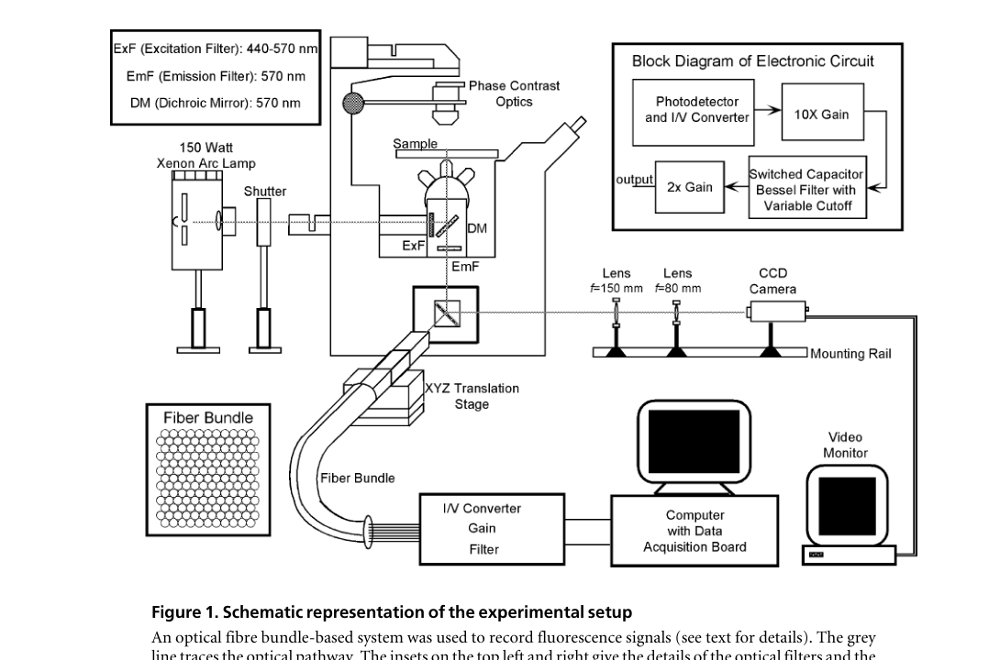
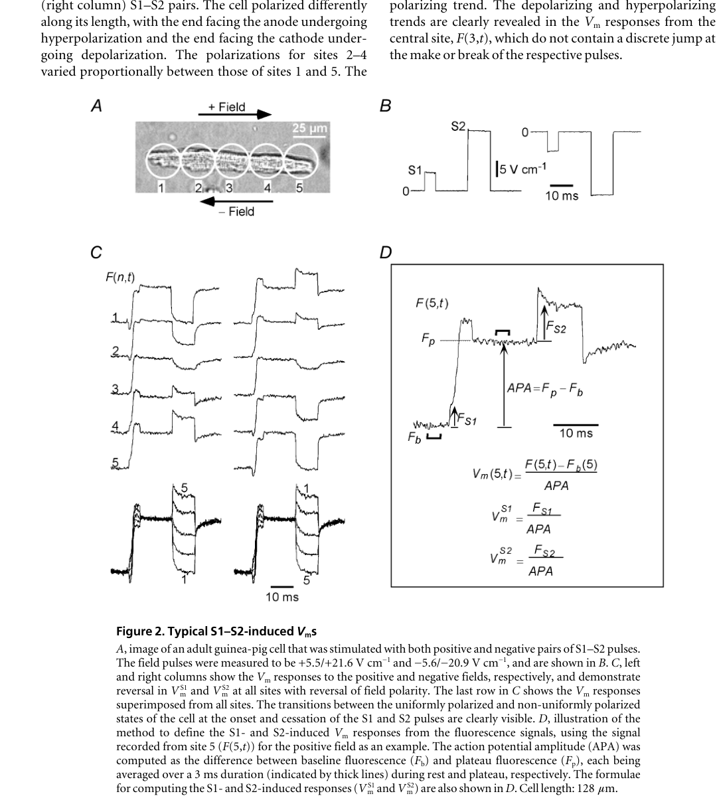
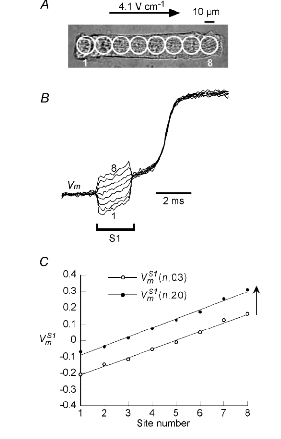
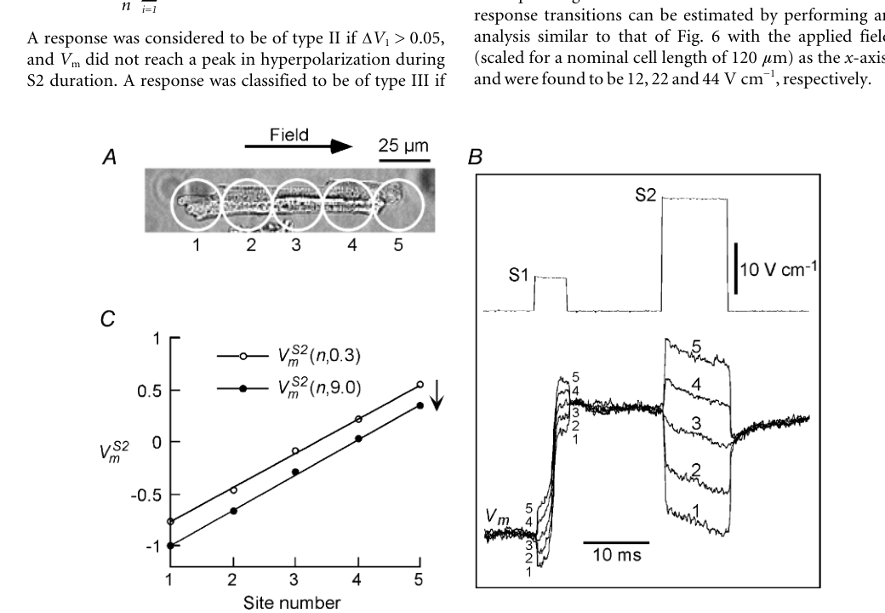
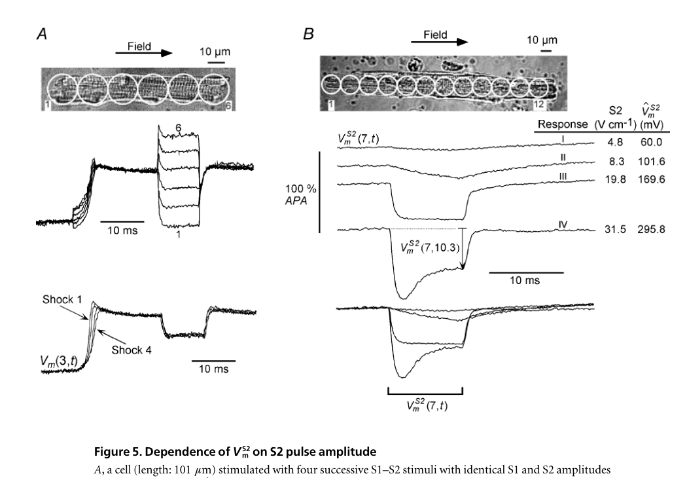
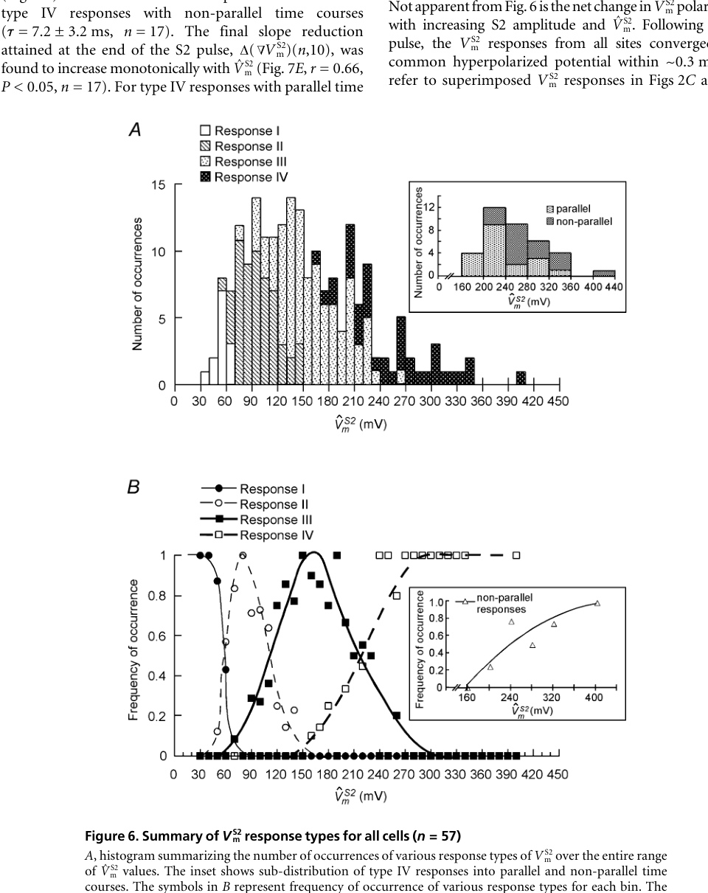
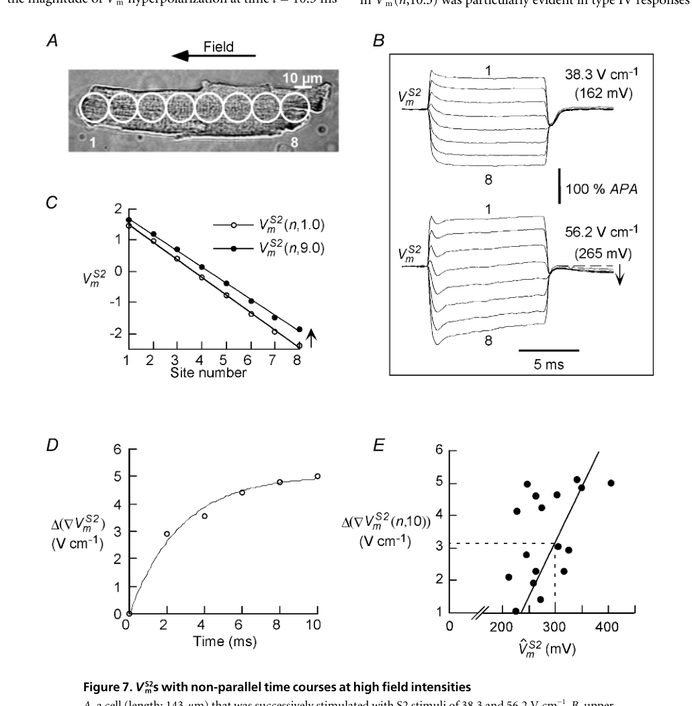
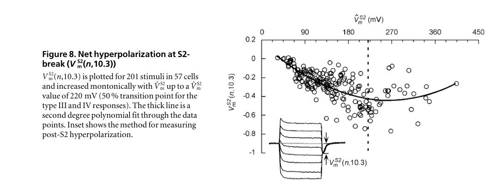

# 胞外电场刺激下，单个心肌细胞的膜电位到底长什么样？

**论文题目**：Spatial heterogeneity of transmembrane potential responses of single guinea-pig cardiac cells during electric field stimulation

**作者**：Vinod Sharma, Leslie Tung

**单位**：Department of Biomedical Engineering, The Johns Hopkins University

**期刊**：The Journal of Physiology, 2002, 542(2): 477-492

**DOI**：[10.1113/jphysiol.2001.013197](https://doi.org/10.1113/jphysiol.2001.013197)

---

> 一句话讲完这篇论文：外电场刺激单个心肌细胞时，膜电位的变化不是"全细胞同步升降"，而是可以拆成一个沿细胞长轴的空间梯度项和一个全细胞共享的公共偏移项——当场强足够高时，这套简单的线性叠加就会被打破，系统进入带有内部电场和非线性损伤的新区间。

---

## 为什么要读这篇论文

我们做电生理的时候，习惯把单个心肌细胞当作一个"点"：给它一个电流，它整体去极化；测到的膜电位 $V_m$ 就代表了整个细胞的状态。这在电流钳或空间钳制条件下完全成立。

但换成**外电场刺激**，情况就完全不一样了。

外电场不是从细胞内部某一点注入电流，而是在细胞外部施加一个空间均匀的电位梯度。这会导致细胞一端被推向去极化、另一端被拉向超极化——同一个细胞，同一时刻，不同位置的膜电位可以方向相反。

这件事对理解除颤和抗心律失常刺激至关重要。组织层面常常讨论的 virtual electrode、make excitation、break excitation，追到最底层，都绑定在一个基本问题上：**一个单独的心肌细胞，在均匀外电场里，膜电位的空间分布究竟是怎样的？**

Sharma 和 Tung 这篇 2002 年的论文，就是要把这个问题彻底拆清楚。

---

## 先抓住四件事

读这篇论文，先把下面四条记牢：

1. 外电场一加上去，单个心肌细胞的膜电位就会沿长轴出现空间异质性——一端去极化，另一端超极化，中间近似线性过渡。
2. 作者把这个响应拆成两个分量：一个是来得快、随位置线性变化的 $V_{mr}$（空间梯度项），一个是来得慢、各测点几乎同步变化的 $V_{ms}$（公共偏移项）。
3. $V_{ms}$ 的方向不是固定的，而是取决于细胞当前所处的状态——静息期偏去极化，平台期偏超极化。
4. 场强继续往上推，响应就不再是简单的线性叠加了：细胞内部会长出额外的电场 $E_i$，不同测点的轨迹不再平行，系统进入了与电穿孔相关的非线性区。

---

## 实验怎么做的

作者用成年豚鼠心室肌单细胞（共 57 个细胞，201 次刺激），用电压敏感染料 di-8-ANEPPS 标记后，沿细胞长轴进行多位点（4–12 个点）同步光学记录，空间分辨率达到 17 或 25 $\mu$m。

关键的刺激方案是 $S1$-$S2$ 双脉冲：$S1$ 在静息期施加，用来触发动作电位；$S2$ 在动作电位平台期施加，用来观察平台期的场响应。外加场强覆盖约 3–62 V/cm，场方向可以反转。

这个设计的精妙之处在于，它把两个问题分开了：场刚加上去那一瞬间发生了什么（对应 $V_{mr}$），以及场持续存在时，膜电流和细胞状态又把系统往哪个方向推（对应 $V_{ms}$）。

---

## 全文最核心的一个等式

如果只记一个公式，就记这个：

$$
V_m(x,t) = V_{mr}(x) + V_{ms}(t)
$$

$V_{mr}(x)$ 是空间项——外电场一加上去就立刻出现的线性极化模板，随位置变化，随场方向翻转而翻转，对细胞正处于静息期还是平台期不太敏感。

$V_{ms}(t)$ 是时间项——在空间极化的基础上，膜离子电流逐渐把整条细胞往同一个方向推过去的那个公共偏移。它在各测点几乎同步变化，但方向取决于细胞的电生理状态。

这个分解背后的物理图像很清晰。论文的讨论部分给出了一个等价表达：

$$
V_m(x,t) = \phi_i(t) + f E_o x
$$

其中 $\phi_i(t)$ 是细胞内电位（近似等势），$E_o$ 是外加电场，$f$ 是与细胞形状有关的系数。只要外场存在，膜电位就天然带有位置依赖——$V_{mr}$ 对应 $f E_o x$，$V_{ms}$ 对应 $\phi_i(t)$。

---

## 荧光信号是怎么变成膜电位的

作者先用动作电位幅度（APA）做归一化：

$$
APA = F_p - F_b
$$

其中 $F_b$ 是基线荧光，$F_p$ 是平台期荧光。然后把任意测点的荧光变化换算成膜电位变化：

$$
V_m(n,t) = \frac{F(n,t) - F_b(n)}{APA}
$$

所以文中看到的 $V_m$ 是归一化后的相对量，不是微电极直接测到的绝对毫伏值。这样做的好处是，不同细胞、不同测点之间的响应可以直接比较。

---

## 逐图拆解

### Figure 1：实验平台——证明"能看到空间差异"

这张方法图看似平淡，但它是全文的技术前提。作者不是在看整颗细胞的平均荧光，而是沿长轴做同步多点记录。没有这套系统，后面关于 $V_{mr}$ 和 $V_{ms}$ 的拆分就无从谈起。

### Figure 2：主线第一次浮出水面

这张图要读出三件事：

第一，场方向反转时，空间极化图样跟着反转——说明快速响应确实由外电场方向控制。第二，细胞中部测点没有明显的 make 或 break 跳变，但会出现缓慢偏移——说明在两端极化之外，还存在一个全细胞共享的公共分量。第三，静息期和平台期的公共偏移方向是反的：$S1$ 期间偏去极化，$S2$ 期间偏超极化。

Figure 2 不只是在"定义变量"，而是在实验现象层面第一次把 $V_{mr}$ 和 $V_{ms}$ 的雏形摆了出来。

### Figure 3：静息期——公共项把细胞推向去极化

作者故意把 $S1$ 做得更短更弱（2 ms，4.1 V/cm），让动作电位上升相推迟到脉冲之后，从而把场刺激阶段单独看清楚。

结果很明确：场一开始，先出现沿长轴分散开的线性极化；随后，不同位置的轨迹几乎平行地整体上移。也就是说，静息期的 $V_{ms}$ 是去极化型的——场刺激把细胞的平均状态推向了更容易被激发的方向。

### Figure 4：平台期——公共项方向反转

和 Figure 3 形成镜像对照。快速空间极化仍然存在（$V_{mr}$ 不受细胞状态影响），但公共项的方向反过来了：平台期的 $V_{ms}$ 是超极化型的。

这一步是全文最重要的逻辑转折。它告诉我们，$V_{mr}$ 更像外场施加在细胞上的被动几何结果，而 $V_{ms}$ 则明显取决于细胞当前的电生理状态——是静息期还是平台期。换句话说，公共项的方向不是由电场决定的，而是由膜离子电流决定的。

### Figure 5：场强加大后，平台期响应不是线性放大

Figure 5A 先做了一个重要的排除：反复照光和重复刺激不会明显改变同一细胞的响应，因此后面看到的形态变化不是实验伪迹。

Figure 5B 才是核心结果。随着 $S2$ 场强逐步增加，平台期响应依次经历四种形态：

- **I 型**：几乎不动。
- **II 型**：缓慢超极化，脉冲结束前还没到峰值。
- **III 型**：快速达到超极化峰值后维持平台。
- **IV 型**：先快速超极化，随后出现回摆——非线性开始露头了。

重点不在于分类本身，而在于它说明：平台期场响应会跨过不同机制主导的区间，而不是"场越大，波形按比例放大"。

### Figure 6：四型分布的总体统计

这张图把 Figure 5 的个例变成了 57 个细胞、201 次刺激的总体规律。

作者用两端最大极化的平均值 $\hat{V}_m^{S2}$ 作为强度指标，给出三个关键阈值：约 60 mV（I→II）、110 mV（II→III）、220 mV（III→IV），对应名义场强大约 12、22、44 V/cm。

值得注意的是，非平行的 IV 型响应主要集中在高极化区间——真正危险的非线性不是从一开始就全面出现的，而是极化量上去之后才越来越占主导。

### Figure 7：高场强下——系统开始"坏掉"

这是全文最关键的机制图。

同一个细胞，先用 38.3 V/cm 的 $S2$ 刺激，各测点轨迹大体平行；再用 56.2 V/cm，轨迹开始收敛，空间斜率随时间下降。作者把这种斜率下降等效成细胞内部长出了一个时间依赖的内部电场 $E_i(t)$：

$$
\nabla V_m(x,t) = f E_o - E_i(t)
$$

$E_i(t)$ 不是瞬间跳出来的，而是在脉冲期间以指数形式逐步增长，时间常数 $\tau = 7.2 \pm 3.2$ ms。

Figure 7 给出的不只是"图形看起来不一样了"，而是一个清晰的机制判断：高场强下，细胞内部本身也产生了新的空间电位结构。系统不再只是"外场加在被动细胞上"那么简单了。

作者的解释是，当两端极化达到数百毫伏量级时，膜电导很可能因电穿孔（electroporation）而显著增加，允许新的纵向电流在胞内形成，这就是 $E_i$ 的来源。与此一致的是，所有出现非平行响应的 17 个细胞都伴随着脉冲后平台电位下移、自发收缩和兴奋性异常。

### Figure 8：净超极化的饱和与回落

Figure 8 看的是 $S2$ 结束后，细胞还留下了多少净超极化。

在 $\hat{V}_m^{S2} < 220$ mV 的范围内，净超极化随刺激强度单调增加。过了这个点之后，趋势开始饱和，甚至略有回落——因为 IV 型响应中的去极化回摆抵消了一部分早期超极化。

这和 Figure 7 是互相印证的：Figure 7 说高场强下出现内部电场和非平行性，Figure 8 说高场强下净效应不再线性增强。二者合在一起指向同一个结论——系统已经越过了线性极化的边界，进入了新的非线性机制区。

---

## 这篇论文最终得出了什么

压缩成五条：

1. 单个心肌细胞在外电场下的膜电位响应，天然具有空间异质性：一端去极化，另一端超极化，中间线性过渡。
2. 这种响应可以清楚地拆成快速空间项 $V_{mr}$（被动极化模板）和慢公共项 $V_{ms}$（全细胞状态偏移）。
3. $V_{ms}$ 的方向由细胞当前的电生理状态决定：静息期偏去极化，平台期偏超极化——它本质上反映的是细胞内电位 $\phi_i$ 的变化。
4. 平台期的场响应并非线性放大，而是随场强依次跨过 I–IV 四个形态区间，每个区间对应不同的主导机制。
5. 当极化达到更高水平（$\hat{V}_m^{S2} > 200$ mV），细胞内部出现时间依赖的内部电场 $E_i$，响应轨迹不再平行，净超极化趋于饱和——系统很可能已经进入电穿孔相关的损伤区。

---

## 一句话总结

> 场刺激下的心肌细胞不是一个"单一膜电位"的系统，而是"空间梯度 + 全细胞公共偏移"的叠加体。理解这个结构，是理解除颤和抗心律失常刺激的第一步。

---

## 参考信息

- PubMed：[Spatial heterogeneity of transmembrane potential responses of single guinea-pig cardiac cells during electric field stimulation](https://pubmed.ncbi.nlm.nih.gov/12096054/)
- DOI：[10.1113/jphysiol.2001.013197](https://doi.org/10.1113/jphysiol.2001.013197)
